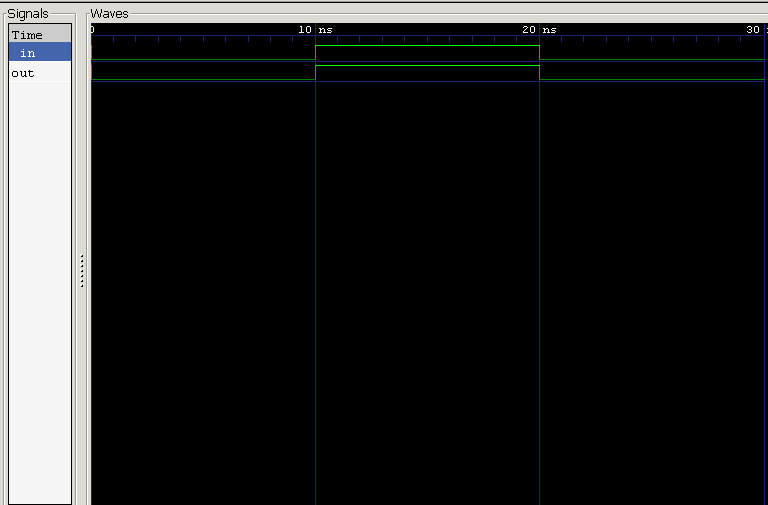

<div align="center">

# 🔌 01 — Simple Wire

### *Project 01 of the Verilog Fundamentals Repository*

**The simplest possible digital circuit — a direct, continuous connection between input and output.**


</div>

---

## 📖 Objective

This project builds the foundation for everything that follows in the repository. By the end of it, you'll understand:

| Concept | Description |
|---|---|
| 🧩 Module Declaration | How a Verilog module is structured |
| 🔀 Ports | Input and output port definitions |
| ⚡ Continuous Assignment | The `assign` statement |
| 🧪 Testbenches | Writing stimulus to verify a design |
| 🔗 Module Instantiation | Connecting a DUT to a testbench |
| ▶️ Simulation | Running designs with Icarus Verilog |
| 🌊 Waveforms | Visualizing signals with GTKWave |
| ✅ RTL Verification | The full simulate → verify workflow |

---

## 📚 Prerequisites

- Basic digital electronics
- Binary logic fundamentals
- Understanding of what a *wire* is
- Basic Verilog syntax

---

## 🧠 Theory

A **Simple Wire** is the most fundamental digital connection there is — the input passes straight through to the output, with **zero logic** in between. The moment the input changes, the output follows instantly.

<div align="center">

### Boolean Expression

**Y = A**

</div>

---

## 🔌 Circuit Representation

```
             +------------------+
   in ------>|   Simple Wire    |------> out
             +------------------+
```

Or, more simply:

```
Input ───────────────────────────────► Output
```

---

## 💻 RTL Design

```verilog
module simple_wire(
    input  wire in,
    output wire out
);

    assign out = in;

endmodule
```

---

## 🧪 Testbench

The testbench drives a sequence of values onto the input and confirms the output tracks it exactly.

**Input Sequence:** `0 → 1 → 0`
**Simulation Timeline:** `0 ns → 10 ns → 20 ns → 30 ns`

---

## 📊 Expected Simulation Result

| Time (ns) | Input | Output |
|:---:|:---:|:---:|
| 0 | 0 | 0 |
| 10 | 1 | 1 |
| 20 | 0 | 0 |
| 30 | — *simulation ends* — | — *simulation ends* — |

---

## Waveform



---

## 🔍 Waveform Analysis

<table>
<tr><td><b>0 ns</b></td><td>Input is <code>LOW (0)</code> — output immediately matches at <code>LOW (0)</code></td></tr>
<tr><td><b>10 ns</b></td><td>Input rises to <code>HIGH (1)</code> — output follows instantly to <code>HIGH (1)</code></td></tr>
<tr><td><b>20 ns</b></td><td>Input falls back to <code>LOW (0)</code> — output follows instantly to <code>LOW (0)</code></td></tr>
<tr><td><b>30 ns</b></td><td><code>$finish</code> terminates the simulation</td></tr>
</table>

Because this design uses a **continuous assignment**, the output tracks the input with no delay and no additional logic — a perfect 1:1 mirror.

---

## 📂 Project Structure

```
01_simple_wire/
│
├── README.md
├── simple_wire.v
├── simple_wire_tb.v
└── waveform.png
```

---

## ▶️ How to Run

**1. Compile the design**
```bash
iverilog -o simple_wire.out simple_wire.v simple_wire_tb.v
```

**2. Run the simulation**
```bash
vvp simple_wire.out
```

**3. View the waveform**
```bash
gtkwave waveform.vcd
```

---

## 🖥️ Expected Output

```
Input
0 ─────────── 1 ─────────── 0

Output
0 ─────────── 1 ─────────── 0
```

The output always mirrors the input — the defining behavior of a continuous assignment.

---

## 🎯 Key Concepts Learned

<details>
<summary><b>Click to expand full concept list</b></summary>

- Verilog module & module declaration
- Input / output ports
- `wire` vs `reg`
- Continuous assignment (`assign`)
- Testbenches & module instantiation
- Named port mapping
- `` `timescale ``
- `initial` blocks, `begin` / `end`
- Delays (`#10`)
- `$dumpfile`, `$dumpvars`, `$finish`
- Icarus Verilog & GTKWave
- RTL simulation & waveform analysis

</details>

---

## 📝 My Learning Notes

This project taught me that **Verilog isn't a traditional programming language — it's a Hardware Description Language (HDL)** used to model digital circuits, not compute step-by-step instructions.

I learned how a **testbench** generates stimulus and how the **DUT (Design Under Test)** responds to it, and walked through the complete RTL verification workflow for the first time:

```
Write RTL → Write Testbench → Compile (Icarus Verilog)
     → Simulate → Generate VCD → View Waveform (GTKWave)
```

It also sharpened my understanding of:

- The difference between `wire` and `reg`
- Continuous assignments
- Module instantiation
- Waveform-based verification
- The basics of digital hardware simulation

This was my **first complete RTL verification project** — small in scope, but it's the foundation everything else in this repository builds on.

---

## 💼 Interview Questions

<details>
<summary><b>1. Why is the input declared as <code>reg</code> inside the testbench?</b></summary>
<br>
Because the testbench assigns values to it inside an <code>initial</code> block, and only <code>reg</code> types can be assigned procedurally.
</details>

<details>
<summary><b>2. Why is the output declared as <code>wire</code>?</b></summary>
<br>
Because the output is driven by the DUT (Design Under Test) — the testbench only observes it, never drives it.
</details>

<details>
<summary><b>3. What does <code>assign</code> do?</b></summary>
<br>
It creates a <b>continuous assignment</b> — the output updates automatically, in real time, whenever the input changes.
</details>

<details>
<summary><b>4. What is the purpose of <code>$dumpfile</code>?</b></summary>
<br>
It creates a <b>VCD (Value Change Dump)</b> file that records every signal transition during simulation.
</details>

<details>
<summary><b>5. What is the purpose of <code>$dumpvars</code>?</b></summary>
<br>
It specifies which modules or signals should actually be recorded into that VCD file.
</details>

<details>
<summary><b>6. What is the purpose of <code>$finish</code>?</b></summary>
<br>
It terminates the simulation.
</details>

<details>
<summary><b>7. What is a Testbench?</b></summary>
<br>
A Verilog module that generates input stimulus, drives the DUT, and checks whether it behaves as expected.
</details>

<details>
<summary><b>8. What is a DUT?</b></summary>
<br>
<b>DUT</b> = <b>Design Under Test</b> — the hardware module actively being verified by the testbench.
</details>

---

## 🚀 Next Project

### ➡️ [02 — Multiple Wire](../02_multiple_wire)

Coming up:
- Multiple inputs and outputs
- Signal connections
- Multi-bit data flow
- Improved testbench design

---

<div align="center">

## 👨‍💻 Author

**Padma Charan S S**

**Repository:** Verilog Fundamentals
**Learning Approach:** Project-Driven Learning

### Repository Roadmap

```
Basic Verilog → Combinational Logic → Sequential Logic
     → RTL Design → FPGA Design → Computer Architecture → CPU Design
```

*Every project teaches one new concept through practical implementation.*

---

> *"Learning Verilog by building hardware, verifying it, documenting it, and improving one project at a time."*

</div>