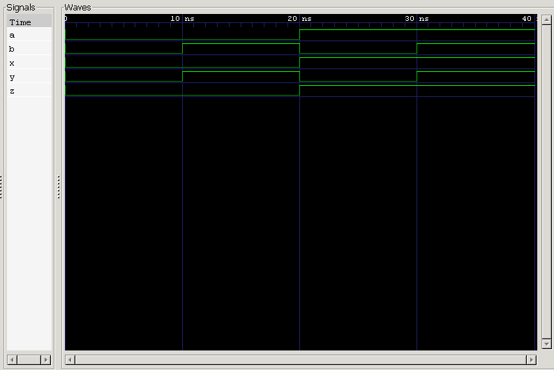

<div align="center">

#  02 — Multiple Wire

### Signal Fan-Out in Verilog RTL Design

[](https://en.wikipedia.org/wiki/Verilog)
[](http://iverilog.icarus.com/)
[](http://gtkwave.sourceforge.net/)
[]()
[]()

*Part of the [**Verilog Fundamentals**](../) repository — a project-driven journey from basic gates to full CPU design.*

</div>

---

##  Overview

This project demonstrates **signal fan-out** — the ability of a single input to drive multiple independent outputs simultaneously — using continuous assignments in Verilog.

It builds directly on the *Simple Wire* project by introducing a second input and expanding the design to three outputs, one of which is fed by the same source signal twice.

> **Core idea:** one signal → many destinations, all updating in lockstep.

---

##  Learning Objectives

| # | Concept |
|---|---------|
| 1 | Multiple input ports |
| 2 | Multiple output ports |
| 3 | Continuous assignments (`assign`) |
| 4 | Signal fan-out |
| 5 | RTL design fundamentals |
| 6 | Testbench creation & exhaustive stimulus |
| 7 | Module instantiation |
| 8 | Simulation with Icarus Verilog |
| 9 | Waveform verification with GTKWave |

---

##  Prerequisites

- Basic digital electronics & binary logic
- Verilog module declaration syntax
- Input/output port fundamentals
- Continuous assignment (`assign`)
- Completion of the **Simple Wire** project

---

##  Theory

A **Multiple Wire** circuit routes a set of inputs to a larger set of outputs, with at least one input driving more than one output — a pattern known as **fan-out**.

| Signal | Driven By |
|:------:|:---------:|
| `x`    | `a`       |
| `y`    | `b`       |
| `z`    | `a`       |

Input **`a`** feeds both **`x`** and **`z`** — a direct example of fan-out, one of the most common structural patterns in digital hardware, since a single control or data signal often needs to reach several parts of a circuit at once.

### Circuit Diagram

```
                 ┌─────────────────────────┐
      a ───────► │                         │ ───────► x
                 │      MULTIPLE_WIRE      │
      b ───────► │                         │ ───────► y
                 │                         │
                 │                         │ ───────► z
                 └─────────────────────────┘
```

### Signal Routing

```
a ──┬──────────────► x
    │
    └──────────────► z

b ───────────────► y
```

---

##  RTL Design

```verilog
module multiple_wire (
    input  wire a,
    input  wire b,

    output wire x,
    output wire y,
    output wire z
);

    assign x = a;
    assign y = b;
    assign z = a;

endmodule
```

---

##  Testbench Strategy

With **2 inputs**, exhaustive verification requires:

$$
2^2 = 4 \text{ test vectors}
$$

| Input Sequence | Applied At |
|:--------------:|:----------:|
| `00`           | 0 ns       |
| `01`           | 10 ns      |
| `10`           | 20 ns      |
| `11`           | 30 ns      |

Simulation terminates at **40 ns**.

---

##  Expected Results

| Time (ns) | a | b | x | y | z |
|:---------:|:-:|:-:|:-:|:-:|:-:|
| 0         | 0 | 0 | 0 | 0 | 0 |
| 10        | 0 | 1 | 0 | 1 | 0 |
| 20        | 1 | 0 | 1 | 0 | 1 |
| 30        | 1 | 1 | 1 | 1 | 1 |
| 40        | — | — | *simulation ends* | — | — |

---

##  Waveform

<div align="center">



</div>

---

##  Waveform Analysis

<table>
<tr><th>Time</th><th>Inputs</th><th>Outputs</th><th>Observation</th></tr>

<tr>
<td><code>0 ns</code></td>
<td><code>a=0, b=0</code></td>
<td><code>x=0, y=0, z=0</code></td>
<td>Reset state — all lines low.</td>
</tr>

<tr>
<td><code>10 ns</code></td>
<td><code>a=0, b=1</code></td>
<td><code>x=0, y=1, z=0</code></td>
<td>Only <b>y</b> changes — it tracks <b>b</b> exclusively.</td>
</tr>

<tr>
<td><code>20 ns</code></td>
<td><code>a=1, b=0</code></td>
<td><code>x=1, y=0, z=1</code></td>
<td><b>x</b> and <b>z</b> switch together — both fan out from <b>a</b>.</td>
</tr>

<tr>
<td><code>30 ns</code></td>
<td><code>a=1, b=1</code></td>
<td><code>x=1, y=1, z=1</code></td>
<td>All outputs high simultaneously.</td>
</tr>

<tr>
<td><code>40 ns</code></td>
<td colspan="3" align="center"><code>$finish</code> — simulation terminates</td>
</tr>

</table>

**Takeaway:** `x` and `z` always move together because they're both continuously assigned to `a`, while `y` moves independently in step with `b`.

---

##  Project Structure

```
02_multiple_wire/
├── README.md
├── multiple_wire.v        # RTL design
├── multiple_wire_tb.v      # Testbench
└── waveform.png            # GTKWave capture
```

---

##  Running the Simulation

```bash
# 1. Compile design + testbench
iverilog -o multiple_wire.out multiple_wire.v multiple_wire_tb.v

# 2. Run the simulation
vvp multiple_wire.out

# 3. View waveform in GTKWave
gtkwave waveform.vcd
```

---

##  Console Output Reference

```
a   0 ──────── 0 ──────── 1 ──────── 1
b   0 ──────── 1 ──────── 0 ──────── 1
x   0 ──────── 0 ──────── 1 ──────── 1
y   0 ──────── 1 ──────── 0 ──────── 1
z   0 ──────── 0 ──────── 1 ──────── 1
```

- `x` follows `a`
- `y` follows `b`
- `z` follows `a`

---

##  Key Concepts Learned

`Multiple I/O Ports` · `Signal Fan-Out` · `Continuous Assignment` · `Wire Connections` · `Testbench Design` · `Module Instantiation` · `Named Port Mapping` · `GTKWave` · `Icarus Verilog` · `RTL Simulation` · `Waveform Verification` · `Digital Signal Routing`

---

##  Learning Notes

This project deepened my understanding of how a single signal can be distributed to multiple destinations through continuous assignments — a foundational pattern in digital hardware known as **fan-out**.

Writing the testbench also reinforced the value of **exhaustive verification**: with only two inputs, testing all four combinations gives complete confidence that the design behaves correctly under every possible condition.

This marks my **second complete RTL verification project**, building steadily toward more complex combinational and sequential designs.

---

##  Interview Questions

<details>
<summary><b>1. What is fan-out?</b></summary>
<br>
Fan-out is the ability of one signal to drive multiple outputs or destinations simultaneously.
</details>

<details>
<summary><b>2. Why do <code>x</code> and <code>z</code> change together?</b></summary>
<br>
Because both are continuously assigned to the same input signal, <code>a</code>. Any change in <code>a</code> propagates to both outputs at the same time.
</details>

<details>
<summary><b>3. Why is exhaustive testing important?</b></summary>
<br>
It guarantees that the circuit behaves correctly across every possible input combination, leaving no untested edge case.
</details>

<details>
<summary><b>4. How many input combinations exist for two inputs?</b></summary>
<br>
2² = 4 combinations: <code>00</code>, <code>01</code>, <code>10</code>, <code>11</code>.
</details>

<details>
<summary><b>5. What is the purpose of a testbench?</b></summary>
<br>
A testbench applies controlled input stimulus to the Design Under Test (DUT) and lets the designer verify its output behavior.
</details>

<details>
<summary><b>6. What is RTL simulation?</b></summary>
<br>
RTL simulation verifies the functional behavior of a hardware design before it is synthesized into actual gates and hardware.
</details>

<details>
<summary><b>7. Why are the outputs declared as <code>wire</code>?</b></summary>
<br>
Because they are driven continuously by the DUT via <code>assign</code> statements, rather than being assigned procedurally.
</details>

<details>
<summary><b>8. What is the advantage of continuous assignment?</b></summary>
<br>
It automatically re-evaluates and updates the output the moment any input changes — no procedural blocks or triggers required.
</details>

---

##  Next Up

### [03 — NOT Gate →](../03_not_gate)

Coming next in the series:

- Inverter (NOT gate) design
- Bitwise NOT operator (`~`)
- Boolean complement logic
- Combinational logic design
- Gate-level verification

---

##  Repository Roadmap

```
Basic Verilog → Combinational Logic → Sequential Logic
      → RTL Design → FPGA Design → Computer Architecture → CPU Design
```

Each project in this series teaches exactly **one new concept** through hands-on, practical implementation.

---

<div align="center">

## 👨‍💻 Author

**Padma Charan S S**

**Repository:** Verilog Fundamentals · **Approach:** Project-Driven Learning

*"Every wire carries a signal, every project builds a skill, and every simulation brings me one step closer to designing my own CPU."*

</div>