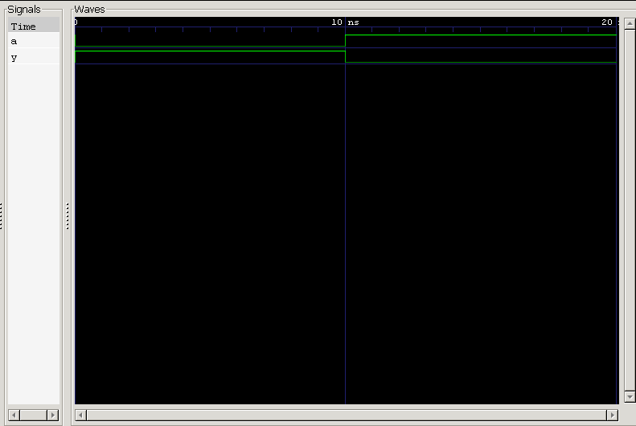

<div align="center">

#  01 — NOT Gate (Inverter)

**Project 01 · Logic Gates · Verilog Fundamentals**

[](#)
[](#)
[](#)
[](#)

*A clean, verified implementation of the simplest logic gate — the foundation of digital design.*

</div>

---

##  Overview

The **NOT Gate**, or **Inverter**, is the most fundamental logic gate in digital electronics. It takes a single input and produces its logical complement — nothing more, nothing less. This project implements, simulates, and verifies a NOT gate in Verilog HDL, serving as the entry point into a structured, project-driven journey through digital logic design.

**In this project, you'll find:**

- ✅ A minimal, correct RTL implementation
- ✅ A self-checking testbench
- ✅ Simulation output and waveform analysis
- ✅ Interview-style Q&A for concept reinforcement

---

##  Learning Objectives

| # | Concept |
|---|---------|
| 1 | NOT gate behavior and implementation in Verilog |
| 2 | The bitwise NOT operator (`~`) |
| 3 | Continuous assignment (`assign`) |
| 4 | Testbench development fundamentals |
| 5 | Module instantiation and port mapping |
| 6 | RTL simulation with Icarus Verilog |
| 7 | Waveform verification with GTKWave |

---

##  Prerequisites

- Basic digital electronics
- Binary logic fundamentals
- Verilog module declaration syntax
- Continuous assignment (`assign`)
- Testbench basics

---

##  Theory

A NOT gate inverts its input: a `LOW` input produces a `HIGH` output, and vice versa. With a single input, it has exactly **2¹ = 2** possible states.

**Boolean Expression**

$$Y = \overline{A}$$

**Truth Table**

| A | Y |
|:-:|:-:|
| 0 | 1 |
| 1 | 0 |

**Symbol**

```
A ──────▷o────── Y
```

---

##  RTL Design

```verilog
module not_gate (
    input  wire a,
    output wire y
);

    assign y = ~a;

endmodule
```

A single continuous assignment is all that's required — the output tracks the inverted input at all times, with no clock or memory involved.

---

##  Verification

### Testbench Strategy

The testbench drives the input through both possible states and observes the corresponding output, dumping results to a `.vcd` file for waveform inspection.

**Input sequence:** `0 → 1`
**Simulation window:** `0 ns → 20 ns`

### Expected Results

| Time (ns) | Input (A) | Output (Y) | Event |
|:---------:|:---------:|:----------:|-------|
| 0  | 0 | 1 | Initial state |
| 10 | 1 | 0 | Input toggles |
| 20 | — | — | `$finish` — simulation ends |

---

##  Waveform



**Analysis**

- **@ 0 ns** — `A = 0` → `Y = 1`
- **@ 10 ns** — `A` toggles to `1` → `Y` immediately falls to `0`
- **@ 20 ns** — `$finish` terminates the simulation

Because the design uses a **continuous assignment**, `Y` updates instantaneously in response to `A`, with zero simulated propagation delay — confirming purely combinational behavior.

---

##  Project Structure

```
01_not_gate/
├── README.md          # Project documentation
├── not_gate.v          # RTL design
├── not_gate_tb.v        # Testbench
└── waveform.png         # GTKWave capture
```

---

##  Getting Started

```bash
# 1. Compile the design and testbench
iverilog -o not_gate.out not_gate.v not_gate_tb.v

# 2. Run the simulation
vvp not_gate.out

# 3. View the waveform
gtkwave waveform.vcd
```

**Expected console/waveform output:**

```
Input  (A):  0 ─────────────── 1
Output (Y):  1 ─────────────── 0
```

The output is the logical inverse of the input at every point in time.

---

##  Key Concepts Learned

<table>
<tr>
<td valign="top" width="33%">

**Design**
- Logic gates
- Inverter behavior
- Bitwise NOT (`~`)
- Continuous assignment
- Module declaration

</td>
<td valign="top" width="33%">

**Verification**
- Testbenches
- Module instantiation
- Named port mapping
- `initial` blocks
- Simulation delays (`#10`)

</td>
<td valign="top" width="33%">

**Toolflow**
- `` `timescale ``
- `$dumpfile` / `$dumpvars`
- `$finish`
- Icarus Verilog
- GTKWave

</td>
</tr>
</table>

---

##  Reflections

This was my **first logic gate implementation and verification project**. Working through it clarified how logical inversion maps to hardware, how the `~` operator behaves in Verilog, and how a purely combinational circuit can be described in a single line via `assign`.

It also reinforced the broader RTL verification workflow — from writing a testbench, to simulating, to reading a waveform and connecting it back to the truth table. A small circuit, but a solid foundation for everything that follows.

---

##  Interview Questions

<details>
<summary><strong>1. Why is a NOT gate called an Inverter?</strong></summary><br>

Because it inverts the logic level of its input, producing the opposite output.
</details>

<details>
<summary><strong>2. What is the Boolean expression of a NOT gate?</strong></summary><br>

`Y = ~A`
</details>

<details>
<summary><strong>3. How many input combinations does a NOT gate have?</strong></summary><br>

Since it has a single input: 2¹ = **2** possible combinations.
</details>

<details>
<summary><strong>4. Which Verilog operator implements a NOT gate?</strong></summary><br>

The bitwise NOT operator: `~`
</details>

<details>
<summary><strong>5. Why is the testbench input declared as <code>reg</code>?</strong></summary><br>

Because the testbench drives (changes) its value procedurally inside an `initial` block.
</details>

<details>
<summary><strong>6. Why is the output declared as <code>wire</code>?</strong></summary><br>

Because it is driven by the DUT through a continuous assignment, not procedurally.
</details>

<details>
<summary><strong>7. What does <code>assign</code> do?</strong></summary><br>

It creates a continuous assignment — the output updates automatically whenever any signal on the right-hand side changes.
</details>

<details>
<summary><strong>8. Why is a NOT gate a combinational circuit?</strong></summary><br>

Because its output depends only on the current input value, with no internal memory or state.
</details>

<details>
<summary><strong>9. What does DUT mean?</strong></summary><br>

**Design Under Test** — the hardware module being exercised and verified by the testbench.
</details>

---

##  What's Next

<div align="center">

###  [02 — AND Gate](../02_and_gate)

*Two-input logic · Multiple input combinations · Truth table verification · Waveform analysis for multi-input combinational logic*

</div>

---

<div align="center">

## 👨‍💻 Author

**Padma Charan S S**

**Repository:** Verilog Fundamentals · **Approach:** Project-Driven Learning

### Repository Roadmap

```
Basic Verilog → Combinational Logic → Sequential Logic
      → RTL Design → FPGA Design → Computer Architecture → CPU Design
```

*Every project teaches one new concept through practical implementation.*

---

*"Learning Verilog by designing hardware, verifying functionality, documenting the process, and improving one project at a time."*

</div>