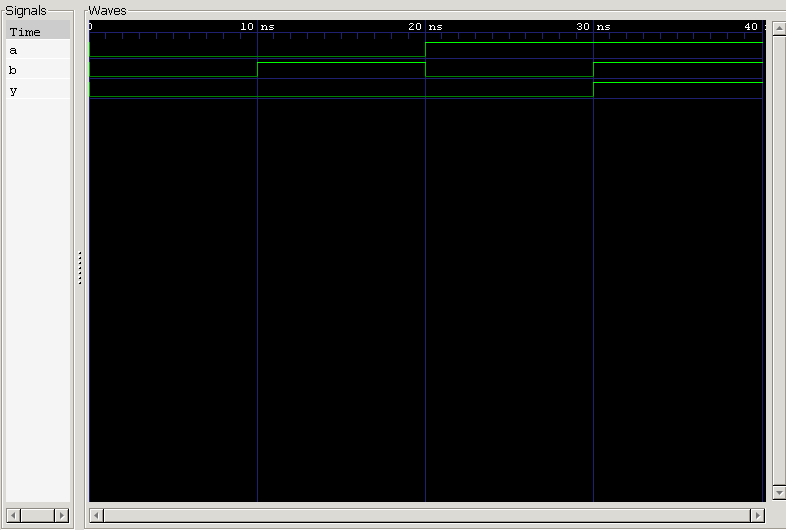

<div align="center">

#  02 — AND Gate

### 2-Input AND Gate · Verilog HDL Implementation & Verification

*Project 02 of the **Logic Gates** module — [Verilog Fundamentals](#)*

[](#)
[](#)
[](#)
[](#)

</div>

---

##  Overview

This project implements and verifies a **2-input AND gate** in Verilog HDL. An AND gate is a fundamental combinational logic element whose output goes **HIGH only when every input is HIGH** — the digital equivalent of logical multiplication.

It builds directly on the NOT gate project and introduces the first true **multi-input** combinational circuit in this repository, along with exhaustive truth-table verification.

**In this project you will:**

- 🔹 Implement an AND gate using continuous assignment
- 🔹 Apply the bitwise AND operator (`&`)
- 🔹 Design a self-checking, exhaustive testbench
- 🔹 Simulate with Icarus Verilog
- 🔹 Verify behavior with GTKWave waveforms

---

##  Prerequisites

| Topic | Why it matters |
|---|---|
| Basic Digital Electronics | Understand gate-level logic |
| Binary Logic | Reason about 0/1 signal states |
| Verilog Module Declaration | Structure the design |
| Continuous Assignment (`assign`) | Drive combinational outputs |
| NOT Gate (Project 01) | Foundation for gate-level design |
| Testbench Fundamentals | Stimulate and verify the DUT |

---

##  Theory

An **AND gate** is a combinational logic gate performing logical multiplication: the output is HIGH **only if all inputs are HIGH**. If even a single input is LOW, the output is forced LOW.

With **2 inputs**, the number of possible combinations is:

$$2^2 = 4$$

**Boolean Expression**

$$Y = A \cdot B \quad \text{(Verilog: } Y = A \mathbin{\&} B\text{)}$$

### Truth Table

| A | B | Y |
|:-:|:-:|:-:|
| 0 | 0 | 0 |
| 0 | 1 | 0 |
| 1 | 0 | 0 |
| 1 | 1 | **1** |

---

## 🔌 Circuit Representation

```
              ┌──────────────┐
   A ────────▶│              │
              │   AND Gate   │────────▶ Y
   B ────────▶│              │
              └──────────────┘
```

**Logic Symbol**

```
       ______
A ─────|     \
       | AND  )───── Y
B ─────|_____/
```

---

##  RTL Design

```verilog
module and_gate (
    input  wire a,
    input  wire b,
    output wire y
);

    assign y = a & b;

endmodule
```

| Element | Purpose |
|---|---|
| `input wire a, b` | Two single-bit gate inputs |
| `output wire y` | Gate output, driven continuously |
| `assign y = a & b;` | Combinational logic via bitwise AND |

---

##  Testbench Strategy

The testbench applies **all 4 possible input combinations**, holding each for 10 ns before advancing.

**Stimulus sequence:** `00 → 01 → 10 → 11`

```
0 ns ──▶ 10 ns ──▶ 20 ns ──▶ 30 ns ──▶ 40 ns (simulation ends)
```

### Expected Results

| Time (ns) | A | B | Y | Notes |
|---:|:-:|:-:|:-:|---|
| 0  | 0 | 0 | 0 | Both LOW |
| 10 | 0 | 1 | 0 | One input LOW |
| 20 | 1 | 0 | 0 | One input LOW |
| 30 | 1 | 1 | **1** | Both HIGH → output HIGH |
| 40 | — | — | — | `$finish` |

---

##  Waveform



### Waveform Analysis

<table>
<tr><th>Time</th><th>A</th><th>B</th><th>Y</th><th>Explanation</th></tr>
<tr><td>0 ns</td><td>0</td><td>0</td><td>0</td><td>Both inputs LOW → output LOW</td></tr>
<tr><td>10 ns</td><td>0</td><td>1</td><td>0</td><td>One input LOW → output stays LOW</td></tr>
<tr><td>20 ns</td><td>1</td><td>0</td><td>0</td><td>One input LOW → output stays LOW</td></tr>
<tr><td>30 ns</td><td>1</td><td>1</td><td>1</td><td>Both inputs HIGH → output HIGH ✅</td></tr>
<tr><td>40 ns</td><td colspan="3" align="center">simulation terminates via <code>$finish</code></td><td></td></tr>
</table>

---

##  Project Structure

```
02_and_gate/
├── README.md
├── and_gate.v          # RTL design
├── and_gate_tb.v        # Testbench
└── waveform.png          # GTKWave capture
```

---

##  How to Run

```bash
# 1. Compile design + testbench
iverilog -o and_gate.out and_gate.v and_gate_tb.v

# 2. Run the simulation
vvp and_gate.out

# 3. View waveform in GTKWave
gtkwave waveform.vcd
```

### Expected Console/Waveform Output

```
A   0 ──── 0 ──── 1 ──── 1
B   0 ──── 1 ──── 0 ──── 1
Y   0 ──── 0 ──── 0 ──── 1
```

✅ Output is HIGH only when **both** inputs are HIGH — matching the truth table exactly.

---

##  Key Concepts Learned

<table>
<tr>
<td valign="top" width="50%">

**Design Concepts**
- Logic gates & AND operation
- Bitwise AND operator (`&`)
- Continuous assignment (`assign`)
- Combinational logic
- Truth tables

</td>
<td valign="top" width="50%">

**Verification & Tooling**
- Testbench design & module instantiation
- `` `timescale ``, `wire`, `reg`, `initial`
- Delay control (`#10`)
- `$dumpfile`, `$dumpvars`, `$finish`
- Icarus Verilog & GTKWave

</td>
</tr>
</table>

---

##  Learning Notes

This project deepened my understanding of **multi-input combinational logic** — how an AND gate performs logical multiplication, producing a HIGH output only when *every* input is HIGH.

I practiced building an **exhaustive testbench** that walks through every input combination and validated the resulting waveform against the predicted truth table — my first end-to-end verification of a multi-input logic gate.

**Skills reinforced:**
- Truth table–driven verification
- RTL simulation workflow
- Testbench development
- Waveform interpretation
- Functional (not just structural) correctness checking

---

##  Interview Questions

<details>
<summary><b>1. What is the Boolean expression of an AND gate?</b></summary>
<br>

$$Y = A \cdot B$$
</details>

<details>
<summary><b>2. How many input combinations exist for a 2-input AND gate?</b></summary>
<br>

$2^2 = 4$ combinations.
</details>

<details>
<summary><b>3. When does an AND gate produce a HIGH output?</b></summary>
<br>

Only when **every input is HIGH**.
</details>

<details>
<summary><b>4. Which Verilog operator implements an AND gate?</b></summary>
<br>

The bitwise AND operator `&`.
</details>

<details>
<summary><b>5. Why is exhaustive testing important?</b></summary>
<br>

Testing every input combination guarantees the circuit behaves correctly across the entire input space, leaving no untested edge cases.
</details>

<details>
<summary><b>6. Why is an AND gate a combinational circuit?</b></summary>
<br>

Its output depends only on the current input values — it has no memory or internal state.
</details>

<details>
<summary><b>7. Why is the testbench input declared as <code>reg</code>?</b></summary>
<br>

Because it is assigned and changed procedurally inside an `initial` block.
</details>

<details>
<summary><b>8. Why is the output declared as <code>wire</code>?</b></summary>
<br>

Because it is continuously driven by the DUT via `assign`, not procedurally.
</details>

<details>
<summary><b>9. What does DUT stand for?</b></summary>
<br>

**Design Under Test** — the hardware module currently being verified.
</details>

---

##  Next Project

### [03 — OR Gate →](#)

Coming up:
- Logical OR operation
- Bitwise OR operator (`|`)
- Multi-input combinational logic
- Truth table verification
- Waveform analysis

---

<div align="center">

## 👨‍💻 Author

**Padma Charan S S**

**Repository:** Verilog Fundamentals · **Approach:** Project-Driven Learning

### 🗺️ Repository Roadmap

```
Basic Verilog → Combinational Logic → Sequential Logic
     → RTL Design → FPGA Design → Computer Architecture → CPU Design
```

*Every project teaches one new concept through practical implementation.*

---

> *"Every logic gate mastered is another building block toward designing complete digital systems."*

</div>