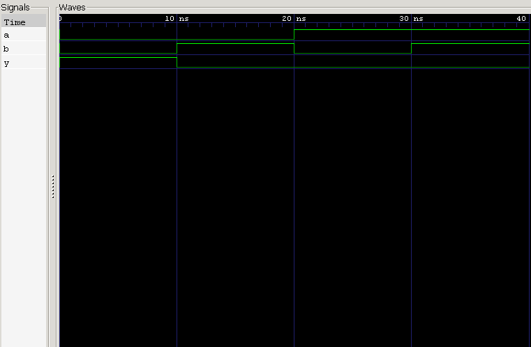

<div align="center">

#  04 — NOR Gate

### 2-Input NOR Gate · Verilog HDL Implementation & Verification

*Project 04 of the **Logic Gates** module — [Verilog Fundamentals](#)*

[](#)
[](#)
[](#)
[](#)
[](#)

</div>

---

## 📖 Overview

This project implements and verifies a **2-input NOR gate** in Verilog HDL. A NOR gate is an **OR gate followed by inversion** — its output is **HIGH only when every input is LOW**, and drops LOW the moment any input goes HIGH.

NOR is one of the two **Universal Gates** in digital logic: any combinational or sequential circuit — from a single NOT gate to a full CPU — can be built using NOR gates alone.

**In this project you will:**

- 🔹 Implement a NOR gate using continuous assignment
- 🔹 Apply the bitwise OR (`|`) and NOT (`~`) operators together
- 🔹 Explore the **Universal Gate** concept
- 🔹 Design a self-checking, exhaustive testbench
- 🔹 Simulate with Icarus Verilog
- 🔹 Verify behavior with GTKWave waveforms

---

##  Prerequisites

| Topic | Why it matters |
|---|---|
| Basic Digital Electronics | Understand gate-level logic |
| Binary Logic | Reason about 0/1 signal states |
| Verilog Module Declaration | Structure the design |
| Continuous Assignment (`assign`) | Drive combinational outputs |
| NOT Gate (Project 01) | Foundation for inversion logic |
| AND Gate (Project 02) | Contrast with OR-based gates |
| OR Gate (Project 03) | Directly extended into NOR |
| Testbench Fundamentals | Stimulate and verify the DUT |

---

##  Theory

A **NOR gate** is formed by an **OR gate** whose output is passed through a **NOT gate**. The output is HIGH **only when every input is LOW** — if even one input becomes HIGH, the output is immediately forced LOW.

With **2 inputs**, the number of possible combinations is:

$$2^2 = 4$$

**Boolean Expression**

$$Y = \overline{A + B} \quad \text{(Verilog: } Y = \sim(A \mathbin{|} B)\text{)}$$

By **De Morgan's Law**, this is equivalent to:

$$Y = \bar{A} \cdot \bar{B} \quad \text{(Verilog: } Y = \sim A \mathbin{\&} \sim B\text{)}$$

Both forms describe identical logic.

### Truth Table

| A | B | Y |
|:-:|:-:|:-:|
| 0 | 0 | **1** |
| 0 | 1 | 0 |
| 1 | 0 | 0 |
| 1 | 1 | 0 |

---

##  Circuit Representation

```
              ┌──────────────┐
   A ────────▶│              │
              │   NOR Gate   │────────▶ Y
   B ────────▶│              │
              └──────────────┘
```

**Logic Symbol**

```
       ______
A ─────\     \
        ) OR  )o───── Y
B ─────/_____/
```
*(The bubble at the output represents inversion.)*

---

##  RTL Design

```verilog
module nor_gate (
    input  wire a,
    input  wire b,
    output wire y
);

    assign y = ~(a | b);

endmodule
```

| Element | Purpose |
|---|---|
| `input wire a, b` | Two single-bit gate inputs |
| `output wire y` | Gate output, driven continuously |
| `assign y = ~(a \| b);` | OR followed by inversion |

---

##  Testbench Strategy

The testbench applies **all 4 possible input combinations**, holding each for 10 ns before advancing.

**Stimulus sequence:** `00 → 01 → 10 → 11`

```
0 ns ──▶ 10 ns ──▶ 20 ns ──▶ 30 ns ──▶ 40 ns (simulation ends)
```

### Expected Results

| Time (ns) | A | B | Y | Notes |
|---:|:-:|:-:|:-:|---|
| 0  | 0 | 0 | **1** | Both LOW → output HIGH |
| 10 | 0 | 1 | 0 | One input HIGH → output LOW |
| 20 | 1 | 0 | 0 | One input HIGH → output LOW |
| 30 | 1 | 1 | 0 | Both HIGH → output LOW |
| 40 | — | — | — | `$finish` |

---

##  Waveform



### Waveform Analysis

<table>
<tr><th>Time</th><th>A</th><th>B</th><th>Y</th><th>Explanation</th></tr>
<tr><td>0 ns</td><td>0</td><td>0</td><td>1</td><td>Both inputs LOW → output HIGH ✅</td></tr>
<tr><td>10 ns</td><td>0</td><td>1</td><td>0</td><td>One input HIGH → output goes LOW</td></tr>
<tr><td>20 ns</td><td>1</td><td>0</td><td>0</td><td>One input HIGH → output stays LOW</td></tr>
<tr><td>30 ns</td><td>1</td><td>1</td><td>0</td><td>Both inputs HIGH → output stays LOW</td></tr>
<tr><td>40 ns</td><td colspan="3" align="center">simulation terminates via <code>$finish</code></td><td></td></tr>
</table>

---

##  Why NOR Is a Universal Gate

A gate is called **universal** when it alone is sufficient to construct *any* digital logic function. Using only NOR gates, it's possible to build:

<table>
<tr>
<td valign="top" width="50%">

**Basic Gates**
- NOT Gate
- OR Gate
- AND Gate
- NAND Gate
- XOR Gate

</td>
<td valign="top" width="50%">

**Higher-Level Systems**
- Multiplexers & Decoders
- Adders
- ALUs
- Complete CPUs

</td>
</tr>
</table>

This universality is why NOR (along with NAND) sits at the foundation of digital IC design.

---

##  Project Structure

```
04_nor_gate/
├── README.md
├── nor_gate.v          # RTL design
├── nor_gate_tb.v        # Testbench
└── waveform.png          # GTKWave capture
```

---

##  How to Run

```bash
# 1. Compile design + testbench
iverilog -o nor_gate.out nor_gate.v nor_gate_tb.v

# 2. Run the simulation
vvp nor_gate.out

# 3. View waveform in GTKWave
gtkwave waveform.vcd
```

### Expected Console/Waveform Output

```
A   0 ──── 0 ──── 1 ──── 1
B   0 ──── 1 ──── 0 ──── 1
Y   1 ──── 0 ──── 0 ──── 0
```

✅ Output is HIGH only when **all** inputs are LOW — matching the truth table exactly.

---

##  Key Concepts Learned

<table>
<tr>
<td valign="top" width="50%">

**Design Concepts**
- Logic gates & NOR operation
- Universal Gate concept
- Bitwise OR (`|`) and NOT (`~`) operators
- De Morgan's Law
- Combinational logic

</td>
<td valign="top" width="50%">

**Verification & Tooling**
- Testbench design & module instantiation
- `` `timescale ``, `wire`, `reg`, `initial`
- Delay control (`#10`)
- `$dumpfile`, `$dumpvars`, `$finish`
- Icarus Verilog & GTKWave

</td>
</tr>
</table>

---

##  Learning Notes

This project showed how a **NOR gate** is formed by combining an OR operation with inversion — and how, despite its simplicity, it's powerful enough to be classified as a **Universal Gate**.

Working through **De Morgan's Law** ($\overline{A+B} = \bar{A}\cdot\bar{B}$) clarified how two seemingly different Boolean expressions can represent identical logic — a concept that will be essential for logic simplification later in this repository.

**Skills reinforced:**
- Truth table–driven verification
- RTL simulation workflow
- Testbench development
- Waveform interpretation
- Universal gate theory
- Boolean algebra (De Morgan's Law)

---

##  Interview Questions

<details>
<summary><b>1. What is the Boolean expression of a NOR gate?</b></summary>
<br>

$$Y = \overline{A + B}$$
</details>

<details>
<summary><b>2. Why is NOR called a Universal Gate?</b></summary>
<br>

Because every digital logic gate — and by extension, every digital circuit — can be constructed using only NOR gates.
</details>

<details>
<summary><b>3. When does a NOR gate produce a HIGH output?</b></summary>
<br>

Only when **all inputs are LOW**.
</details>

<details>
<summary><b>4. Which Verilog operators implement a NOR gate?</b></summary>
<br>

The NOT operator `~` combined with the OR operator `|`.
</details>

<details>
<summary><b>5. What is the De Morgan's equivalent expression for a NOR gate?</b></summary>
<br>

$$Y = \bar{A} \cdot \bar{B}$$
</details>

<details>
<summary><b>6. Why is a NOR gate a combinational circuit?</b></summary>
<br>

Its output depends only on the current input values — it has no memory or internal state.
</details>

<details>
<summary><b>7. Why are the testbench inputs declared as <code>reg</code>?</b></summary>
<br>

Because their values are assigned and changed procedurally inside an `initial` block.
</details>

<details>
<summary><b>8. What does DUT stand for?</b></summary>
<br>

**Design Under Test** — the hardware module currently being verified.
</details>

---

##  Next Project

### [05 — NAND Gate →](#)

Coming up:
- NAND gate implementation
- The second Universal Gate
- Logic inversion after AND operation
- Truth table verification
- RTL simulation & waveform analysis

---

<div align="center">

## 👨‍💻 Author

**Padma Charan S S**

**Repository:** Verilog Fundamentals · **Approach:** Project-Driven Learning

### 🗺️ Repository Roadmap

```
Basic Verilog → Combinational Logic → Sequential Logic
     → RTL Design → FPGA Design → Computer Architecture → CPU Design
```

*Every project teaches one new concept through practical implementation.*

---

> *"Universal gates demonstrate that complex digital systems can be built from a single fundamental building block."*

</div>