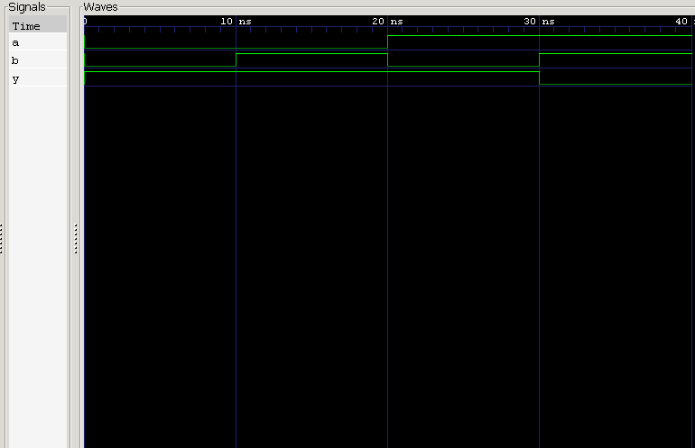

<div align="center">

#  05 — NAND Gate

### 2-Input NAND Gate · Verilog HDL Implementation & Verification

*Project 05 of the **Logic Gates** module — [Verilog Fundamentals](#)*

[](#)
[](#)
[](#)
[](#)
[](#)

</div>

---

##  Overview

This project implements and verifies a **2-input NAND gate** in Verilog HDL. A NAND gate is an **AND gate followed by inversion** — its output is **LOW only when every input is HIGH**, and stays HIGH as soon as any input goes LOW.

NAND is the second of the two **Universal Gates** in digital logic (alongside NOR): any combinational or sequential circuit — from a single NOT gate to a full CPU — can be built using NAND gates alone.

**In this project you will:**

- 🔹 Implement a NAND gate using continuous assignment
- 🔹 Apply the bitwise AND (`&`) and NOT (`~`) operators together
- 🔹 Explore the **Universal Gate** concept
- 🔹 Design a self-checking, exhaustive testbench
- 🔹 Simulate with Icarus Verilog
- 🔹 Verify behavior with GTKWave waveforms

---

##  Prerequisites

| Topic | Why it matters |
|---|---|
| Basic Digital Electronics | Understand gate-level logic |
| Binary Logic | Reason about 0/1 signal states |
| Verilog Module Declaration | Structure the design |
| Continuous Assignment (`assign`) | Drive combinational outputs |
| NOT Gate (Project 01) | Foundation for inversion logic |
| AND Gate (Project 02) | Directly extended into NAND |
| OR Gate (Project 03) | Contrast with AND-based gates |
| NOR Gate (Project 04) | Compare the two Universal Gates |
| Testbench Fundamentals | Stimulate and verify the DUT |

---

##  Theory

A **NAND gate** is formed by an **AND gate** whose output is passed through a **NOT gate**. The output is LOW **only when every input is HIGH** — if even one input is LOW, the output stays HIGH.

With **2 inputs**, the number of possible combinations is:

$$2^2 = 4$$

**Boolean Expression**

$$Y = \overline{A \cdot B} \quad \text{(Verilog: } Y = \sim(A \mathbin{\&} B)\text{)}$$

By **De Morgan's Law**, this is equivalent to:

$$Y = \bar{A} + \bar{B} \quad \text{(Verilog: } Y = \sim A \mathbin{|} \sim B\text{)}$$

Both forms describe identical logic.

### Truth Table

| A | B | Y |
|:-:|:-:|:-:|
| 0 | 0 | **1** |
| 0 | 1 | **1** |
| 1 | 0 | **1** |
| 1 | 1 | 0 |

---

##  Circuit Representation

```
              ┌───────────────┐
   A ────────▶│               │
              │   NAND Gate   │────────▶ Y
   B ────────▶│               │
              └───────────────┘
```

**Logic Symbol**

```
       ______
A ─────|     \
       | AND  )o───── Y
B ─────|_____/
```
*(The bubble at the output represents inversion.)*

---

##  RTL Design

```verilog
module nand_gate (
    input  wire a,
    input  wire b,
    output wire y
);

    assign y = ~(a & b);

endmodule
```

| Element | Purpose |
|---|---|
| `input wire a, b` | Two single-bit gate inputs |
| `output wire y` | Gate output, driven continuously |
| `assign y = ~(a & b);` | AND followed by inversion |

---

##  Testbench Strategy

The testbench applies **all 4 possible input combinations**, holding each for 10 ns before advancing.

**Stimulus sequence:** `00 → 01 → 10 → 11`

```
0 ns ──▶ 10 ns ──▶ 20 ns ──▶ 30 ns ──▶ 40 ns (simulation ends)
```

### Expected Results

| Time (ns) | A | B | Y | Notes |
|---:|:-:|:-:|:-:|---|
| 0  | 0 | 0 | **1** | Both LOW → output HIGH |
| 10 | 0 | 1 | **1** | One input LOW → output HIGH |
| 20 | 1 | 0 | **1** | One input LOW → output HIGH |
| 30 | 1 | 1 | 0 | Both HIGH → output LOW |
| 40 | — | — | — | `$finish` |

---

##  Waveform



### Waveform Analysis

<table>
<tr><th>Time</th><th>A</th><th>B</th><th>Y</th><th>Explanation</th></tr>
<tr><td>0 ns</td><td>0</td><td>0</td><td>1</td><td>Both inputs LOW → output HIGH ✅</td></tr>
<tr><td>10 ns</td><td>0</td><td>1</td><td>1</td><td>One input LOW → output stays HIGH ✅</td></tr>
<tr><td>20 ns</td><td>1</td><td>0</td><td>1</td><td>One input LOW → output stays HIGH ✅</td></tr>
<tr><td>30 ns</td><td>1</td><td>1</td><td>0</td><td>Both inputs HIGH → output goes LOW</td></tr>
<tr><td>40 ns</td><td colspan="3" align="center">simulation terminates via <code>$finish</code></td><td></td></tr>
</table>

---

##  Why NAND Is a Universal Gate

A gate is called **universal** when it alone is sufficient to construct *any* digital logic function. Using only NAND gates, it's possible to build:

<table>
<tr>
<td valign="top" width="50%">

**Basic Gates**
- NOT Gate
- AND Gate
- OR Gate
- NOR Gate
- XOR Gate

</td>
<td valign="top" width="50%">

**Higher-Level Systems**
- Multiplexers & Decoders
- Adders
- ALUs
- Complete CPUs

</td>
</tr>
</table>

**Quick example — NOT from NAND:** tying both inputs together collapses the gate to a pure inverter:

$$Y = \overline{A \cdot A} = \bar{A}$$

This universality is why NAND (along with NOR) is the workhorse of standard-cell digital IC design.

---

##  Project Structure

```
05_nand_gate/
├── README.md
├── nand_gate.v          # RTL design
├── nand_gate_tb.v        # Testbench
└── waveform.png            # GTKWave capture
```

---

##  How to Run

```bash
# 1. Compile design + testbench
iverilog -o nand_gate.out nand_gate.v nand_gate_tb.v

# 2. Run the simulation
vvp nand_gate.out

# 3. View waveform in GTKWave
gtkwave waveform.vcd
```

### Expected Console/Waveform Output

```
A   0 ──── 0 ──── 1 ──── 1
B   0 ──── 1 ──── 0 ──── 1
Y   1 ──── 1 ──── 1 ──── 0
```

✅ Output is LOW only when **all** inputs are HIGH — matching the truth table exactly.

---

##  Key Concepts Learned

<table>
<tr>
<td valign="top" width="50%">

**Design Concepts**
- Logic gates & NAND operation
- Universal Gate concept
- Bitwise AND (`&`) and NOT (`~`) operators
- De Morgan's Law
- Combinational logic

</td>
<td valign="top" width="50%">

**Verification & Tooling**
- Testbench design & module instantiation
- `` `timescale ``, `wire`, `reg`, `initial`
- Delay control (`#10`)
- `$dumpfile`, `$dumpvars`, `$finish`
- Icarus Verilog & GTKWave

</td>
</tr>
</table>

---

##  Learning Notes

This project showed how a **NAND gate** is formed by combining an AND operation with inversion — and how, like NOR, it's powerful enough to be classified as a **Universal Gate**.

Deriving a **NOT gate from a NAND gate** (by tying both inputs together) was a great concrete demonstration of universality — a single primitive, wired cleverly, reproduces an entirely different gate's behavior.

**Skills reinforced:**
- Truth table–driven verification
- RTL simulation workflow
- Testbench development
- Waveform interpretation
- Universal gate theory
- Boolean algebra (De Morgan's Law)

---

##  Interview Questions

<details>
<summary><b>1. What is the Boolean expression of a NAND gate?</b></summary>
<br>

$$Y = \overline{A \cdot B}$$
</details>

<details>
<summary><b>2. Why is NAND called a Universal Gate?</b></summary>
<br>

Because every digital logic gate — and by extension, every digital circuit — can be constructed using only NAND gates.
</details>

<details>
<summary><b>3. When does a NAND gate produce a LOW output?</b></summary>
<br>

Only when **all inputs are HIGH**.
</details>

<details>
<summary><b>4. Which Verilog operators implement a NAND gate?</b></summary>
<br>

The NOT operator `~` combined with the AND operator `&`.
</details>

<details>
<summary><b>5. What is the De Morgan's equivalent expression for a NAND gate?</b></summary>
<br>

$$Y = \bar{A} + \bar{B}$$
</details>

<details>
<summary><b>6. Why is a NAND gate a combinational circuit?</b></summary>
<br>

Its output depends only on the current input values — it has no memory or internal state.
</details>

<details>
<summary><b>7. How can a NOT gate be implemented using a NAND gate?</b></summary>
<br>

By tying both inputs of the NAND gate to the same signal:

$$Y = \overline{A \cdot A} = \bar{A}$$
</details>

<details>
<summary><b>8. What does DUT stand for?</b></summary>
<br>

**Design Under Test** — the hardware module currently being verified.
</details>

---

##  Next Project

### [06 — XOR Gate →](#)

Coming up:
- XOR gate implementation
- Exclusive-OR operation
- Difference detection
- Truth table verification
- RTL simulation & waveform analysis

---

<div align="center">

## 👨‍💻 Author

**Padma Charan S S**

**Repository:** Verilog Fundamentals · **Approach:** Project-Driven Learning

### 🗺️ Repository Roadmap

```
Basic Verilog → Combinational Logic → Sequential Logic
     → RTL Design → FPGA Design → Computer Architecture → CPU Design
```

*Every project teaches one new concept through practical implementation.*

---

> *"Universal gates prove that complex digital systems can be constructed from a single versatile building block."*

</div>