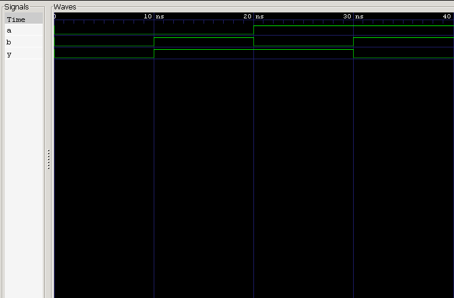

<div align="center">

#  06 — XOR Gate

### 2-Input XOR (Exclusive OR) Gate · Verilog HDL Implementation & Verification

*Project 06 of the **Logic Gates** module — [Verilog Fundamentals](#)*

[](#)
[](#)
[](#)
[](#)
[](#)

</div>

---

##  Overview

This project implements and verifies a **2-input XOR (Exclusive OR) gate** in Verilog HDL. Unlike AND/OR/NAND/NOR — which check whether inputs are HIGH — an XOR gate checks whether its inputs are **different**, producing a HIGH output only when exactly one input is HIGH.

This "difference detector" behavior makes XOR the backbone of **arithmetic circuits** (adders), **parity generation**, and **error detection** — it's the first gate in this repository used less for pure logic and more for *computation*.

**In this project you will:**

- 🔹 Implement an XOR gate using continuous assignment
- 🔹 Apply the bitwise XOR operator (`^`)
- 🔹 Understand difference detection and odd-parity behavior
- 🔹 Design a self-checking, exhaustive testbench
- 🔹 Simulate with Icarus Verilog
- 🔹 Verify behavior with GTKWave waveforms

---

##  Prerequisites

| Topic | Why it matters |
|---|---|
| Basic Digital Electronics | Understand gate-level logic |
| Binary Logic | Reason about 0/1 signal states |
| Verilog Module Declaration | Structure the design |
| Continuous Assignment (`assign`) | Drive combinational outputs |
| NOT / AND / OR Gates (Projects 01–03) | Foundation gate primitives |
| NOR / NAND Gates (Projects 04–05) | Universal gate context |
| Testbench Fundamentals | Stimulate and verify the DUT |

---

##  Theory

An **XOR gate** is a combinational logic gate that produces a HIGH output **only when its two inputs differ**. If both inputs are the same — both LOW or both HIGH — the output is LOW.

This is fundamentally different from OR: OR checks *"is at least one input HIGH?"*, while XOR checks *"are the inputs different?"*

With **2 inputs**, the number of possible combinations is:

$$2^2 = 4$$

**Boolean Expression**

$$Y = A \oplus B \quad \text{(Verilog: } Y = A \mathbin{\char`\^} B\text{)}$$

**Expanded (Sum-of-Products) form**

$$Y = A'B + AB' = (\bar{A} \cdot B) + (A \cdot \bar{B})$$

### Truth Table

| A | B | Y |
|:-:|:-:|:-:|
| 0 | 0 | 0 |
| 0 | 1 | **1** |
| 1 | 0 | **1** |
| 1 | 1 | 0 |

---

##  Circuit Representation

```
              ┌──────────────┐
   A ────────▶│              │
              │   XOR Gate   │────────▶ Y
   B ────────▶│              │
              └──────────────┘
```

**Logic Symbol**

```
        ______
A ──────\     \
         ) XOR )────── Y
B ──────/_____/
```

---

##  RTL Design

```verilog
module xor_gate (
    input  wire a,
    input  wire b,
    output wire y
);

    assign y = a ^ b;

endmodule
```

| Element | Purpose |
|---|---|
| `input wire a, b` | Two single-bit gate inputs |
| `output wire y` | Gate output, driven continuously |
| `assign y = a ^ b;` | Combinational logic via bitwise XOR |

---

##  Testbench Strategy

The testbench applies **all 4 possible input combinations**, holding each for 10 ns before advancing.

**Stimulus sequence:** `00 → 01 → 10 → 11`

```
0 ns ──▶ 10 ns ──▶ 20 ns ──▶ 30 ns ──▶ 40 ns (simulation ends)
```

### Expected Results

| Time (ns) | A | B | Y | Notes |
|---:|:-:|:-:|:-:|---|
| 0  | 0 | 0 | 0 | Inputs match (both LOW) → output LOW |
| 10 | 0 | 1 | **1** | Inputs differ → output HIGH |
| 20 | 1 | 0 | **1** | Inputs differ → output HIGH |
| 30 | 1 | 1 | 0 | Inputs match (both HIGH) → output LOW |
| 40 | — | — | — | `$finish` |

---

##  Waveform



### Waveform Analysis

<table>
<tr><th>Time</th><th>A</th><th>B</th><th>Y</th><th>Explanation</th></tr>
<tr><td>0 ns</td><td>0</td><td>0</td><td>0</td><td>Inputs identical → output LOW</td></tr>
<tr><td>10 ns</td><td>0</td><td>1</td><td>1</td><td>Inputs differ → output HIGH ✅</td></tr>
<tr><td>20 ns</td><td>1</td><td>0</td><td>1</td><td>Inputs differ → output HIGH ✅</td></tr>
<tr><td>30 ns</td><td>1</td><td>1</td><td>0</td><td>Inputs identical → output LOW</td></tr>
<tr><td>40 ns</td><td colspan="3" align="center">simulation terminates via <code>$finish</code></td><td></td></tr>
</table>

---

##  Applications of XOR

XOR's "difference detector" property makes it one of the most practically useful gates in digital design:

<table>
<tr>
<td valign="top" width="50%">

**Arithmetic**
- Half Adders (Sum bit)
- Full Adders
- ALUs

</td>
<td valign="top" width="50%">

**Data Integrity**
- Odd Parity Generation
- Parity Checking
- Error Detection
- Bitwise Comparison

</td>
</tr>
</table>

> 💡 **Note:** Because XOR outputs HIGH exactly when the number of HIGH inputs is odd, it's often described as an **odd-parity detector**.

---

##  Project Structure

```
06_xor_gate/
├── README.md
├── xor_gate.v          # RTL design
├── xor_gate_tb.v        # Testbench
└── waveform.png          # GTKWave capture
```

---

##  How to Run

```bash
# 1. Compile design + testbench
iverilog -o xor_gate.out xor_gate.v xor_gate_tb.v

# 2. Run the simulation
vvp xor_gate.out

# 3. View waveform in GTKWave
gtkwave waveform.vcd
```

### Expected Console/Waveform Output

```
A   0 ──── 0 ──── 1 ──── 1
B   0 ──── 1 ──── 0 ──── 1
Y   0 ──── 1 ──── 1 ──── 0
```

✅ Output is HIGH only when the inputs are **different** — matching the truth table exactly.

---

##  Key Concepts Learned

<table>
<tr>
<td valign="top" width="50%">

**Design Concepts**
- Logic gates & XOR operation
- Bitwise XOR operator (`^`)
- Difference detection
- Odd-parity behavior
- Sum-of-Products expansion

</td>
<td valign="top" width="50%">

**Verification & Tooling**
- Testbench design & module instantiation
- `` `timescale ``, `wire`, `reg`, `initial`
- Delay control (`#10`)
- `$dumpfile`, `$dumpvars`, `$finish`
- Icarus Verilog & GTKWave

</td>
</tr>
</table>

---

##  Learning Notes

This project introduced **difference detection** as a new category of digital logic — distinct from the "is any/all input HIGH?" behavior of AND, OR, NAND, and NOR gates seen so far.

Understanding XOR as an **odd-parity detector** connected the gate-level truth table to real-world use cases: parity bits, error checking, and — most importantly — the **Sum** output of a half adder, which is where this repository heads next.

**Skills reinforced:**
- Truth table–driven verification
- RTL simulation workflow
- Testbench development
- Waveform interpretation
- Boolean expansion (Sum-of-Products)
- Bridging combinational logic to arithmetic circuits

---

##  Interview Questions

<details>
<summary><b>1. What is the Boolean expression of an XOR gate?</b></summary>
<br>

$$Y = A \oplus B$$
</details>

<details>
<summary><b>2. What is the expanded Boolean expression of an XOR gate?</b></summary>
<br>

$$Y = A'B + AB'$$
</details>

<details>
<summary><b>3. When does an XOR gate produce a HIGH output?</b></summary>
<br>

Only when the two inputs are **different**.
</details>

<details>
<summary><b>4. Which Verilog operator implements an XOR gate?</b></summary>
<br>

The bitwise XOR operator `^`.
</details>

<details>
<summary><b>5. Why is XOR called an odd-parity detector?</b></summary>
<br>

Because it produces a HIGH output whenever the number of HIGH inputs is odd.
</details>

<details>
<summary><b>6. Name some applications of XOR gates.</b></summary>
<br>

Half adders, full adders, parity generation/checking, error detection, data comparison, and ALUs.
</details>

<details>
<summary><b>7. Why is an XOR gate a combinational circuit?</b></summary>
<br>

Its output depends only on the current input values — it has no memory or internal state.
</details>

<details>
<summary><b>8. What does DUT stand for?</b></summary>
<br>

**Design Under Test** — the hardware module currently being verified.
</details>

---

##  Next Project

### [Combinational Circuits — Half Adder →](#)

Coming up:
- Half adder design
- **Sum** generation using XOR
- **Carry** generation using AND
- Multi-output combinational circuits
- Introduction to arithmetic circuit design

---

<div align="center">

## 👨‍💻 Author

**Padma Charan S S**

**Repository:** Verilog Fundamentals · **Approach:** Project-Driven Learning

### 🗺️ Repository Roadmap

```
Basic Verilog → Logic Gates → Combinational Logic → Sequential Logic
     → RTL Design → FPGA Design → Computer Architecture → CPU Design
```

*Every project teaches one new concept through practical implementation.*

---

> *"XOR transforms simple logic into meaningful computation by detecting differences, enabling arithmetic operations, and forming the foundation of digital adders."*

</div>