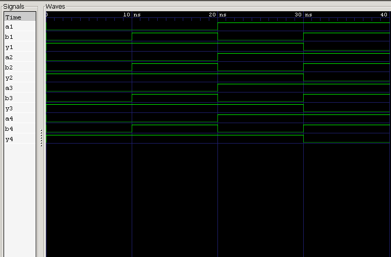

<div align="center">

#  01 — 7400 Quad 2-Input NAND Gate IC

### Behavioral Modeling & Verification of the 7400 TTL IC

*Project 01 of the **7400 Series ICs** module — [Verilog Fundamentals](#)*

[](#)
[](#)
[](#)
[](#)
[](#)

</div>

---

##  Overview

This project models and verifies the **7400 Quad 2-Input NAND Gate IC** in Verilog HDL — the first project in this repository to move from an *abstract logic gate* to a **real-world integrated circuit**.

The 7400 belongs to the **74xx TTL logic family** and packages **four independent 2-input NAND gates** into a single 14-pin DIP. It's one of the most iconic and widely used ICs in digital electronics history.

**In this project you will:**

- 🔹 Understand the 7400 TTL logic family
- 🔹 Model a Quad NAND Gate IC's internal architecture
- 🔹 Map out a real 14-pin DIP pinout
- 🔹 Behaviorally model an IC (not just a single gate) in Verilog
- 🔹 Verify all four gates independently with a testbench
- 🔹 Simulate with Icarus Verilog and inspect with GTKWave

---

##  Prerequisites

| Topic | Why it matters |
|---|---|
| Basic Digital Electronics | Understand IC-level organization |
| NAND Gate (Logic Gates §05) | Core logic function replicated 4× |
| Universal Gates | Context for NAND's importance |
| Continuous Assignment (`assign`) | Model each gate's behavior |
| Verilog Module Declaration | Structure a multi-gate IC |
| Testbench Fundamentals | Stimulate and verify the DUT |

---

##  Theory

The **7400** is a **Quad 2-Input NAND Gate IC** containing **four completely independent NAND gates** in one package — allowing four separate logic operations to run simultaneously.

Each gate implements:

$$Y = \overline{A \cdot B} \quad \text{(Verilog: } Y = \sim(A \mathbin{\&} B)\text{)}$$

Since each gate has **2 inputs**, every gate has:

$$2^2 = 4$$

possible input combinations — and because the four gates share no internal logic (only power), each can be tested and used entirely independently.

---

##  Internal Architecture

```
                        7400 IC
   ┌─────────────────────────────────────────────┐
   │                                                │
   │   Gate 1  ⎡A1,B1→Y1⎤     Gate 2  ⎡A2,B2→Y2⎤   │
   │                                                │
   │   Gate 3  ⎡A3,B3→Y3⎤     Gate 4  ⎡A4,B4→Y4⎤   │
   │                                                │
   └─────────────────────────────────────────────┘
```

Each gate has its own dedicated inputs and output, while all four share a common **VCC** and **GND**.

---

##  Pin Configuration

**14-Pin DIP Package**

```
              ┌─── ⏦ ───┐
       1A  ── │1      14│ ── VCC
       1B  ── │2      13│ ── 4B
       1Y  ── │3      12│ ── 4A
       2A  ── │4      11│ ── 4Y
       2B  ── │5      10│ ── 3B
       2Y  ── │6       9│ ── 3A
      GND  ── │7       8│ ── 3Y
              └──────────┘
```

| Pin | Signal | Pin | Signal |
|:-:|:--|:-:|:--|
| 1 | 1A (Gate 1 input) | 8 | 3Y (Gate 3 output) |
| 2 | 1B (Gate 1 input) | 9 | 3A (Gate 3 input) |
| 3 | 1Y (Gate 1 output) | 10 | 3B (Gate 3 input) |
| 4 | 2A (Gate 2 input) | 11 | 4Y (Gate 4 output) |
| 5 | 2B (Gate 2 input) | 12 | 4A (Gate 4 input) |
| 6 | 2Y (Gate 2 output) | 13 | 4B (Gate 4 input) |
| 7 | **GND** | 14 | **VCC** (+5V) |

> ⚡ **Power pins:** Pin 14 → VCC (+5V) · Pin 7 → GND

---

##  Truth Table

*(applies identically to all four gates)*

| A | B | Y |
|:-:|:-:|:-:|
| 0 | 0 | **1** |
| 0 | 1 | **1** |
| 1 | 0 | **1** |
| 1 | 1 | 0 |

---

##  Verilog Model

The IC is modeled as a single module containing **four independent NAND gates**, each driven by continuous assignment:

```verilog
module ic_7400 (
    input  wire a1, b1,   input  wire a2, b2,
    input  wire a3, b3,   input  wire a4, b4,
    output wire y1, y2, y3, y4
);

    assign y1 = ~(a1 & b1);   // Gate 1
    assign y2 = ~(a2 & b2);   // Gate 2
    assign y3 = ~(a3 & b3);   // Gate 3
    assign y4 = ~(a4 & b4);   // Gate 4

endmodule
```

| Element | Purpose |
|---|---|
| `a1,b1 … a4,b4` | Independent input pairs for each gate |
| `y1 … y4` | Independent outputs, one per gate |
| `assign yN = ~(aN & bN);` | Behavioral model of each NAND gate |

---

##  Testbench Strategy

The testbench exercises **each of the four gates independently**, applying all four input combinations to verify every gate matches the NAND truth table on its own.

### Expected Results *(per gate)*

| A | B | Y |
|:-:|:-:|:-:|
| 0 | 0 | **1** |
| 0 | 1 | **1** |
| 1 | 0 | **1** |
| 1 | 1 | 0 |

Since all four gates are functionally identical, the same truth table validates Gates 1–4.

---

##  Waveform



### Waveform Analysis

| Condition | Output | Explanation |
|---|:-:|---|
| Both inputs LOW | **HIGH** | ✅ matches NAND behavior |
| One input HIGH | **HIGH** | ✅ matches NAND behavior |
| Both inputs HIGH | **LOW** | ✅ matches NAND behavior |

The waveform confirms all four gates behave **correctly and independently**, with no interaction between gates beyond the shared power supply.

---

##  Applications

The 7400 IC has been a cornerstone of digital design for decades, appearing in:

<table>
<tr>
<td valign="top" width="50%">

**Logic & Arithmetic**
- Combinational logic circuits
- Adders
- Arithmetic Logic Units (ALUs)

</td>
<td valign="top" width="50%">

**Sequential Systems**
- Flip-flops & latches
- Counters
- CPU control logic

</td>
</tr>
</table>

---

##  Project Structure

```
01_7400_nand_ic/
├── README.md
├── 7400_nand_ic.v          # RTL design
├── 7400_nand_ic_tb.v        # Testbench
└── waveform.png                # GTKWave capture
```

---

##  How to Run

```bash
# 1. Compile design + testbench
iverilog -o 7400_nand_ic.out 7400_nand_ic.v 7400_nand_ic_tb.v

# 2. Run the simulation
vvp 7400_nand_ic.out

# 3. View waveform in GTKWave
gtkwave waveform.vcd
```

---

##  Key Concepts Learned

<table>
<tr>
<td valign="top" width="50%">

**IC & Hardware Concepts**
- 74xx TTL logic family
- Quad NAND Gate IC architecture
- 14-pin DIP package layout
- Pin configuration & power pins

</td>
<td valign="top" width="50%">

**Verilog & Verification**
- Multi-gate behavioral modeling
- Continuous assignment (`assign`)
- Testbench design & functional verification
- Icarus Verilog & GTKWave

</td>
</tr>
</table>

---

##  Learning Notes

This project marked a shift from modeling a **single abstract gate** to modeling a **real, physical integrated circuit** — complete with pinout, package layout, and power connections.

Modeling all four gates in one module reinforced that they are **fully independent** logic elements sharing only a power rail, and that verifying an IC means verifying *each* internal gate on its own terms, not just the package as a whole.

**Skills reinforced:**
- Multi-gate behavioral modeling
- Real-world IC pinout interpretation
- Independent-block functional verification
- RTL simulation workflow
- Bridging Verilog HDL with practical hardware components

---

##  Interview Questions

<details>
<summary><b>1. What is the 7400 IC?</b></summary>
<br>

A **Quad 2-Input NAND Gate Integrated Circuit** belonging to the **74xx TTL logic family**.
</details>

<details>
<summary><b>2. How many NAND gates are inside a 7400 IC?</b></summary>
<br>

Four independent 2-input NAND gates.
</details>

<details>
<summary><b>3. How many pins does the 7400 IC have?</b></summary>
<br>

14 pins.
</details>

<details>
<summary><b>4. Which pins provide power?</b></summary>
<br>

Pin 14 → VCC (+5V) · Pin 7 → GND
</details>

<details>
<summary><b>5. What Boolean equation does each gate implement?</b></summary>
<br>

$$Y = \overline{A \cdot B}$$
</details>

<details>
<summary><b>6. Why is the 7400 IC called a Quad NAND Gate?</b></summary>
<br>

Because it contains **four** independent NAND gates within a single package.
</details>

<details>
<summary><b>7. Can all four NAND gates operate simultaneously?</b></summary>
<br>

Yes — each gate is fully independent and can operate at the same time as the others.
</details>

<details>
<summary><b>8. Why should unused gate inputs never be left floating?</b></summary>
<br>

Floating inputs pick up electrical noise and can produce unpredictable output behavior. Unused inputs should always be tied to a defined logic level (VCC or GND).
</details>

---

##  Next Project

### [02 — 7402 Quad 2-Input NOR Gate IC →](#)

Coming up:
- 7402 IC architecture
- Quad NOR gate behavior
- Pin configuration
- Behavioral modeling & RTL simulation
- Waveform analysis

---

<div align="center">

##  Author

**Padma Charan S S**

**Repository:** Verilog Fundamentals · **Approach:** Project-Driven Learning

### 🗺️ Repository Roadmap

```
Basic Verilog → Logic Gates → 7400 Series ICs → Combinational Circuits
     → Sequential Logic → RTL Design → FPGA Design → Computer Architecture → CPU Design
```

*Every project teaches one new concept through practical implementation.*

---

> *"Understanding real integrated circuits bridges the gap between digital logic theory and practical hardware implementation."*

</div>