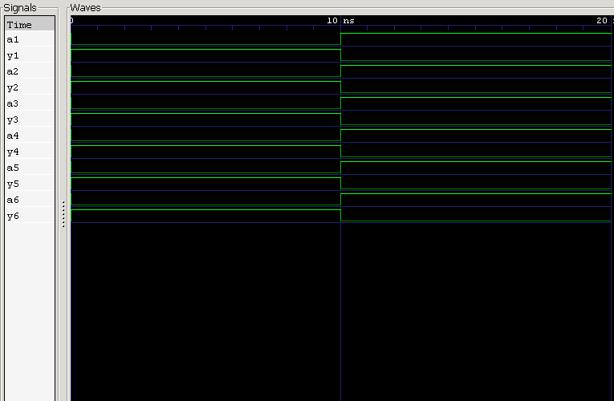

<div align="center">

#  03 — 7404 Hex Inverter IC

### Behavioral Modeling & Verification of the 7404 TTL IC

*Project 03 of the **7400 Series ICs** module — [Verilog Fundamentals](#)*

[](#)
[](#)
[](#)
[](#)
[](#)
[](#)

</div>

---

##  Overview

This project models and verifies the **7404 Hex Inverter IC** in Verilog HDL. Unlike the 7400 and 7402, which pack **four 2-input gates** into their 14-pin package, the 7404 packs **six single-input NOT gates** — the "Hex" in its name refers to this count of six.

Because each inverter only needs one input and one output, more gates fit into the same 14-pin footprint — a nice illustration of how **pin budget shapes IC design**.

**In this project you will:**

- 🔹 Understand why the 7404 fits six gates where others fit four
- 🔹 Model a Hex Inverter IC's internal architecture
- 🔹 Map out its 14-pin DIP pinout
- 🔹 Behaviorally model all six inverters in one Verilog module
- 🔹 Verify each inverter independently with a testbench
- 🔹 Simulate with Icarus Verilog and inspect with GTKWave

---

##  Prerequisites

| Topic | Why it matters |
|---|---|
| Basic Digital Electronics | Understand IC-level organization |
| NOT Gate (Logic Gates §01) | Core logic function replicated 6× |
| Continuous Assignment (`assign`) | Model each inverter's behavior |
| Verilog Module Declaration | Structure a multi-gate IC |
| Testbench Fundamentals | Stimulate and verify the DUT |
| 7400 / 7402 ICs (Projects 01–02) | Quad-gate IC organization for contrast |

---

## Theory

The **7404** is a **Hex Inverter IC** containing **six independent NOT gates**, each capable of inverting a separate signal simultaneously.

Each inverter implements:

$$Y = \bar{A} \quad \text{(Verilog: } Y = \sim A\text{)}$$

Since each inverter has only **one input**, there are:

$$2^1 = 2$$

possible input states per gate — half the combinations of a 2-input gate, which is exactly why **twice as many** inverters (six vs. four) fit in the same 14-pin package.

---

##  Internal Architecture

```
                       7404 IC
   ┌──────────────────────────────────────────┐
   │                                             │
   │   INV1 [A1→Y1]   INV2 [A2→Y2]   INV3 [A3→Y3] │
   │                                             │
   │   INV4 [A4→Y4]   INV5 [A5→Y5]   INV6 [A6→Y6] │
   │                                             │
   └──────────────────────────────────────────┘
```

Each inverter has one dedicated input and one output, while all six share a common **VCC** and **GND**.

---

##  Pin Configuration

**14-Pin DIP Package**

```
              ┌─── ⏦ ───┐
       1A  ── │1      14│ ── VCC
       1Y  ── │2      13│ ── 6A
       2A  ── │3      12│ ── 6Y
       2Y  ── │4      11│ ── 5A
       3A  ── │5      10│ ── 5Y
       3Y  ── │6       9│ ── 4A
      GND  ── │7       8│ ── 4Y
              └──────────┘
```

| Pin | Signal | Pin | Signal |
|:-:|:--|:-:|:--|
| 1 | 1A (Inv 1 input) | 8 | 4Y (Inv 4 output) |
| 2 | 1Y (Inv 1 output) | 9 | 4A (Inv 4 input) |
| 3 | 2A (Inv 2 input) | 10 | 5Y (Inv 5 output) |
| 4 | 2Y (Inv 2 output) | 11 | 5A (Inv 5 input) |
| 5 | 3A (Inv 3 input) | 12 | 6Y (Inv 6 output) |
| 6 | 3Y (Inv 3 output) | 13 | 6A (Inv 6 input) |
| 7 | **GND** | 14 | **VCC** (+5V) |

> ⚡ **Power pins:** Pin 14 → VCC (+5V) · Pin 7 → GND

---

##  Truth Table

*(applies identically to all six inverters)*

| A | Y |
|:-:|:-:|
| 0 | **1** |
| 1 | 0 |

---

##  Verilog Model

The IC is modeled as a single module containing **six independent NOT gates**, each driven by continuous assignment:

```verilog
module ic_7404 (
    input  wire a1, a2, a3, a4, a5, a6,
    output wire y1, y2, y3, y4, y5, y6
);

    assign y1 = ~a1;   // Inverter 1
    assign y2 = ~a2;   // Inverter 2
    assign y3 = ~a3;   // Inverter 3
    assign y4 = ~a4;   // Inverter 4
    assign y5 = ~a5;   // Inverter 5
    assign y6 = ~a6;   // Inverter 6

endmodule
```

| Element | Purpose |
|---|---|
| `a1 … a6` | Six independent single-bit inputs |
| `y1 … y6` | Six independent outputs, one per inverter |
| `assign yN = ~aN;` | Behavioral model of each NOT gate |

---

##  Testbench Strategy

The testbench exercises **each of the six inverters independently**, applying both possible input states to verify every gate matches the NOT truth table on its own.

### Expected Results *(per inverter)*

| A | Y |
|:-:|:-:|
| 0 | **1** |
| 1 | 0 |

Since all six inverters are functionally identical, the same truth table validates Inverters 1–6.

---

##  Waveform



### Waveform Analysis

| Condition | Output | Explanation |
|---|:-:|---|
| Input LOW | **HIGH** | ✅ matches NOT behavior |
| Input HIGH | **LOW** | ✅ matches NOT behavior |

The waveform confirms all six inverters behave **correctly and independently**, with no interaction between gates beyond the shared power supply.

---

##  Applications

The 7404 Hex Inverter is a general-purpose workhorse used throughout digital systems:

<table>
<tr>
<td valign="top" width="50%">

**Signal Handling**
- Signal inversion
- Logic-level conversion
- Digital signal conditioning

</td>
<td valign="top" width="50%">

**Timing & Control**
- Clock signal generation
- Oscillator circuits
- Timing & control circuits

</td>
</tr>
</table>

---

##  Project Structure

```
03_7404_hex_inverter_ic/
├── README.md
├── 7404_hex_inverter_ic.v          # RTL design
├── 7404_hex_inverter_ic_tb.v        # Testbench
└── waveform.png                        # GTKWave capture
```

---

##  How to Run

```bash
# 1. Compile design + testbench
iverilog -o 7404_hex_inverter_ic.out 7404_hex_inverter_ic.v 7404_hex_inverter_ic_tb.v

# 2. Run the simulation
vvp 7404_hex_inverter_ic.out

# 3. View waveform in GTKWave
gtkwave waveform.vcd
```

---

##  Key Concepts Learned

<table>
<tr>
<td valign="top" width="50%">

**IC & Hardware Concepts**
- 74xx TTL logic family
- Hex Inverter architecture
- 14-pin DIP package layout
- Pin configuration & power pins

</td>
<td valign="top" width="50%">

**Verilog & Verification**
- Multi-gate behavioral modeling
- Continuous assignment (`assign`)
- Testbench design & functional verification
- Icarus Verilog & GTKWave

</td>
</tr>
</table>

---

##  Learning Notes

This project highlighted a subtle but important IC-design idea: **gate count per package depends on pin budget, not just gate complexity**. Because a NOT gate needs only one input and one output, the 7404 fits **six** of them in the same 14-pin footprint that holds just **four** 2-input gates in the 7400 or 7402.

Modeling all six inverters in one module also reinforced the now-familiar pattern from the 7400 series: independent gates, shared power, individually verified — just scaled to a different gate count.

**Skills reinforced:**
- Multi-gate behavioral modeling
- Real-world IC pinout interpretation
- Independent-block functional verification
- Understanding pin-count trade-offs in IC design
- RTL simulation workflow

---

##  Interview Questions

<details>
<summary><b>1. What is the 7404 IC?</b></summary>
<br>

A **Hex Inverter Integrated Circuit** belonging to the **74xx TTL logic family**.
</details>

<details>
<summary><b>2. How many NOT gates are inside a 7404 IC?</b></summary>
<br>

Six independent NOT gates.
</details>

<details>
<summary><b>3. How many pins does the 7404 IC have?</b></summary>
<br>

14 pins.
</details>

<details>
<summary><b>4. Which pins provide power?</b></summary>
<br>

Pin 14 → VCC (+5V) · Pin 7 → GND
</details>

<details>
<summary><b>5. What Boolean equation does each inverter implement?</b></summary>
<br>

$$Y = \bar{A}$$
</details>

<details>
<summary><b>6. Why is the 7404 called a Hex Inverter?</b></summary>
<br>

Because it contains **six** independent NOT gates within a single integrated circuit.
</details>

<details>
<summary><b>7. Why can the 7404 fit six gates while most other 74xx ICs fit only four?</b></summary>
<br>

Each NOT gate needs just **one input and one output** (versus two inputs for AND/OR/NAND/NOR), so more gates fit within the same 14-pin package.
</details>

<details>
<summary><b>8. Can all six inverters operate simultaneously?</b></summary>
<br>

Yes — each inverter is fully independent and operates simultaneously with the others, sharing only the power supply.
</details>

---

##  Next Project

### [04 — 7408 Quad 2-Input AND Gate IC →](#)

Coming up:
- 7408 IC architecture
- Quad AND gate design
- Pin configuration
- Behavioral modeling & RTL simulation
- Waveform analysis

---

<div align="center">

## 👨‍💻 Author

**Padma Charan S S**

**Repository:** Verilog Fundamentals · **Approach:** Project-Driven Learning

### 🗺️ Repository Roadmap

```
Basic Verilog → Logic Gates → 7400 Series ICs → Combinational Circuits
     → Sequential Logic → RTL Design → FPGA Design → Computer Architecture → CPU Design
```

*Every project teaches one new concept through practical implementation.*

---

> *"The 7404 Hex Inverter demonstrates how simple logic functions are efficiently organized into standardized integrated circuits, forming the foundation of practical digital system design."*

</div>