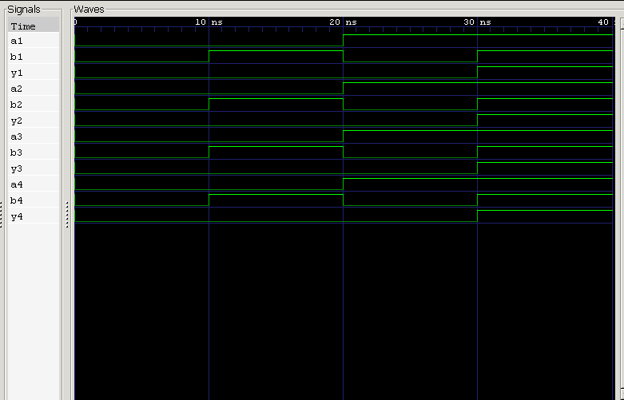

<div align="center">

# 7408 — Quad 2-Input AND Gate IC

**Behavioral Verilog Model · Testbench · RTL Simulation**

`Project 04` — 7400 Series ICs — *Verilog Fundamentals*


</div>

---

##  Overview

The **7408** is a member of the classic **74xx TTL logic family**, packing **four independent 2-input AND gates** into a single 14-pin DIP. It's one of the most fundamental building blocks in digital design — small enough to breadboard in minutes, foundational enough to show up inside ALUs, adders, and control logic decades later.

This project models the 7408 behaviorally in Verilog, verifies it against a testbench, and confirms correct operation via waveform analysis in GTKWave.

### What you'll learn

| Topic | Focus |
|---|---|
| 🔌 IC Architecture | Quad-gate internal organization |
| 📍 Pinout | 14-pin DIP mapping |
| 💻 HDL Modeling | Continuous assignments (`assign`) |
| 🧪 Verification | Testbench-driven functional checks |
| 🌊 Simulation | Icarus Verilog + GTKWave workflow |

---

##  Theory

Each of the four gates independently implements:

$$Y = A \cdot B$$

With 2 inputs per gate, each gate has $2^2 = 4$ possible input combinations — and all four gates run **in parallel**, sharing only power and ground.

| A | B | Y |
|:-:|:-:|:-:|
| 0 | 0 | **0** |
| 0 | 1 | **0** |
| 1 | 0 | **0** |
| 1 | 1 | **1** |

---

##  Internal Architecture

```
┌─────────────────────────────┐
│            7408 IC           │
│                               │
│   ┌────────┐    ┌────────┐   │
│   │ Gate 1 │    │ Gate 2 │   │
│   └────────┘    └────────┘   │
│                               │
│   ┌────────┐    ┌────────┐   │
│   │ Gate 3 │    │ Gate 4 │   │
│   └────────┘    └────────┘   │
│                               │
└─────────────────────────────┘
```

Four gates, one package, one shared supply — each gate otherwise fully independent.

---

##  Pin Configuration (14-Pin DIP)

```
        ┌──────∪──────┐
   1A ──┤ 1        14 ├── VCC
   1B ──┤ 2        13 ├── 4B
   1Y ──┤ 3        12 ├── 4A
   2A ──┤ 4        11 ├── 4Y
   2B ──┤ 5        10 ├── 3B
   2Y ──┤ 6         9 ├── 3A
  GND ──┤ 7         8 ├── 3Y
        └─────────────┘
```

| Pin | Signal | Pin | Signal |
|:-:|:-:|:-:|:-:|
| 1 | 1A | 8 | 3Y |
| 2 | 1B | 9 | 3A |
| 3 | 1Y | 10 | 3B |
| 4 | 2A | 11 | 4Y |
| 5 | 2B | 12 | 4A |
| 6 | 2Y | 13 | 4B |
| 7 | **GND** | 14 | **VCC (+5V)** |

---

##  Verilog Model

Each gate is expressed as a single continuous assignment — clean, synthesizable, and directly mirroring the truth table:

```verilog
assign y1 = a1 & b1;
assign y2 = a2 & b2;
assign y3 = a3 & b3;
assign y4 = a4 & b4;
```

---

##  Testbench

The testbench sweeps **all four input combinations** through **each of the four gates**, independently confirming that every gate on the die conforms to the AND truth table — not just gate 1.

---

##  Waveform



**Analysis:**
- Both inputs LOW → output LOW ✅
- One input HIGH → output stays LOW ✅
- Both inputs HIGH → output goes HIGH ✅
- All four gates behave identically and independently ✅

---

##  Real-World Applications

- Arithmetic Logic Units (ALUs)
- Half & Full Adders
- Address Decoding
- Enable / Register-Enable Logic
- Digital Control Systems
- General Combinational Logic

---

##  Project Structure

```
04_7408_and_ic/
├── README.md
├── 7408_and_ic.v
├── 7408_and_ic_tb.v
└── waveform.png
```

---

##  How to Run

```bash
# 1 — Compile
iverilog -o 7408_and_ic.out 7408_and_ic.v 7408_and_ic_tb.v

# 2 — Simulate
vvp 7408_and_ic.out

# 3 — View Waveform
gtkwave waveform.vcd
```

---

##  Key Concepts Learned

`74xx TTL Logic` · `Quad AND Gate` · `14-Pin DIP` · `Pin Configuration` · `Continuous Assignment` · `Behavioral Modeling` · `Testbench Development` · `RTL Simulation` · `GTKWave` · `Icarus Verilog`

---

##  Learning Notes

This project moved beyond a single AND gate to model a **complete commercial IC** — four gates, one package, one shared supply. Building it in Verilog clarified how real 74xx-series devices map onto HDL: each internal gate becomes its own independent logic path, verified separately but sharing infrastructure.

It reinforced how AND gates, despite being logically "incomplete" on their own, are indispensable building blocks across arithmetic and control logic.

---

## 💼 Interview Questions

<details>
<summary><b>1. What is the 7408 IC?</b></summary>
<br>
A Quad 2-Input AND Gate Integrated Circuit belonging to the 74xx TTL logic family.
</details>

<details>
<summary><b>2. How many AND gates are inside a 7408?</b></summary>
<br>
Four independent 2-input AND gates.
</details>

<details>
<summary><b>3. How many pins does the 7408 have?</b></summary>
<br>
14 pins.
</details>

<details>
<summary><b>4. Which pins provide power?</b></summary>
<br>
Pin 14 → VCC, Pin 7 → GND.
</details>

<details>
<summary><b>5. What Boolean equation does each gate implement?</b></summary>
<br>
Y = A · B
</details>

<details>
<summary><b>6. Can all four AND gates operate simultaneously?</b></summary>
<br>
Yes — each gate is fully independent and operates in parallel with the others.
</details>

<details>
<summary><b>7. Why isn't the 7408 a "universal gate" IC?</b></summary>
<br>
An AND gate alone can't implement every Boolean function. Unlike NAND or NOR, it can't construct all logic functions by itself.
</details>

<details>
<summary><b>8. Where is the 7408 commonly used?</b></summary>
<br>
ALUs, adders, control logic, address decoding, register-enable circuits, and general combinational logic.
</details>

---

##  Next Project

**05 — 7432 Quad 2-Input OR Gate IC**

Coming up: OR gate architecture, pin configuration, behavioral modeling, RTL simulation, and waveform analysis.

---

<div align="center">

## 👨‍💻 Author

**Padma Charan S S**
*Repository: Verilog Fundamentals — Project-Driven Learning*

</div>

### 🗺️ Repository Roadmap

```
Basic Verilog → Logic Gates → 7400 Series ICs → Combinational Circuits
      → Sequential Logic → RTL Design → FPGA Design
      → Computer Architecture → CPU Design
```

---

<div align="center">

*"The 7408 Quad AND Gate IC demonstrates how fundamental logical operations are packaged into standardized integrated circuits — the building blocks of arithmetic, control, and digital processing systems."*

</div>