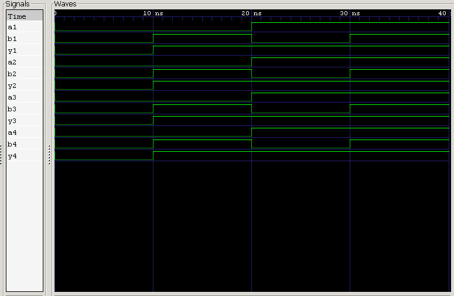

<div align="center">

# 7432 — Quad 2-Input OR Gate IC

**Behavioral Verilog Model · Testbench · RTL Simulation**

`Project 05` — 7400 Series ICs — *Verilog Fundamentals*


</div>

---

##  Overview

The **7432** is another staple of the **74xx TTL logic family**, packing **four independent 2-input OR gates** into a single 14-pin DIP. Wherever a circuit needs to ask "is *any* of these true?" — interrupt lines, control signals, decision logic — the OR gate is usually doing the asking.

This project models the 7432 behaviorally in Verilog, verifies it against a testbench, and confirms correct operation via waveform analysis in GTKWave.

### What you'll learn

| Topic | Focus |
|---|---|
| 🔌 IC Architecture | Quad-gate internal organization |
| 📍 Pinout | 14-pin DIP mapping |
| 💻 HDL Modeling | Continuous assignments (`assign`) |
| 🧪 Verification | Testbench-driven functional checks |
| 🌊 Simulation | Icarus Verilog + GTKWave workflow |

---

##  Theory

Each of the four gates independently implements:

$$Y = A + B$$

With 2 inputs per gate, each gate has $2^2 = 4$ possible input combinations — and all four gates run **in parallel**, sharing only power and ground.

| A | B | Y |
|:-:|:-:|:-:|
| 0 | 0 | **0** |
| 0 | 1 | **1** |
| 1 | 0 | **1** |
| 1 | 1 | **1** |

---

##  Internal Architecture

```
┌─────────────────────────────┐
│            7432 IC           │
│                               │
│   ┌────────┐    ┌────────┐   │
│   │ Gate 1 │    │ Gate 2 │   │
│   └────────┘    └────────┘   │
│                               │
│   ┌────────┐    ┌────────┐   │
│   │ Gate 3 │    │ Gate 4 │   │
│   └────────┘    └────────┘   │
│                               │
└─────────────────────────────┘
```

Four gates, one package, one shared supply — each gate otherwise fully independent.

---

##  Pin Configuration (14-Pin DIP)

```
        ┌──────∪──────┐
   1A ──┤ 1        14 ├── VCC
   1B ──┤ 2        13 ├── 4B
   1Y ──┤ 3        12 ├── 4A
   2A ──┤ 4        11 ├── 4Y
   2B ──┤ 5        10 ├── 3B
   2Y ──┤ 6         9 ├── 3A
  GND ──┤ 7         8 ├── 3Y
        └─────────────┘
```

| Pin | Signal | Pin | Signal |
|:-:|:-:|:-:|:-:|
| 1 | 1A | 8 | 3Y |
| 2 | 1B | 9 | 3A |
| 3 | 1Y | 10 | 3B |
| 4 | 2A | 11 | 4Y |
| 5 | 2B | 12 | 4A |
| 6 | 2Y | 13 | 4B |
| 7 | **GND** | 14 | **VCC (+5V)** |

---

##  Verilog Model

Each gate is expressed as a single continuous assignment — clean, synthesizable, and directly mirroring the truth table:

```verilog
assign y1 = a1 | b1;
assign y2 = a2 | b2;
assign y3 = a3 | b3;
assign y4 = a4 | b4;
```

---

##  Testbench

The testbench sweeps **all four input combinations** through **each of the four gates**, independently confirming that every gate on the die conforms to the OR truth table — not just gate 1.

---

##  Waveform



**Analysis:**
- Both inputs LOW → output LOW ✅
- Either input HIGH → output HIGH ✅
- Both inputs HIGH → output HIGH ✅
- All four gates behave identically and independently ✅

---

##  Real-World Applications

- Arithmetic Logic Units (ALUs)
- Interrupt Logic
- Address Decoding
- Control Signal Generation
- Decision / Enable Logic
- Combinational Circuits
- Embedded Digital Systems

---

##  Project Structure

```
05_7432_or_ic/
├── README.md
├── 7432_or_ic.v
├── 7432_or_ic_tb.v
└── waveform.png
```

---

##  How to Run

```bash
# 1 — Compile
iverilog -o 7432_or_ic.out 7432_or_ic.v 7432_or_ic_tb.v

# 2 — Simulate
vvp 7432_or_ic.out

# 3 — View Waveform
gtkwave waveform.vcd
```

---

##  Key Concepts Learned

`74xx TTL Logic` · `Quad OR Gate` · `14-Pin DIP` · `Pin Configuration` · `Continuous Assignment` · `Behavioral Modeling` · `Testbench Development` · `RTL Simulation` · `GTKWave` · `Icarus Verilog`

---

##  Learning Notes

This project extended the quad-gate modeling approach from the AND gate to the OR gate — same package layout, same verification flow, different Boolean logic. Seeing both side by side made it clear how consistently the 74xx family reuses architecture: four independent gates, one shared supply, one pinout convention.

It also reinforced why OR gates dominate decision and enable logic — any single active input is enough to drive the output HIGH.

---

##  Interview Questions

<details>
<summary><b>1. What is the 7432 IC?</b></summary>
<br>
A Quad 2-Input OR Gate Integrated Circuit belonging to the 74xx TTL logic family.
</details>

<details>
<summary><b>2. How many OR gates are inside a 7432?</b></summary>
<br>
Four independent 2-input OR gates.
</details>

<details>
<summary><b>3. How many pins does the 7432 have?</b></summary>
<br>
14 pins.
</details>

<details>
<summary><b>4. Which pins provide power?</b></summary>
<br>
Pin 14 → VCC, Pin 7 → GND.
</details>

<details>
<summary><b>5. What Boolean equation does each gate implement?</b></summary>
<br>
Y = A + B (A OR B)
</details>

<details>
<summary><b>6. Can all four OR gates operate simultaneously?</b></summary>
<br>
Yes — each gate is fully independent and operates in parallel with the others.
</details>

<details>
<summary><b>7. Is the OR gate a universal gate?</b></summary>
<br>
No. Unlike NAND or NOR, an OR gate alone cannot implement every Boolean function.
</details>

<details>
<summary><b>8. Where is the 7432 commonly used?</b></summary>
<br>
ALUs, control logic, address decoding, interrupt logic, combinational circuits, and digital processing systems.
</details>

---

##  Next Project

**06 — 7486 Quad 2-Input XOR Gate IC**

Coming up: XOR gate architecture, pin configuration, behavioral modeling, RTL simulation, and waveform analysis.

---

<div align="center">

## 👨‍💻 Author

**Padma Charan S S**
*Repository: Verilog Fundamentals — Project-Driven Learning*

</div>

### 🗺️ Repository Roadmap

```
Basic Verilog → Logic Gates → 7400 Series ICs → Combinational Circuits
      → Sequential Logic → RTL Design → FPGA Design
      → Computer Architecture → CPU Design
```

---

<div align="center">

*"The 7432 Quad OR Gate IC demonstrates how logical decision-making operations are implemented in standardized integrated circuits — an essential building block of digital systems."*

</div>