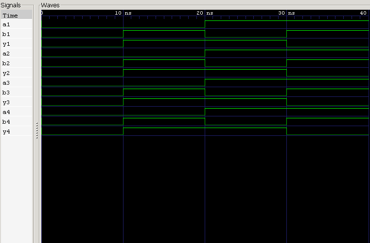

<div align="center">

# 7486 — Quad 2-Input XOR Gate IC

**Behavioral Verilog Model · Testbench · RTL Simulation**

`Project 06` — 7400 Series ICs — *Verilog Fundamentals*


</div>

---

##  Overview

The **7486** rounds out the core logic-gate trio of the **74xx TTL family**, packing **four independent 2-input XOR gates** into a single 14-pin DIP. Unlike AND or OR, the XOR gate cares about *difference* — its output goes HIGH only when its inputs disagree — which makes it the quiet workhorse behind adders, parity checks, and error detection.

This project models the 7486 behaviorally in Verilog, verifies it against a testbench, and confirms correct operation via waveform analysis in GTKWave.

### What you'll learn

| Topic | Focus |
|---|---|
| 🔌 IC Architecture | Quad-gate internal organization |
| 📍 Pinout | 14-pin DIP mapping |
| 💻 HDL Modeling | Continuous assignments (`assign`) |
| 🧪 Verification | Testbench-driven functional checks |
| 🌊 Simulation | Icarus Verilog + GTKWave workflow |

---

##  Theory

Each of the four gates independently implements:

$$Y = A \oplus B$$

equivalent to:

$$Y = (\overline{A} \cdot B) + (A \cdot \overline{B})$$

An XOR gate outputs HIGH **only when its two inputs differ**. With 2 inputs per gate, each gate has $2^2 = 4$ possible input combinations — and all four gates run **in parallel**, sharing only power and ground.

| A | B | Y |
|:-:|:-:|:-:|
| 0 | 0 | **0** |
| 0 | 1 | **1** |
| 1 | 0 | **1** |
| 1 | 1 | **0** |

---

##  Internal Architecture

```
┌─────────────────────────────┐
│            7486 IC           │
│                               │
│   ┌────────┐    ┌────────┐   │
│   │ Gate 1 │    │ Gate 2 │   │
│   └────────┘    └────────┘   │
│                               │
│   ┌────────┐    ┌────────┐   │
│   │ Gate 3 │    │ Gate 4 │   │
│   └────────┘    └────────┘   │
│                               │
└─────────────────────────────┘
```

Four gates, one package, one shared supply — each gate otherwise fully independent.

---

##  Pin Configuration (14-Pin DIP)

```
        ┌──────∪──────┐
   1A ──┤ 1        14 ├── VCC
   1B ──┤ 2        13 ├── 4B
   1Y ──┤ 3        12 ├── 4A
   2A ──┤ 4        11 ├── 4Y
   2B ──┤ 5        10 ├── 3B
   2Y ──┤ 6         9 ├── 3A
  GND ──┤ 7         8 ├── 3Y
        └─────────────┘
```

| Pin | Signal | Pin | Signal |
|:-:|:-:|:-:|:-:|
| 1 | 1A | 8 | 3Y |
| 2 | 1B | 9 | 3A |
| 3 | 1Y | 10 | 3B |
| 4 | 2A | 11 | 4Y |
| 5 | 2B | 12 | 4A |
| 6 | 2Y | 13 | 4B |
| 7 | **GND** | 14 | **VCC (+5V)** |

---

##  Verilog Model

Each gate is expressed as a single continuous assignment — clean, synthesizable, and directly mirroring the truth table:

```verilog
assign y1 = a1 ^ b1;
assign y2 = a2 ^ b2;
assign y3 = a3 ^ b3;
assign y4 = a4 ^ b4;
```

---

##  Testbench

The testbench sweeps **all four input combinations** through **each of the four gates**, independently confirming that every gate on the die conforms to the XOR truth table — not just gate 1.

---

##  Waveform



**Analysis:**
- Both inputs LOW → output LOW ✅
- Inputs differ → output HIGH ✅
- Both inputs HIGH → output LOW ✅
- All four gates behave identically and independently ✅

---

##  Real-World Applications

- Half & Full Adders
- Arithmetic Logic Units (ALUs)
- Parity Generators & Checkers
- Error Detection Circuits
- Binary Comparators
- Digital Communication Systems

---

##  Project Structure

```
06_7486_xor_ic/
├── README.md
├── 7486_xor_ic.v
├── 7486_xor_ic_tb.v
└── waveform.png
```

---

##  How to Run

```bash
# 1 — Compile
iverilog -o 7486_xor_ic.out 7486_xor_ic.v 7486_xor_ic_tb.v

# 2 — Simulate
vvp 7486_xor_ic.out

# 3 — View Waveform
gtkwave waveform.vcd
```

---

##  Key Concepts Learned

`74xx TTL Logic` · `Quad XOR Gate` · `Exclusive-OR Operation` · `14-Pin DIP` · `Pin Configuration` · `Continuous Assignment` · `Behavioral Modeling` · `RTL Simulation` · `GTKWave` · `Icarus Verilog`

---

##  Learning Notes

XOR closed the loop on the three fundamental 2-input gates covered in this chapter — AND, OR, and now XOR — each modeled with the same quad-gate, 14-pin package pattern. What stood out with the 7486 is how its "difference detector" behavior makes it uniquely suited to arithmetic: it's the core of every adder's sum bit and the backbone of parity-based error detection.

Seeing AND, OR, and XOR modeled back-to-back made the progression from *simple gates* → *commercial ICs* → *arithmetic building blocks* click into place.

---

##  Interview Questions

<details>
<summary><b>1. What is the 7486 IC?</b></summary>
<br>
A Quad 2-Input Exclusive-OR (XOR) Gate Integrated Circuit belonging to the 74xx TTL logic family.
</details>

<details>
<summary><b>2. How many XOR gates are inside a 7486?</b></summary>
<br>
Four independent 2-input XOR gates.
</details>

<details>
<summary><b>3. How many pins does the 7486 have?</b></summary>
<br>
14 pins.
</details>

<details>
<summary><b>4. Which pins provide power?</b></summary>
<br>
Pin 14 → VCC, Pin 7 → GND.
</details>

<details>
<summary><b>5. What Boolean equation does each gate implement?</b></summary>
<br>
Y = A ⊕ B, equivalently (Ā·B) + (A·B̄)
</details>

<details>
<summary><b>6. When does an XOR gate produce a HIGH output?</b></summary>
<br>
Only when its two inputs are different from each other.
</details>

<details>
<summary><b>7. Why is the XOR gate important?</b></summary>
<br>
It's central to arithmetic circuits (adder sum bits), parity generation, and error detection — making it far more than "just another gate."
</details>

<details>
<summary><b>8. Where is the 7486 commonly used?</b></summary>
<br>
Half/full adders, ALUs, parity generators and checkers, binary comparators, and digital communication systems.
</details>

---

##  Chapter Completion

With this project, the **7400 Series ICs** chapter is complete — AND, OR, and XOR gates have all been modeled, verified, and analyzed as real commercial ICs.

**Up next:** combining these gates and IC concepts into full **combinational circuits**.

---

<div align="center">

## 👨‍💻 Author

**Padma Charan S S**
*Repository: Verilog Fundamentals — Project-Driven Learning*

</div>

### 🗺️ Repository Roadmap

```
Basic Verilog → Logic Gates → 7400 Series ICs → Combinational Circuits
      → Sequential Logic → RTL Design → FPGA Design
      → Computer Architecture → CPU Design
```

---

<div align="center">

*"The 7486 Quad XOR Gate IC highlights the importance of exclusive-OR logic in arithmetic operations, parity generation, and error detection — an essential building block of modern digital systems."*

</div>