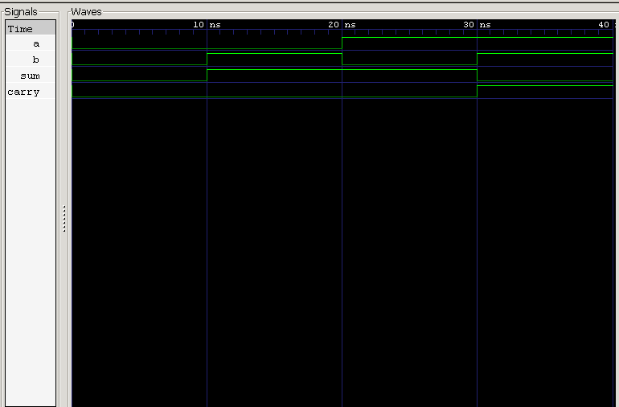

<div align="center">

# Half Adder

**Behavioral Verilog Model · Testbench · RTL Simulation**

`Project 01` — Combinational Circuits — *Verilog Fundamentals*


</div>

---

##  Overview

The **Half Adder** is the first true arithmetic circuit in digital electronics — the moment logic gates stop just gating and start *computing*. It adds two single-bit binary numbers and produces a **Sum** and a **Carry**, using nothing more than an XOR gate and an AND gate.

This marks the transition point in the repository: from modeling individual gates and commercial ICs to building actual **combinational circuits** out of them.

### What you'll learn

| Topic | Focus |
|---|---|
| ➕ Arithmetic | Single-bit binary addition |
| 🧩 Circuit Design | Composing gates into a functional block |
| 💻 HDL Modeling | Continuous assignments (`assign`) |
| 🧪 Verification | Testbench-driven functional checks |
| 🌊 Simulation | Icarus Verilog + GTKWave workflow |

---

##  Theory

A Half Adder takes two single-bit inputs, **A** and **B**, and produces two outputs:

$$Sum = A \oplus B$$

$$Carry = A \cdot B$$

**Sum** comes from an XOR gate, **Carry** comes from an AND gate — that's the entire circuit. The name "half" reflects what it's missing: a **Carry-In**, which means it can only ever add two bits, never chain onto a previous addition.

| A | B | Sum | Carry |
|:-:|:-:|:---:|:-----:|
| 0 | 0 | **0** | **0** |
| 0 | 1 | **1** | **0** |
| 1 | 0 | **1** | **0** |
| 1 | 1 | **0** | **1** |

---

##  Circuit Implementation

```
   A ──┬────────────┐
       │            │
       │    XOR   ──┼───► Sum
       │            │
   B ──┼────────────┘
       │
       │    AND   ──────► Carry
       │
   A ──┘   B ──┘
```

Both gates share the same two inputs — Sum and Carry are generated **independently and simultaneously**.

---

##  Verilog Model

Two continuous assignments — one gate each — fully describe the circuit:

```verilog
assign sum   = a ^ b;
assign carry = a & b;
```

---

##  Testbench

The testbench sweeps **all four input combinations** and checks both `sum` and `carry` against the expected truth table at every step.

---

##  Waveform



**Analysis:**
- Both inputs LOW → Sum LOW, Carry LOW ✅
- One input HIGH → Sum HIGH, Carry LOW ✅
- Both inputs HIGH → Sum LOW, Carry HIGH ✅
- Confirms correct single-bit binary addition ✅

---

##  Real-World Applications

- Arithmetic Logic Units (ALUs)
- Binary Adder Chains
- Digital Processors
- Building Block for Full Adders
- FPGA Arithmetic Datapaths
- Educational Digital Circuits

---

##  Project Structure

```
01_half_adder/
├── README.md
├── half_adder.v
├── half_adder_tb.v
└── waveform.png
```

---

##  How to Run

```bash
# 1 — Compile
iverilog -o half_adder.out half_adder.v half_adder_tb.v

# 2 — Simulate
vvp half_adder.out

# 3 — View Waveform
gtkwave waveform.vcd
```

---

##  Key Concepts Learned

`Half Adder` · `Binary Addition` · `XOR Gate` · `AND Gate` · `Sum Generation` · `Carry Generation` · `Combinational Logic` · `Continuous Assignment` · `RTL Simulation` · `GTKWave` · `Icarus Verilog`

---

##  Learning Notes

This project marked the shift from modeling gates and ICs to actually **building something** with them. Seeing Sum and Carry fall out of just two gate instantiations made the connection between Boolean algebra and real arithmetic hardware concrete for the first time.

It also set up the natural next question: what happens when you need to chain additions together? That's exactly the gap a Full Adder fills.

---

##  Interview Questions

<details>
<summary><b>1. What is a Half Adder?</b></summary>
<br>
A combinational circuit that adds two single-bit binary inputs and produces a Sum and a Carry output.
</details>

<details>
<summary><b>2. Why is it called a "Half" Adder?</b></summary>
<br>
Because it has no Carry-In input — it can only add two raw bits, not chain onto a previous addition.
</details>

<details>
<summary><b>3. Which logic gates are used?</b></summary>
<br>
An XOR gate generates the Sum; an AND gate generates the Carry.
</details>

<details>
<summary><b>4. What are the Boolean equations?</b></summary>
<br>
Sum = A ⊕ B, Carry = A · B
</details>

<details>
<summary><b>5. How many inputs and outputs does a Half Adder have?</b></summary>
<br>
2 inputs (A, B), 2 outputs (Sum, Carry).
</details>

<details>
<summary><b>6. Can a Half Adder add three bits?</b></summary>
<br>
No — without a Carry-In, it's limited to adding exactly two input bits.
</details>

<details>
<summary><b>7. Where is a Half Adder used?</b></summary>
<br>
Arithmetic circuits, ALUs, binary adders, FPGA datapaths, and as the core building block inside a Full Adder.
</details>

---

##  Next Project

**02 — Full Adder**

Coming up: Carry-In / Carry-Out handling, cascaded addition, arithmetic circuit design, RTL simulation, and waveform analysis.

---

<div align="center">

## 👨‍💻 Author

**Padma Charan S S**
*Repository: Verilog Fundamentals — Project-Driven Learning*

</div>

### 🗺️ Repository Roadmap

```
Basic Verilog → Logic Gates → 7400 Series ICs → Combinational Circuits
      → Sequential Logic → RTL Design → FPGA Design
      → Computer Architecture → CPU Design
```

---

<div align="center">

*"The Half Adder is the first arithmetic circuit in digital electronics, demonstrating how simple logic gates combine to perform binary addition and laying the foundation for larger arithmetic systems."*

</div>