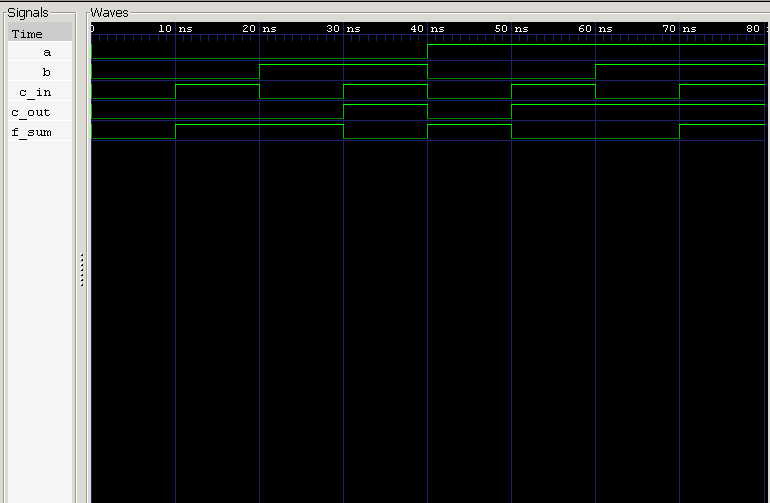

<div align="center">

# Full Adder — Structural Design (Two Half Adders)

**Structural Verilog Model · Testbench · RTL Simulation**

`Project 02A` — Combinational Circuits — *Verilog Fundamentals*


</div>

---

##  Overview

The **Full Adder** picks up where the Half Adder left off — it adds a third input, **Carry-In**, making true multi-bit addition possible. Instead of writing its Boolean equations from scratch, this project builds it **structurally**, by instantiating two already-verified Half Adder modules and combining their carries with a single OR gate.

This is the repository's first real taste of **hierarchical hardware design**: composing bigger, more capable circuits out of smaller, trusted building blocks rather than re-deriving everything at the gate level.

### What you'll learn

| Topic | Focus |
|---|---|
| 🧩 Hierarchical Design | Building circuits from reusable sub-modules |
| 🔗 Module Instantiation | Wiring Half Adders into a larger structure |
| ➕ Arithmetic | Three-bit addition with carry propagation |
| 🧪 Verification | Testbench-driven functional checks |
| 🌊 Simulation | Icarus Verilog + GTKWave workflow |

---

##  Theory

A Full Adder adds **three** single-bit inputs — **A**, **B**, and **Carry-In (Cin)** — and produces:

- **Sum**
- **Carry-Out (Cout)**

The key difference from a Half Adder: it can absorb a carry from a previous stage, which is exactly what's needed to chain adders together for multi-bit arithmetic.

Rather than implementing this directly with Boolean equations, this design reuses:

- **Two Half Adders**
- **One OR gate**

| A | B | Cin | Sum | Cout |
|:-:|:-:|:---:|:---:|:----:|
| 0 | 0 | 0 | **0** | **0** |
| 0 | 0 | 1 | **1** | **0** |
| 0 | 1 | 0 | **1** | **0** |
| 0 | 1 | 1 | **0** | **1** |
| 1 | 0 | 0 | **1** | **0** |
| 1 | 0 | 1 | **0** | **1** |
| 1 | 1 | 0 | **0** | **1** |
| 1 | 1 | 1 | **1** | **1** |

---

##  Circuit Implementation

```
                ┌─────────────┐
   A ───────────┤             ├── Sum1 ──┐    ┌─────────────┐
                │  Half Adder │          ├────┤             ├── Final Sum
   B ───────────┤     HA1     │          │    │  Half Adder │
                │             ├── Carry1─┼─┐  │     HA2     │
                └─────────────┘          │ │  ├── Carry2────┤
                                          │ │  │             │
   Cin ────────────────────────────────────┼──┘             │
                                          │ │  └─────────────┘
                                          │ │
                                          ▼ ▼
                                        ┌─────┐
                                        │ OR  ├───► Carry Out
                                        └─────┘
```

---

##  Design Methodology

**Step 1 — First Half Adder:** adds `A + B`
→ produces `Sum1`, `Carry1`

**Step 2 — Second Half Adder:** adds `Sum1 + Cin`
→ produces `Final Sum`, `Carry2`

**Step 3 — Combine carries:**
```
Carry Out = Carry1 | Carry2
```

Only one of the two Half Adders can ever produce a carry at a time, so a simple OR is enough to merge them correctly.

---

##  Verilog Model

The design is purely **structural** — no Boolean equations at this level, just instantiation and wiring:

- Two instantiated `half_adder` modules
- One OR gate combining the intermediate carries
- Internal wires (`sum1`, `carry1`, `carry2`) linking the stages

---

##  Testbench

The testbench sweeps **all eight possible input combinations** of `A`, `B`, and `Cin`, checking `sum` and `cout` against the full 3-input truth table at every step.

---

##  Waveform



**Analysis:**
- Sum correctly reflects the parity of all three inputs ✅
- Carry-Out correctly asserts whenever two or more inputs are HIGH ✅
- Carry propagates correctly through both Half Adder stages ✅
- Structural implementation matches the standard Full Adder truth table exactly ✅

---

##  Real-World Applications

- Arithmetic Logic Units (ALUs)
- Ripple Carry Adders
- Multi-bit Binary Adders
- Digital Signal Processing
- Processors & Microcontrollers
- FPGA Arithmetic Datapaths

---

## Project Structure

```
01_using_half_adder/
├── README.md
├── half_adder.v
├── full_adder.v
├── full_adder_tb.v
└── waveform.png
```

---

##  How to Run

```bash
# 1 — Compile (include the reused Half Adder module)
iverilog -o full_adder.out half_adder.v full_adder.v full_adder_tb.v

# 2 — Simulate
vvp full_adder.out

# 3 — View Waveform
gtkwave waveform.vcd
```

---

##  Key Concepts Learned

`Full Adder` · `Structural Modeling` · `Hierarchical Design` · `Module Reuse` · `Module Instantiation` · `Internal Wire Connections` · `Carry Propagation` · `RTL Simulation` · `GTKWave` · `Icarus Verilog`

---

##  Learning Notes

This project was the first time a circuit in this repository was built by **reusing** a previously verified module instead of writing logic from scratch. Wiring two Half Adders together with one OR gate and getting a fully correct Full Adder out the other end made the value of hierarchical design click immediately — smaller, trusted blocks compose into bigger, still-trustworthy systems.

It's a methodology that scales directly into professional FPGA and ASIC RTL development, where nobody re-derives an adder's Boolean equations every time one is needed.

---

##  Interview Questions

<details>
<summary><b>1. Why is a Full Adder needed?</b></summary>
<br>
Because it adds three inputs — including a Carry-In — making it suitable for chained, multi-bit addition.
</details>

<details>
<summary><b>2. Why can't a Half Adder replace a Full Adder?</b></summary>
<br>
A Half Adder has no Carry-In input, so it can't accept a carry propagated from a previous stage.
</details>

<details>
<summary><b>3. How many Half Adders are required to build a Full Adder?</b></summary>
<br>
Two.
</details>

<details>
<summary><b>4. Why is an OR gate required?</b></summary>
<br>
To combine the two Carry outputs (Carry1 and Carry2) from the Half Adders into the final Carry-Out.
</details>

<details>
<summary><b>5. What is hierarchical design?</b></summary>
<br>
The practice of building larger hardware modules by instantiating and wiring together smaller, already-verified reusable modules.
</details>

---

##  Next Project

**Full Adder — Behavioral Modeling**

The same Full Adder, rebuilt using direct Boolean equations instead of module instantiation — a direct comparison between structural and behavioral design styles.

---

<div align="center">

## 👨‍💻 Author

**Padma Charan S S**
*Repository: Verilog Fundamentals — Project-Driven Learning*

</div>

### 🗺️ Repository Roadmap

```
Basic Verilog → Logic Gates → 7400 Series ICs → Combinational Circuits
      → Sequential Logic → RTL Design → FPGA Design
      → Computer Architecture → CPU Design
```

---

<div align="center">

*"Hierarchical design enables complex digital systems to be built from smaller, reusable hardware modules, improving readability, scalability, and maintainability."*

</div>