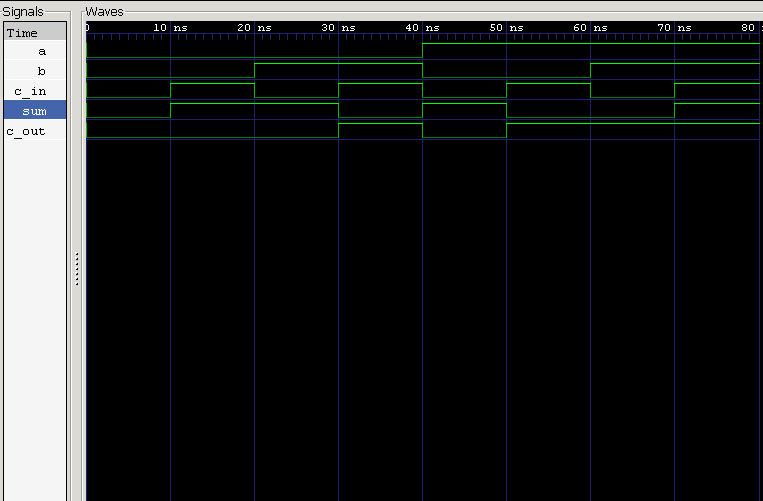

<div align="center">

# Full Adder — Behavioral Modeling

**Dataflow Verilog Model · Testbench · RTL Simulation**

`Project 16(B)` — Combinational Circuits — *Verilog Fundamentals*


</div>

---

## s Overview

Same circuit, different lens. Where the previous project built a Full Adder **structurally** by instantiating two Half Adders and an OR gate, this one describes the **exact same behavior** in two lines of Boolean logic — no submodules, no hierarchy, just direct dataflow.

It's a compact but important lesson: the same hardware function can be expressed either by *how it's built* (structural) or by *what it does* (behavioral), and Verilog supports both fluently.

### What you'll learn

| Topic | Focus |
|---|---|
| ⚡ Dataflow Modeling | Describing logic directly via Boolean equations |
| ➕ Arithmetic | Three-bit addition with carry propagation |
| 🔀 Style Comparison | Structural vs. behavioral tradeoffs |
| 🧪 Verification | Testbench-driven functional checks |
| 🌊 Simulation | Icarus Verilog + GTKWave workflow |

---

##  Theory

A Full Adder adds three single-bit inputs — **A**, **B**, and **Carry-In (Cin)** — and produces:

- **Sum**
- **Carry-Out (Cout)**

This project skips module reuse entirely and implements the circuit's behavior directly from its Boolean equations:

$$Sum = A \oplus B \oplus C_{in}$$

$$C_{out} = (A \cdot B) + \big(C_{in} \cdot (A \oplus B)\big)$$

| A | B | Cin | Sum | Cout |
|:-:|:-:|:---:|:---:|:----:|
| 0 | 0 | 0 | **0** | **0** |
| 0 | 0 | 1 | **1** | **0** |
| 0 | 1 | 0 | **1** | **0** |
| 0 | 1 | 1 | **0** | **1** |
| 1 | 0 | 0 | **1** | **0** |
| 1 | 0 | 1 | **0** | **1** |
| 1 | 1 | 0 | **0** | **1** |
| 1 | 1 | 1 | **1** | **1** |

---

##  Verilog Model

Two continuous assignments capture the entire Full Adder — no instantiation required:

```verilog
assign f_sum = a ^ b ^ c_in;
assign c_out = (a & b) | (c_in & (a ^ b));
```

Compare this to the structural version's two `half_adder` instances plus an OR gate — same truth table, radically different amount of code.

---

##  Testbench

The testbench sweeps **all eight possible input combinations** of `A`, `B`, and `Cin`, checking `sum` and `cout` against the full 3-input truth table at every step.

---

##  Waveform



**Analysis:**
- Sum correctly tracks the XOR relationship across all three inputs ✅
- Carry-Out goes HIGH whenever two or more inputs are HIGH ✅
- All eight combinations match the expected truth table exactly ✅

---

##  Real-World Applications

- Arithmetic Logic Units (ALUs)
- Ripple Carry Adders
- Binary Adders
- Digital Processors & Microcontrollers
- FPGA / ASIC Arithmetic Datapaths

---

##  Project Structure

```
02_behavioral/
├── README.md
├── full_adder.v
├── full_adder_tb.v
└── waveform.png
```

---

##  How to Run

```bash
# 1 — Compile
iverilog -o full_adder.out full_adder.v full_adder_tb.v

# 2 — Simulate
vvp full_adder.out

# 3 — View Waveform
gtkwave waveform.vcd
```

---

##  Key Concepts Learned

`Full Adder` · `Behavioral Modeling` · `Continuous Assignment` · `Boolean Equations` · `Carry Propagation` · `RTL Simulation` · `GTKWave` · `Icarus Verilog`

---

##  Structural vs. Behavioral

| | Structural (16A) | Behavioral (16B) |
|---|---|---|
| **Approach** | Instantiates Half Adder modules | Direct Boolean equations |
| **Logic reuse** | Reuses verified sub-modules | Implements logic from scratch |
| **Design style** | Hierarchical | Dataflow |
| **Best for** | Learning hardware hierarchy | Compact, simple combinational logic |
| **Code size** | Larger (module wiring) | Smaller (2 assignments) |

---

##  Learning Notes

Building the same Full Adder twice — once structurally, once behaviorally — made the distinction between the two modeling styles tangible rather than theoretical. The structural version taught hierarchy and reuse; this one showed how concise a circuit's *description* can be once you already know its Boolean equations.

Neither approach is "better" in isolation — structural scales better for reuse and readability in large designs, while behavioral is faster to write for small, well-understood logic. Knowing when to reach for each is its own skill.

---

##  Interview Questions

<details>
<summary><b>1. What is a Full Adder?</b></summary>
<br>
A combinational circuit that adds three one-bit binary inputs (A, B, Cin) and produces a Sum and a Carry-Out.
</details>

<details>
<summary><b>2. What's the difference between a Half Adder and a Full Adder?</b></summary>
<br>
A Half Adder adds only two inputs; a Full Adder also accepts a Carry-In, enabling chained multi-bit addition.
</details>

<details>
<summary><b>3. What are the Boolean equations of a Full Adder?</b></summary>
<br>
Sum = A ⊕ B ⊕ Cin, Cout = (A·B) + (Cin·(A⊕B))
</details>

<details>
<summary><b>4. What modeling style is used in this project?</b></summary>
<br>
Behavioral (dataflow) modeling, via continuous assignments.
</details>

<details>
<summary><b>5. Which implementation is more modular — this one, or the structural version?</b></summary>
<br>
The structural implementation (two Half Adders + an OR gate) is more modular, since it reuses already-verified hardware modules rather than re-deriving logic.
</details>

---

<div align="center">

## 👨‍💻 Author

**Padma Charan S S**
*Repository: Verilog Fundamentals — Project-Driven Learning*

</div>

### 🗺️ Repository Roadmap

```
Basic Verilog → Logic Gates → 7400 Series ICs → Combinational Circuits
      → Sequential Logic → RTL Design → FPGA Design
      → Computer Architecture → CPU Design
```

---

<div align="center">

*"Behavioral modeling focuses on describing what a circuit does, while structural modeling focuses on describing how the circuit is built."*

</div>