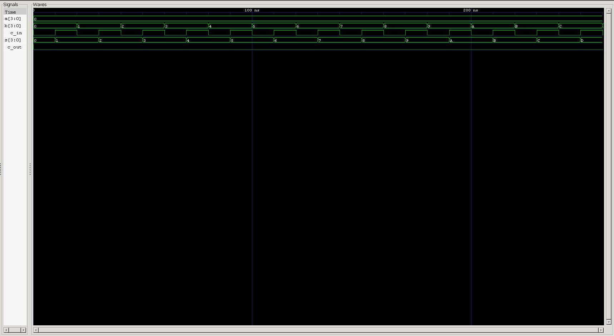

<div align="center">

# Carry Lookahead Adder (CLA)

**Dataflow Verilog Model · Generate/Propagate Logic · Automated & Self-Checking Testbenches**

`Project 04` — Combinational Circuits — *Verilog Fundamentals*


</div>

---

## 📖 Overview

A **Carry Lookahead Adder (CLA)** is a high-speed combinational circuit for binary addition. Where a Ripple Carry Adder forces every Full Adder to wait for the carry from the stage before it, a CLA **predicts every carry in advance** using **Generate** and **Propagate** logic — computed directly from the inputs, in parallel, with no waiting in the chain at all.

The tradeoff is more gates for less delay — a tradeoff that gets more and more worthwhile the wider the adder gets, which is exactly why CLAs (or CLA-based hybrid architectures) show up in real high-performance ALUs.

### What you'll learn

| Topic | Focus |
|---|---|
| ⚡ Parallel Carry Computation | Eliminating sequential ripple delay |
| 🧮 Generate & Propagate Logic | The two signals that make lookahead possible |
| 📐 Boolean Carry Equations | Deriving each carry directly from inputs |
| 💻 HDL Modeling | Pure dataflow, vector-based signal declarations |
| 🤖 Verification | Standard + self-checking testbenches |
| 🌊 Simulation | Icarus Verilog + GTKWave workflow |

---

## 🐢 Why Carry Lookahead?

A Ripple Carry Adder computes its carries **sequentially**:

```
FA0 → FA1 → FA2 → FA3
```

Each Full Adder has to wait for the carry produced by the previous stage before it can finish its own computation — and that wait compounds as bit-width grows, since propagation delay increases roughly linearly with the number of bits.

A Carry Lookahead Adder sidesteps this entirely by computing **every** carry signal simultaneously, using combinational logic derived straight from the input bits.

---

## 🧮 Generate and Propagate Logic

Two signals are computed for every bit position:

### Generate (G)

A carry is **generated** whenever both input bits are `1` — this stage produces a carry on its own, regardless of any incoming carry.

$$G_i = A_i \cdot B_i$$

### Propagate (P)

A carry is **propagated** whenever exactly one input bit is `1` — this stage passes an incoming carry straight through to the next stage.

$$P_i = A_i \oplus B_i$$

Crucially, both `G` and `P` depend **only on the input operands**, not on any carry — which is exactly what makes them safe to compute for all bit positions at the same time.

---

## ⚙️ Carry Equations

For a 4-bit Carry Lookahead Adder, every carry is expressed purely in terms of `G`, `P`, and the initial `C0`:

$$C_1 = G_0 + P_0 C_0$$

$$C_2 = G_1 + P_1 G_0 + P_1 P_0 C_0$$

$$C_3 = G_2 + P_2 G_1 + P_2 P_1 G_0 + P_2 P_1 P_0 C_0$$

$$C_4 = G_3 + P_3 G_2 + P_3 P_2 G_1 + P_3 P_2 P_1 G_0 + P_3 P_2 P_1 P_0 C_0$$

Because none of these equations depend on a *previously computed* carry — only on `G`, `P`, and `C0` — every carry output can be evaluated at the same time, in parallel.

---

## 🔁 How the Carry Lookahead Adder Works

The CLA computes addition in two clean stages:

### Step 1 — Generate & Propagate

For every bit position, `Gi = Ai & Bi` and `Pi = Ai ^ Bi` are computed. Since these depend only on the raw inputs, they're all available immediately and simultaneously.

### Step 2 — Carry Computation

Using the carry equations above, every carry output (`C1`–`C4`) is computed directly and in parallel — no stage has to wait on another.

### Step 3 — Sum Computation

Once carries are available, the sum bits fall out immediately:

$$S_i = P_i \oplus C_i$$

Since every carry is already known by this point, sum computation doesn't wait on any ripple either.

```
     Inputs
        │
        ▼
Generate & Propagate Logic
        │
        ▼
 Carry Lookahead Logic
        │
        ▼
All Carry Outputs Generated Together
        │
        ▼
     Sum Outputs
```

---

## 🚀 Why Is Carry Lookahead Faster?

In a Ripple Carry Adder, total delay grows roughly linearly with bit-width, because each stage's output depends on the one before it finishing first.

In a Carry Lookahead Adder, every carry is derived directly from the Generate/Propagate signals and `C0` — none of them depend on another carry being computed first. That parallelism is what collapses the critical path, making the CLA dramatically faster than an RCA, especially as bit-width scales up.

---

## 💻 Verilog Implementation

The Carry Lookahead Adder is implemented entirely with **continuous assignments (`assign`)** — no procedural blocks required, since every signal here is a pure function of other signals.

**Internal Signals**

```verilog
wire [3:0] g;   // Generate signals
wire [3:0] p;   // Propagate signals
wire [4:0] c;   // Carry signals
```

**Design Features**

- Pure combinational logic
- Parallel carry generation
- Vector-based signal declarations
- Readable, modular RTL structure
- Fully synthesizable Verilog

---

## 📊 Example

| A | B | Cin | Sum | Cout |
|:----:|:----:|:---:|:----:|:----:|
| 0101 | 0011 | 0 | 1000 | 0 |
| 1111 | 0001 | 0 | 0000 | 1 |
| 1010 | 0110 | 1 | 0001 | 1 |

These cases demonstrate correct addition across a range of inputs, including carry generation and overflow.

---

## 🌊 Waveform



The simulation waveform verifies correct operation of the Carry Lookahead Adder across multiple input combinations — confirming that Sum and Carry-Out track the expected results at every step, with all carries resolving in parallel rather than rippling stage-by-stage.

---

## ✅ Advantages

- Faster than a Ripple Carry Adder
- Parallel carry computation
- Significantly reduced propagation delay
- Well-suited to high-speed processors and arithmetic units
- Widely used as a building block inside larger, hybrid adder architectures

## ⚠️ Limitations

- Requires more combinational logic than a Ripple Carry Adder
- Hardware complexity grows with bit-width
- Larger CLAs consume more area and power due to the additional gate count

---

## 📂 Project Structure

```
04_combinational_circuits/
└── 04_carry_lookahead_adder/
    ├── carry_lookahead_adder.v
    ├── carry_lookahead_adder_tb.v
    ├── carry_lookahead_adder_self_checking_tb.v
    ├── waveform.png
    └── README.md
```

---

## ▶️ How to Run

```bash
# 1 — Compile
iverilog -o cla.out carry_lookahead_adder.v carry_lookahead_adder_tb.v

# 2 — Simulate
vvp cla.out

# 3 — View Waveform
gtkwave cla.vcd
```

---

## 🎯 Key Learning Outcomes

After completing this project, you'll understand:

- The difference between a Ripple Carry Adder and a Carry Lookahead Adder
- Carry propagation delay, and why it matters at scale
- Generate and Propagate logic
- The Carry Lookahead equations and how they're derived
- Parallel carry computation
- Vector-based wire declarations
- Designing combinational circuits purely with continuous assignments
- Writing both standard and self-checking testbenches

---

## 🏁 Conclusion

The Carry Lookahead Adder improves the speed of binary addition by eliminating the sequential carry propagation inherent to Ripple Carry Adders. By computing every carry signal in parallel through Generate and Propagate logic, it achieves substantially lower propagation delay — making it a foundational building block in high-performance digital systems and modern processors.

---

<div align="center">

## 👨‍💻 Author

**Padma Charan S S**
*Repository: Verilog Fundamentals — Project-Driven Learning*

</div>

### 🗺️ Repository Roadmap

```
Basic Verilog → Logic Gates → 7400 Series ICs → Combinational Circuits
      → Sequential Circuits → RTL Design → Verification Methodologies
      → FPGA Design → Computer Architecture → Mini CPU Design
```