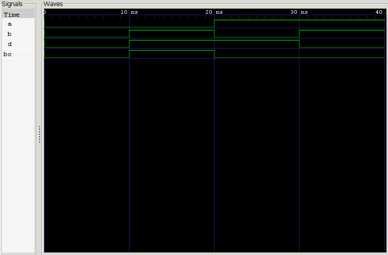

<div align="center">

# Half Subtractor

**Behavioral Verilog Model · Automated & Self-Checking Testbenches · RTL Verification**

`Project 04` — Combinational Circuits — *Verilog Fundamentals*


</div>

---

## 📖 Overview

If the Half Adder introduced arithmetic, the **Half Subtractor** introduces its opposite — and a new complication. Subtraction isn't just addition in reverse: when the minuend is smaller than the subtrahend, the circuit has to **borrow**, a concept with no equivalent in addition.

This project models a Half Subtractor behaviorally in Verilog — two inputs (**Minuend A**, **Subtrahend B**), two outputs (**Difference**, **Borrow**) — and carries forward the automated + self-checking verification methodology introduced in the Ripple Carry Adder project, applying it to a smaller, more focused circuit.

### What you'll learn

| Topic | Focus |
|---|---|
| ➖ Binary Subtraction | Difference and Borrow generation |
| 🔄 Borrow vs. Carry | Where the two concepts diverge |
| 💻 HDL Modeling | Continuous assignments (`assign`) |
| 🤖 Automated Testing | Exhaustive coverage via `for`-loop input generation |
| ✅ Self-Checking Verification | Expected-vs-actual comparison, PASS/FAIL reporting |
| 🌊 Simulation | Icarus Verilog + GTKWave workflow |

---

## 🧠 Theory

A Half Subtractor subtracts one single-bit binary number from another. It takes two inputs:

- **A** — the Minuend
- **B** — the Subtrahend

and produces two outputs:

- **Difference**
- **Borrow**

Unlike a Full Subtractor, it has **no Borrow-In input** — it can only ever subtract two raw bits. Whenever `A` is smaller than `B`, the circuit borrows a binary `1` from the next higher bit position to complete the subtraction.

$$Difference = A \oplus B$$

$$Borrow = \overline{A} \cdot B$$

**Difference** comes from an XOR gate; **Borrow** comes from inverting `A` and ANDing the result with `B`.

| A | B | Difference | Borrow |
|:-:|:-:|:----------:|:------:|
| 0 | 0 | **0** | **0** |
| 0 | 1 | **1** | **1** |
| 1 | 0 | **1** | **0** |
| 1 | 1 | **0** | **0** |

---

## ⚙️ Working Principle

Consider two subtraction cases:

**Case 1 — No borrow needed:**
$$1 - 0 = 1, \quad Borrow = 0$$

**Case 2 — Borrow required:**
$$0 - 1 \;\; \text{cannot be performed directly}$$

The circuit borrows `1` from the next higher bit position:

$$10_2 - 1_2 = 1_2 \implies Difference = 1,\; Borrow = 1$$

This borrow mechanism — pulling a `1` from a higher bit position when the local subtraction goes negative — is the key concept this circuit introduces.

---

## 🏗️ Circuit Implementation

Two small logic paths, sharing the same two inputs:

```
  Difference

   A ──┬──────────────┐
       │     XOR     ──┼──► Difference
   B ──┴──────────────┘


  Borrow

   A ──► NOT ──┐
               │    AND   ──► Borrow
   B ──────────┴──────────┘
```

`Difference` comes straight from an XOR of `A` and `B`. `Borrow` requires one extra step — invert `A` first, then AND with `B`.

---

## 💻 Verilog Model

Two continuous assignments fully describe the circuit:

```verilog
assign difference = a ^ b;
assign borrow     = ~a & b;
```

`difference` is a direct XOR; `borrow` complements `A` and ANDs it with `B` — a concise behavioral description that maps directly onto the Boolean equations above.

---

## 🧪 Testbench

Two independent testbenches verify this design:

1. An **automated testbench** that applies every possible input combination and exposes the results via waveform
2. A **self-checking testbench** that compares the DUT's output against an internally calculated expected result — no manual waveform inspection required

This mirrors the verification workflow carried over from the Ripple Carry Adder project, applied here to a much smaller input space.

### 🤖 Automated Testbench

With only two inputs, `A` and `B`, the Half Subtractor has:

$$2^2 = 4 \text{ possible input combinations}$$

Rather than hardcoding each case, a `for` loop combined with vector concatenation (`{A, B}`) sweeps from `0` to `3`, covering all four combinations automatically. During simulation, the testbench:

- Generates all input combinations automatically
- Applies each test case every 10 ns
- Displays simulation results
- Generates a VCD waveform file
- Supports waveform visualization in GTKWave

### ✅ Self-Checking Testbench

This extends the automated testbench so the simulator can judge its own results. Expected outputs are computed internally from the Boolean equations:

```verilog
Difference = A ^ B
Borrow     = ~A & B
```

```
Expected Output ──► Comparator ◄── DUT Output
                         │
                    PASS / FAIL
```

- **Match** → `PASS`
- **Mismatch** → full debug info is printed: test case number, input values, expected Difference/Borrow, and actual DUT Difference/Borrow

At the end of simulation, a verification summary confirms whether every test case passed. Only four cases exist here, but the exact same methodology scales to circuits with far larger input spaces — as the Ripple Carry Adder project already demonstrated.

---

## 📊 Expected Simulation Result

With only two input signals, there are just 4 total test cases. A correct implementation prints:

```
======================================
All 4 Test Cases Completed

RESULT : ALL TEST CASES PASSED
======================================
```

Any mismatch is reported immediately, with the failing test case and full debug detail — making design errors easy to pinpoint.

---

## 🌊 Waveform



**Analysis:**
- All four input combinations are swept sequentially ✅
- Difference correctly follows the XOR relationship ✅
- Borrow goes HIGH only when `A = 0` and `B = 1` ✅
- No unknown (`X`) or high-impedance (`Z`) states observed ✅
- Confirms correct single-bit binary subtraction ✅

---

## 🏗️ Engineering Insight

The Half Subtractor is a tiny circuit, but it introduces one of the most important ideas in digital arithmetic: **borrow generation**.

Borrowing happens whenever the minuend is smaller than the subtrahend — `0 - 1` can't be computed directly, so the circuit borrows a `1` from the next higher bit position:

$$10_2 - 1_2 = 1_2$$

As subtraction circuits grow wider, this borrow has to propagate through multiple stages — leading to **Ripple Borrow Subtractors**, conceptually the direct counterpart of Ripple Carry Adders.

In practice, though, modern processors rarely build dedicated subtraction hardware at all. Subtraction is usually performed via **2's complement arithmetic**, letting the same adder hardware handle both addition and subtraction. Understanding the Half Subtractor is still essential groundwork — it's the conceptual bridge to Full Subtractors, Ripple Borrow Subtractors, and the arithmetic units inside real CPUs.

From a verification standpoint, this project reinforces just how much automated and self-checking methodologies pay off — even on a circuit this small, they eliminate manual effort and raise confidence in RTL correctness.

---

## ⚠️ Common Beginner Mistakes

- Confusing Borrow with Carry
- Forgetting to invert input `A` while generating Borrow
- Writing the Borrow equation as `A & ~B` (incorrect — should be `~A & B`)
- Connecting Difference and Borrow outputs in the wrong order
- Comparing outputs before the DUT has actually updated
- Forgetting to initialize verification counters in the self-checking testbench
- Assuming Borrow behaves the same as Carry

---

## 🌟 Real-World Applications

- Binary Arithmetic Circuits
- Arithmetic Logic Units (ALUs)
- Digital Processors & Microcontrollers
- FPGA / ASIC Designs
- Building block for Full Subtractors
- Building block for Ripple Borrow Subtractors

---

## 📂 Project Structure

```
04_half_subtractor/
├── rtl/
│   └── half_subtractor.v
│
├── tb/
│   ├── half_subtractor_tb.v
│   └── half_subtractor_self_checking_tb.v
│
├── README.md
└── waveform.png
```

---

## ▶️ How to Run

```bash
# 1 — Compile (automated testbench)
iverilog -o half_subtractor.out rtl/half_subtractor.v tb/half_subtractor_tb.v

# — or, compile with the self-checking testbench instead
iverilog -o half_subtractor.out rtl/half_subtractor.v tb/half_subtractor_self_checking_tb.v

# 2 — Simulate
vvp half_subtractor.out

# 3 — View Waveform
gtkwave waveform.vcd
```

---

## 🎯 Key Concepts Learned

**Digital Electronics**
`Half Subtractor` · `Binary Subtraction` · `Difference Generation` · `Borrow Generation`

**Verilog HDL**
`Behavioral Modeling` · `Continuous Assignment` · `Boolean Expressions` · `Logic Operators`

**Verification**
`Automated Testbench` · `Self-Checking Testbench` · `Expected Result Generation` · `PASS/FAIL Reporting` · `Waveform Generation` · `GTKWave Verification`

---

## 📝 Learning Notes

This project introduced binary subtraction as its own arithmetic operation — not just addition run backwards. Where a Half Adder generates a Carry, the Half Subtractor generates a **Borrow** whenever the minuend is smaller than the subtrahend, and that single difference changes the entire logic structure: Difference still comes from a plain XOR, but Borrow needs the extra inversion (`~A & B`) that has no counterpart in the adder.

This project also reinforced the automated and self-checking verification methodology introduced with the Ripple Carry Adder, showing how the same approach applies cleanly to a much smaller circuit — verification discipline doesn't scale down any less rigorously than it scales up.

Understanding the Half Subtractor sets up the natural next step: what happens when a Borrow-In needs to be accepted from a previous stage? That's exactly the gap a Full Subtractor fills.

---

## 💼 Interview Questions

<details>
<summary><b>1. What is a Half Subtractor?</b></summary>
<br>
A combinational logic circuit that subtracts one single-bit binary number from another, producing Difference and Borrow outputs.
</details>

<details>
<summary><b>2. Why is it called a Half Subtractor?</b></summary>
<br>
Because it performs subtraction without considering a Borrow-In input.
</details>

<details>
<summary><b>3. What are the inputs and outputs of a Half Subtractor?</b></summary>
<br>
Inputs: A (Minuend), B (Subtrahend). Outputs: Difference, Borrow.
</details>

<details>
<summary><b>4. What are the Boolean equations?</b></summary>
<br>
Difference = A ⊕ B, Borrow = Ā · B
</details>

<details>
<summary><b>5. Which logic gates are required to implement a Half Subtractor?</b></summary>
<br>
An XOR gate, a NOT gate, and an AND gate.
</details>

<details>
<summary><b>6. When does the Borrow output become HIGH?</b></summary>
<br>
Only when A = 0 and B = 1 — subtraction requires borrowing from the next higher bit.
</details>

<details>
<summary><b>7. What is the difference between Carry and Borrow?</b></summary>
<br>
Carry is generated during addition when the result exceeds the available bit width. Borrow is generated during subtraction when the minuend is smaller than the subtrahend.
</details>

<details>
<summary><b>8. Can a Half Subtractor subtract three bits?</b></summary>
<br>
No — it has no Borrow-In input. Subtraction involving a Borrow-In requires a Full Subtractor.
</details>

<details>
<summary><b>9. Why is automated verification useful?</b></summary>
<br>
It applies every possible input combination without manual intervention, reducing human effort and ensuring complete functional coverage.
</details>

<details>
<summary><b>10. Why is a self-checking testbench important?</b></summary>
<br>
It automatically compares the DUT output with the expected result, reports failures, and produces a verification summary — no manual waveform inspection required.
</details>

---

## 📈 Project Evolution

**Previous project — 03: 4-bit Ripple Carry Adder**
Introduced structural modeling, module instantiation, vectors and buses, automated verification, and self-checking testbenches.

**New concepts introduced here**

| Domain | Concepts |
|---|---|
| Digital Electronics | Half Subtractor, Borrow Generation, Binary Subtraction |
| Verification | Reusing automated verification and self-checking methodology on a smaller circuit |
| Engineering | Understanding Borrow vs. Carry |

**Next project — 05: Full Subtractor**
Coming up: Full Subtractor architecture, Borrow-In / Borrow-Out, cascaded subtraction, structural design, and hierarchical RTL modeling.

---

<div align="center">

## 👨‍💻 Author

**Padma Charan S S**
*Repository: Verilog Fundamentals — Project-Driven Learning*

</div>

### 🗺️ Repository Roadmap

```
Basic Verilog → Logic Gates → 7400 Series ICs → Combinational Circuits
      → Sequential Circuits → RTL Design → Verification Methodologies
      → FPGA Design → Computer Architecture → Mini CPU Design
```

The goal isn't just to learn Verilog syntax, but to understand how professional digital systems are designed, verified, documented, and organized.

---

## 📚 References

- Morris Mano — *Digital Design*
- M. Morris Mano & Michael Ciletti — *Digital Design with HDL*
- Samir Palnitkar — *Verilog HDL*
- Stephen Brown & Zvonko Vranesic — *Fundamentals of Digital Logic with Verilog Design*

---

<div align="center">

*"The Half Subtractor introduces the concept of borrowing in binary arithmetic, showing that digital subtraction is not simply the opposite of addition. It lays the foundation for larger subtraction circuits and prepares the path toward complete arithmetic units used in modern digital systems."*

</div>