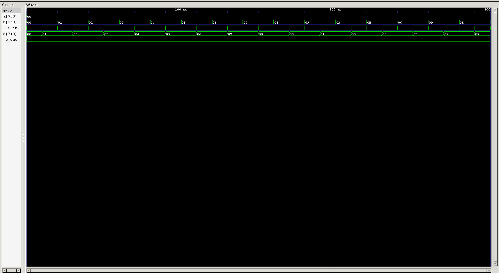

<div align="center">

# Carry Select Adder (CSA)

**Structural Verilog Model · Parameterized RTL · Automated & Self-Checking Testbenches**

`Project 05` — Combinational Circuits — *Verilog Fundamentals*


</div>

---

## 📖 Overview

A **Carry Select Adder (CSA)** is a high-speed combinational circuit that trades hardware for speed. Instead of waiting for the actual carry from the previous stage, a CSA computes the addition for **both possible carry inputs — `0` and `1` — simultaneously**, then picks the correct result the instant the real carry arrives.

This gives most of the speed benefit of a Carry Lookahead Adder without needing to derive its increasingly hairy carry equations — the tradeoff shifts from "complex logic" to "duplicated hardware" instead.

### What you'll learn

| Topic | Focus |
|---|---|
| ⚡ Speculative Computation | Computing both carry outcomes in parallel |
| 🔀 MUX-Based Selection | Choosing the correct result after the fact |
| 🧩 Structural Reuse | Building from previously-verified RCA modules |
| ⚙️ Parameterized RTL | Configurable bit-width via `parameter` |
| 🤖 Verification | Standard + self-checking testbenches |
| 🌊 Simulation | Icarus Verilog + GTKWave workflow |

---

## 🐢 Why Carry Select Adder?

In a Ripple Carry Adder, every stage waits for the carry produced by the one before it:

```
FA0 → FA1 → FA2 → FA3 → ...
```

Delay grows with bit-width. A Carry Lookahead Adder fixes this with Generate/Propagate logic, but the carry equations get progressively uglier as the adder gets wider.

The Carry Select Adder takes a different route entirely: rather than computing the carry faster, it **stops waiting on it** — by computing both possible outcomes ahead of time and picking the right one once the real answer is known.

---

## 💡 Basic Idea

The whole architecture rests on one simple observation: **a block's Carry-In can only ever be `0` or `1`.**

**Case 1 — Assume Cin = 0**
→ Compute `Sum0`, `Carry0`

**Case 2 — Assume Cin = 1**
→ Compute `Sum1`, `Carry1`

Both cases are computed **at the same time**. Once the actual carry arrives from the lower block, a **2×1 multiplexer** picks the correct Sum and Carry — collapsing what would've been a full ripple-through into a single MUX delay.

---

## ⚙️ How the Carry Select Adder Works

### Step 1 — Divide the Adder into Blocks

Rather than one long Ripple Carry Adder, the operand is split into smaller blocks. For an 8-bit CSA:

```
8-bit Adder = 4-bit Lower Block + 4-bit Upper Block
```

The lower block performs ordinary Ripple Carry Addition using the *actual* carry input.

### Step 2 — Compute the Lower Block

The lower 4-bit RCA takes `A[3:0]`, `B[3:0]`, and `Cin`, and produces `Sum[3:0]` and `Carry_Lower`. This carry is the value that will eventually decide which upper result is correct.

### Step 3 — Compute Both Upper Results Simultaneously

Rather than waiting on `Carry_Lower`, the upper half runs **two independent additions at once**:

- **RCA #1** assumes `Cin = 0` → produces `Sum0`, `Carry0`
- **RCA #2** assumes `Cin = 1` → produces `Sum1`, `Carry1`

Neither one waits on the other, and neither waits on the real carry — both simply run in parallel with the lower block.

### Step 4 — Select the Correct Result

Once the lower block finishes, `Carry_Lower` becomes available and acts as the **select line** for the multiplexers:

- `Carry_Lower = 0` → select `Sum0`, `Carry0`
- `Carry_Lower = 1` → select `Sum1`, `Carry1`

The only delay added *after* the real carry is known is a single multiplexer switch — nowhere close to a full ripple through another 4-bit adder.

---

## 🏗️ Carry Select Adder Architecture

```
              ┌─────────────────────────┐
              │  Lower 4-bit RCA        │
              │     (Actual Cin)        │
              └───────────┬─────────────┘
                           │
                  Sum[3:0] │   Carry_Out
                           │
              ┌────────────┴────────────┐
              │                         │
              ▼                         ▼
   ┌─────────────────────┐   ┌─────────────────────┐
   │ Upper RCA            │   │ Upper RCA            │
   │    Cin = 0           │   │    Cin = 1           │
   └─────────────────────┘   └─────────────────────┘
   │ Sum0     Carry0      │   │ Sum1     Carry1      │
   └───────────┬───────────┘   └───────────┬───────────┘
               │                            │
               └─────────────┬──────────────┘
                              │
                    2×1 Multiplexers
                    (select = Carry_Out)
                              │
                              ▼
                    Final Sum[7:4]
                    Final Carry-Out
```

The lower RCA generates the real carry while both upper RCAs race ahead computing both possible answers — the multiplexers then resolve the correct one.

---

## ⚡ Why Is Carry Select Adder Faster?

**Ripple Carry Adder:**
```
Lower Block → Wait for Carry → Upper Block Starts Computing
```

**Carry Select Adder:**
```
Lower Block Computes
           │
Upper Block (Cin=0) Computes ─┐
Upper Block (Cin=1) Computes ─┤── (in parallel with the lower block)
           │                  │
      Carry Arrives ◄─────────┘
           │
    MUX Selects Correct Result
```

Because a multiplexer switch is dramatically faster than another full Ripple Carry Adder, replacing "wait for the upper block to start" with "wait for a MUX to switch" collapses a large chunk of the critical path.

---

## 💻 Verilog Implementation

Implemented using **structural modeling** — instantiating previously-verified **Ripple Carry Adder** modules and combining them with **2×1 multiplexers**, rather than writing new arithmetic logic from scratch.

**Structure:**
- One 4-bit RCA for the lower block
- Two 4-bit RCAs for the upper block — one assuming `Cin = 0`, one assuming `Cin = 1`
- Multiplexers that select the correct upper Sum/Carry based on the carry from the lower block

This promotes module reuse, keeps the code readable, and is a clean demonstration of hierarchical hardware design — the same RCA verified back in Project 03 gets instantiated three separate times here without modification.

### Parameterized Design

This project also introduces **parameters** — compile-time constants that let a module be configured without touching its internal logic:

```verilog
parameter N = 8;
```

Instead of hardcoding widths:

```verilog
input [7:0] a;
input [7:0] b;
```

the design uses the parameter directly:

```verilog
input [N-1:0] a;
input [N-1:0] b;
```

Changing `N` automatically resizes every related signal — making the module reusable across bit-widths instead of locked to one.

---

## 📂 Project Structure

```
carry_select_adder/
├── rtl/
│   └── carry_select_adder.v
│
├── tb/
│   ├── carry_select_adder_tb.v
│   └── carry_select_adder_self_tb.v
│
├── waveform.png
└── README.md
```

---

## ▶️ How to Run

```bash
# 1 — Compile
iverilog -o carry_select_adder.out carry_select_adder.v carry_select_adder_tb.v

# 2 — Simulate
vvp carry_select_adder.out

# 3 — View Waveform
gtkwave carry_select_adder.vcd
```

---

## 📊 Example

| A | B | Cin | Sum | Cout |
|:--------:|:--------:|:---:|:--------:|:----:|
| 00001111 | 00000001 | 0 | 00010000 | 0 |
| 11110000 | 00010000 | 0 | 00000000 | 1 |
| 10101010 | 01010101 | 0 | 11111111 | 0 |
| 11111111 | 00000001 | 0 | 00000000 | 1 |

---

## 🌊 Waveform



**Analysis:**
- The lower Ripple Carry Adder computes the actual carry ✅
- Both upper Ripple Carry Adders operate simultaneously ✅
- The multiplexers correctly select the appropriate Sum and Carry ✅
- Outputs match expected arithmetic results across all test cases ✅

---

## ✅ Advantages

- Faster than a Ripple Carry Adder
- Simpler architecture than a Carry Lookahead Adder
- Parallel computation reduces carry propagation delay
- Reuses Ripple Carry Adder modules — modular by design
- Easy to understand and implement
- A solid fit for medium-speed arithmetic circuits
- Demonstrates hierarchical and structural hardware design

## ⚠️ Limitations

- Requires extra hardware — two Ripple Carry Adders per upper block
- Consumes more silicon area than a plain Ripple Carry Adder
- Multiplexer delay still exists, even if small
- Less area-efficient than Ripple Carry Adders
- Generally slower than Carry Lookahead, Carry Skip, Carry Save, or Parallel Prefix Adders in very high-performance processors

---

## 🌟 Applications

- Arithmetic Logic Units (ALUs)
- Digital Signal Processing (DSP) systems
- FPGA designs
- Medium-speed ASIC arithmetic units
- Embedded processors
- Digital communication hardware
- Custom VLSI arithmetic circuits

---

## 🎯 Learning Outcomes

After completing this project, you'll understand:

- Carry propagation delay in Ripple Carry Adders
- Parallel computation as a technique in Carry Select Adders
- Structural modeling in Verilog
- Module instantiation and hierarchy
- Hardware optimization via parallel processing
- Multiplexer-based output selection
- Parameterized RTL design using `parameter`
- Writing reusable, scalable Verilog modules

---

## 🔑 Key Takeaways

- A CSA improves speed by **computing both possible carry cases simultaneously**
- The lower block generates the actual carry
- Two upper Ripple Carry Adders assume `Cin = 0` and `Cin = 1` respectively
- Multiplexers select the correct result once the actual carry is known
- Parallel computation cuts carry propagation delay compared to a plain RCA
- The design showcases **structural modeling**, **module reuse**, **hierarchical design**, and **parameterized RTL** — all central to real-world digital system design

---

## 🏁 Conclusion

The Carry Select Adder improves addition speed by computing the upper-half results for both possible carry inputs simultaneously, then selecting the correct output with multiplexers. It requires more hardware than a Ripple Carry Adder, but the reduction in propagation delay makes it a practical, well-balanced tradeoff between speed and complexity.

This project ties together several important digital design concepts — **parallel computation**, **hierarchical module design**, **parameterized RTL**, and **hardware optimization** — making it a genuine building block of high-performance arithmetic circuits.

---

<div align="center">

## 👨‍💻 Author

**Padma Charan S S**
*Repository: Verilog Fundamentals — Project-Driven Learning*

</div>

### 🗺️ Repository Roadmap

```
Basic Verilog → Logic Gates → 7400 Series ICs → Combinational Circuits
      → Sequential Circuits → RTL Design → Verification Methodologies
      → FPGA Design → Computer Architecture → Mini CPU Design
```