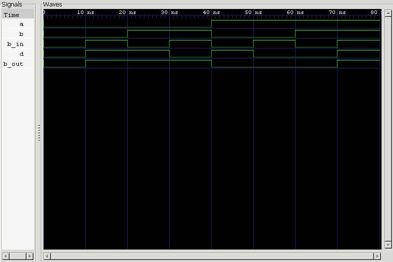

<div align="center">

# Full Subtractor

**Structural Verilog Model · Named Port Mapping · Automated & Self-Checking Testbenches**

`Project 05` — Combinational Circuits — *Verilog Fundamentals*


</div>

---

## 📖 Objective

The objective of this project is to design and verify a **1-bit Full Subtractor** using Verilog HDL. Unlike a Half Subtractor, a Full Subtractor accounts for an additional **Borrow-In** input, letting it perform binary subtraction across multiple cascaded stages in larger arithmetic circuits.

This project covers both the hardware implementation and the verification methodology needed to build reliable combinational logic — reusing the Half Subtractor built in the previous project as a trusted sub-block.

### What you'll learn

| Topic | Focus |
|---|---|
| ➖ Multi-Stage Subtraction | Borrow-In / Borrow-Out handling |
| 🧩 Hierarchical Design | Building a Full Subtractor from two Half Subtractors |
| 🔌 Named Port Mapping | Connecting instantiated modules explicitly and safely |
| 🤖 Automated Testing | Exhaustive coverage via `for`-loop input generation |
| ✅ Self-Checking Verification | Expected-vs-actual comparison, PASS/FAIL reporting |
| 🌊 Simulation | Icarus Verilog + GTKWave workflow |

---

## 🧠 Theory

A **Full Subtractor** is a combinational logic circuit that subtracts two single-bit binary numbers while also accounting for a borrow from the previous stage.

**Three Inputs**
- `A` — Minuend
- `B` — Subtrahend
- `Borrow-In (B_in)`

**Two Outputs**
- `Difference (D)`
- `Borrow-Out (B_out)`

It extends a Half Subtractor by folding in the Borrow-In signal, which is exactly what makes it suitable for chaining into multi-bit subtraction circuits.

### Boolean Expressions

$$Difference = A \oplus B \oplus B_{in}$$

$$Borrow\text{-}Out = (\overline{A} \cdot B) + (\overline{A} \cdot B_{in}) + (B \cdot B_{in})$$

---

## 📊 Truth Table

| A | B | Borrow-In | Difference | Borrow-Out |
|:-:|:-:|:---------:|:----------:|:----------:|
| 0 | 0 | 0 | **0** | **0** |
| 0 | 0 | 1 | **1** | **1** |
| 0 | 1 | 0 | **1** | **1** |
| 0 | 1 | 1 | **0** | **1** |
| 1 | 0 | 0 | **1** | **0** |
| 1 | 0 | 1 | **0** | **0** |
| 1 | 1 | 0 | **0** | **0** |
| 1 | 1 | 1 | **1** | **1** |

---

## 🏗️ Hardware Implementation

Built from two reusable Half Subtractors and one OR gate:

```
    A ──┐
        │      ┌──────────────┐
    B ──┴─────►│ Half         │
               │ Subtractor 1 │
               └──────┬───────┘
                       │
              diff1 ───┼─────────┐   borrow1
                       │         │      │
                       ▼         │      │
               ┌──────────────┐ │      │
  Borrow-In ──►│ Half         │ │      │
               │ Subtractor 2 │ │      │
               └──────┬───────┘ │      │
                       │         │      │
                  Difference     ▼      ▼
                              ┌────────────┐
                              │     OR     │──► Borrow-Out
                              └────────────┘
                                borrow1 | borrow2
```

The first Half Subtractor computes `A − B`, producing an intermediate `Difference1` and `Borrow1`. The second subtracts `Borrow-In` from that intermediate difference, producing the final `Difference` and `Borrow2`. The two borrow signals are then OR'd together into the final `Borrow-Out`.

---

## 💻 RTL Design

The Full Subtractor is implemented using a **structural modeling approach**: two Half Subtractor modules are instantiated and wired together using **named port mapping**, rather than positional connections.

**Step 1 — First Half Subtractor:** computes `A − B`
→ produces `diff1` (intermediate Difference), `borrow1` (intermediate Borrow)

**Step 2 — Second Half Subtractor:** computes `diff1 − Borrow-In`
→ produces `d` (final Difference), `borrow2` (intermediate Borrow)

**Step 3 — Combine borrows:**
```verilog
Borrow-Out = borrow1 | borrow2
```

This hierarchical structure closely mirrors real digital hardware design and demonstrates genuine module reusability — the same Half Subtractor verified in Project 04 gets instantiated twice here without modification.

Named port mapping (`.a(a)`, `.b(b)`, `.diff(diff1)`, ...) is used deliberately over positional mapping, since it makes the wiring self-documenting and immune to accidental port-order mistakes.

---

## 🤖 Automated Testbench

Rather than manually writing out every input combination, a `for` loop generates all possible cases automatically. The three inputs — `A`, `B`, and `Borrow-In` — are grouped via vector concatenation:

```verilog
{a, b, b_in} = i;
```

With three inputs, the Full Subtractor has:

$$2^3 = 8 \text{ possible input combinations}$$

all generated automatically by the loop. The waveform is captured for GTKWave inspection via:

```verilog
$dumpfile("waveform.vcd");
$dumpvars(0, full_sub_tb);
```

---

## ✅ Self-Checking Verification

To remove manual inspection entirely, the testbench computes expected outputs directly from the Boolean equations:

```verilog
expected_d = a ^ b ^ b_in;
expected_b = (~a & b) | (~a & b_in) | (b & b_in);
```

These are then compared against the DUT's actual outputs:

```verilog
if ({expected_b, expected_d} == {b_out, d})
```

- **Match** → test case passes silently
- **Mismatch** → the testbench reports the test case number, applied inputs, expected output, and actual output

At the end of simulation, a summary reports whether all 8 test cases passed, or flags exactly which ones failed — no manual inspection required.

---

## 🌊 Simulation Waveform



**Analysis:**
- Difference output confirmed correct across all 8 combinations ✅
- Borrow-Out generation verified for every Borrow-In condition ✅
- Outputs update immediately after inputs change, validating correct combinational behavior ✅
- All eight test cases pass, confirming both Half Subtractor instances and the OR-combined borrow logic operate correctly ✅

---

## 🏗️ Engineering Insight

The Full Subtractor is the fundamental building block of multi-bit binary subtraction. While a Half Subtractor can only subtract two single-bit numbers, the Full Subtractor's **Borrow-In** input is what makes subtraction across multiple stages possible at all.

Just as multiple Full Adders cascade into a Ripple Carry Adder, multiple Full Subtractors cascade into a **Ripple Borrow Subtractor**:

- Each Full Subtractor processes one bit of the operands
- The Borrow-Out of one stage becomes the Borrow-In of the next
- The borrow propagates from the LSB to the MSB

This architecture is simple and modular, but it inherits the same limitation as its addition counterpart: **borrow propagation delay**, directly analogous to carry propagation delay in Ripple Carry Adders. That shared limitation is exactly what motivates faster architectures like Carry Lookahead Adders and Borrow Lookahead Subtractors in more advanced digital systems.

This project is also a clean demonstration of **hierarchical design** in practice — building the Full Subtractor from two already-verified Half Subtractor modules makes the design easier to read, easier to maintain, and straightforward to scale into larger systems.

---

## ⚠️ Common Beginner Mistakes

- Forgetting to include the Borrow-In signal
- Using incorrect Boolean expressions for Borrow-Out
- Comparing signals of different bit widths during verification
- Performing expected-value calculations outside the verification loop
- Forgetting to test every possible input combination
- Confusing Borrow-Out with Difference
- Using positional port mapping incorrectly, leading to swapped signal connections

---

## 🌟 Real-World Applications

- Arithmetic Logic Units (ALUs)
- Digital Processors & Microcontrollers
- Binary Arithmetic Circuits
- Ripple Borrow Subtractors
- Computer Architecture
- Embedded Systems
- FPGA & ASIC Designs

---

## 📂 Project Structure

```
05_full_subtractor/
├── rtl/
│   ├── half_sub.v
│   └── full_sub.v
│
├── tb/
│   ├── full_sub_tb.v
│   └── full_sub_self_checking_tb.v
│
├── README.md
└── waveform.png
```

---

## ▶️ How to Run

```bash
# 1 — Compile
iverilog -o full_sub.out rtl/half_sub.v rtl/full_sub.v tb/full_sub_tb.v

# 2 — Simulate
vvp full_sub.out

# 3 — View Waveform
gtkwave waveform.vcd
```

---

## 🎯 Key Concepts Learned

`Full Subtractor` · `Structural Modeling` · `Hierarchical Design` · `Module Reusability` · `Named Port Mapping` · `Positional Port Mapping (Concept)` · `Borrow Generation` · `Borrow Propagation` · `Vector Concatenation` · `Automated Testbench` · `Self-Checking Verification` · `GTKWave Simulation` · `Professional RTL Documentation`

---

## 📝 Project Summary

In this project, a **1-bit Full Subtractor** was designed, simulated, and verified using Verilog HDL.

The design was implemented hierarchically using two Half Subtractors and one OR gate. Automated verification generated all eight possible input combinations via a `for` loop, and a self-checking testbench compared the DUT's outputs against expected values computed directly from the Boolean equations.

This project strengthened understanding of binary subtraction, hierarchical RTL design, verification methodology, and the professional coding practices used in real digital hardware development.

---

## 💼 Interview Questions

<details>
<summary><b>1. What is the difference between a Half Subtractor and a Full Subtractor?</b></summary>
<br>
A Half Subtractor subtracts only two single-bit inputs with no Borrow-In. A Full Subtractor adds a Borrow-In input, allowing it to be cascaded for multi-bit subtraction.
</details>

<details>
<summary><b>2. Why is a Borrow-In input required?</b></summary>
<br>
To account for a borrow propagated from a previous (lower-order) subtraction stage, which is essential for multi-bit arithmetic.
</details>

<details>
<summary><b>3. Can a Full Subtractor be implemented using Half Subtractors?</b></summary>
<br>
Yes — two Half Subtractors plus one OR gate to combine the two intermediate borrow signals.
</details>

<details>
<summary><b>4. Why is an OR gate required in the structural implementation?</b></summary>
<br>
To combine the borrow outputs from both Half Subtractor stages into a single final Borrow-Out signal.
</details>

<details>
<summary><b>5. What is borrow propagation?</b></summary>
<br>
The process by which a borrow generated in one subtraction stage ripples forward into the next higher-order stage, analogous to carry propagation in addition.
</details>

<details>
<summary><b>6. Why is named port mapping preferred over positional port mapping?</b></summary>
<br>
Named mapping ties each connection explicitly to a port name, making the wiring self-documenting and immune to bugs caused by reordered ports.
</details>

<details>
<summary><b>7. What is the advantage of hierarchical RTL design?</b></summary>
<br>
It improves readability, encourages reuse of already-verified modules, and makes larger designs easier to scale and maintain.
</details>

<details>
<summary><b>8. Why are self-checking testbenches preferred over manual verification?</b></summary>
<br>
They automatically compare expected and actual outputs, catch mismatches instantly, and remove the risk of human error from manual waveform inspection.
</details>

<details>
<summary><b>9. How many input combinations must a Full Subtractor testbench verify?</b></summary>
<br>
2³ = 8 combinations, covering every possible state of A, B, and Borrow-In.
</details>

<details>
<summary><b>10. What is the role of vector concatenation in automated testbenches?</b></summary>
<br>
It groups multiple individual signals (e.g. {a, b, b_in}) into a single vector, making it possible to sweep every input combination with one loop variable.
</details>

---

<div align="center">

## 👨‍💻 Author

**Padma Charan S S**
*Repository: Verilog Fundamentals — Project-Driven Learning*

</div>

### 🎯 Repository Goal

This repository is not a collection of standalone Verilog examples — every project introduces one or more new concepts while reinforcing what came before it.

```
Basic Verilog → Logic Gates → 7400 Series ICs → Combinational Circuits
      → Sequential Circuits → RTL Design → Verification Methodologies
      → FPGA Design → Computer Architecture → Mini CPU Design
```

The objective is to progressively build a strong foundation in RTL design, verification, and digital hardware engineering — preparing for advanced topics such as FPGA Design, ASIC Design, Computer Architecture, and VLSI System Design.