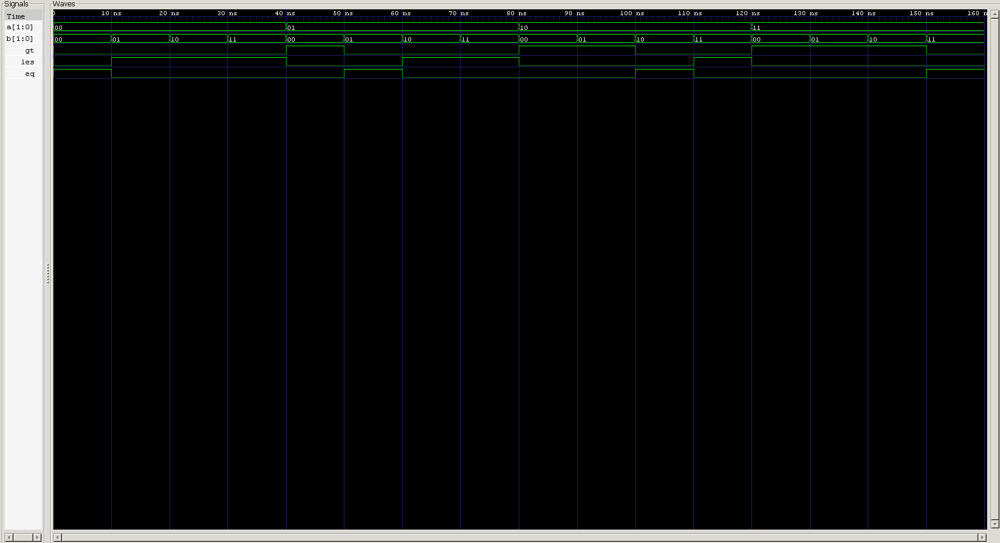

<div align="center">

# 2-Bit Magnitude Comparator

**Dataflow Verilog Model · Automated & Self-Checking Testbenches · RTL Verification**

`Project 06` — Combinational Circuits — *Verilog Fundamentals*


</div>

---

## 📖 Objective

The objective of this project is to design and verify a **2-bit Magnitude Comparator** using Verilog HDL. A magnitude comparator is a combinational logic circuit that compares two binary numbers and determines whether one is greater than, less than, or equal to the other.

This project extends the concept of a 1-bit comparator to multi-bit numbers using a **hierarchical comparison approach** — starting at the Most Significant Bit (MSB), and only descending to the Least Significant Bit (LSB) if the MSBs are equal.

Unlike the arithmetic circuits earlier in this repository, a comparator's job isn't computation — it's **decision-making**.

### What you'll learn

| Topic | Focus |
|---|---|
| ⚖️ Magnitude Comparison | MSB-first hierarchical decision logic |
| 🧵 Intermediate Wires | Reusing shared logic to keep RTL clean |
| 💻 HDL Modeling | Pure dataflow design, no built-in operators |
| 🤖 Automated Testing | Nested-loop exhaustive input generation |
| ✅ Self-Checking Verification | Behavioral reference model comparison |
| 🌊 Simulation | Icarus Verilog + GTKWave workflow |

---

## 🧠 Theory

A Magnitude Comparator compares the magnitudes of two binary numbers. For two 2-bit numbers:

$$A = A_1 A_0 \qquad B = B_1 B_0$$

it produces three **mutually exclusive** outputs:

- **GT (Greater Than)** → HIGH when `A > B`
- **LT (Less Than)** → HIGH when `A < B`
- **EQ (Equal To)** → HIGH when `A = B`

Only one output can ever be HIGH at a time — two binary numbers can't simultaneously be greater than, less than, *and* equal to each other.

---

## ⚙️ Working Principle

Comparison proceeds from the **MSB toward the LSB**:

**Case 1 — MSBs differ, A's MSB is 1:**
$$A_1 > B_1 \implies A > B \quad \text{(decided immediately)}$$

**Case 2 — MSBs differ, A's MSB is 0:**
$$A_1 < B_1 \implies A < B \quad \text{(decided immediately)}$$

**Case 3 — MSBs are equal:**
The MSB alone can't decide the result, so the comparator falls through to the LSBs (`A₀`, `B₀`), which then determine whether `A > B`, `A < B`, or `A = B`.

This hierarchical short-circuit — resolve at the highest-weight bit first, only check further if there's a tie — is the exact principle that scales up to the 4-bit, 8-bit, 16-bit, and 32-bit comparators used in real processors.

---

## 📊 Truth Table

| A | B | A > B | A < B | A = B |
|:-:|:-:|:-----:|:-----:|:-----:|
| 00 | 00 | 0 | 0 | **1** |
| 00 | 01 | 0 | **1** | 0 |
| 00 | 10 | 0 | **1** | 0 |
| 00 | 11 | 0 | **1** | 0 |
| 01 | 00 | **1** | 0 | 0 |
| 01 | 01 | 0 | 0 | **1** |
| 01 | 10 | 0 | **1** | 0 |
| 01 | 11 | 0 | **1** | 0 |
| 10 | 00 | **1** | 0 | 0 |
| 10 | 01 | **1** | 0 | 0 |
| 10 | 10 | 0 | 0 | **1** |
| 10 | 11 | 0 | **1** | 0 |
| 11 | 00 | **1** | 0 | 0 |
| 11 | 01 | **1** | 0 | 0 |
| 11 | 10 | **1** | 0 | 0 |
| 11 | 11 | 0 | 0 | **1** |

---

## ⚙️ Boolean Equations

**Greater Than (GT)**
$$GT = (A_1 \cdot \overline{B_1}) + \big((A_1 \odot B_1) \cdot (A_0 \cdot \overline{B_0})\big)$$

**Less Than (LT)**
$$LT = (\overline{A_1} \cdot B_1) + \big((A_1 \odot B_1) \cdot (\overline{A_0} \cdot B_0)\big)$$

**Equal To (EQ)**
$$EQ = (A_1 \odot B_1) \cdot (A_0 \odot B_0)$$

*(⊙ denotes XNOR)*

---

## 🏗️ Hardware Block Diagram

```
              ┌───────────────────────────────┐
   A[1:0] ───►│                                │───► GT
              │   2-Bit Magnitude Comparator   │───► LT
   B[1:0] ───►│                                │───► EQ
              └───────────────────────────────┘
```

---

## 💻 RTL Design

The comparator is implemented using **pure dataflow modeling** — built entirely from the Boolean equations derived from the truth table, rather than Verilog's built-in comparison operators (`>`, `<`, `==`). Deliberately avoiding those operators forces a real understanding of the underlying hardware instead of hiding it behind a language feature.

The design compares the MSB first. If the MSBs differ, the result is decided immediately; if they're equal, comparison falls through to the LSB.

To keep the RTL readable, an **intermediate wire** captures MSB equality once and reuses it across all three outputs:

```verilog
MSB_Equal = A1 ~^ B1;   // XNOR
```

This single signal feeds into the GT, LT, and EQ equations, avoiding repeated logic and making the design easier to read and debug.

---

## 🤖 Automated Testbench

Rather than manually applying every input combination, **nested `for` loops** sweep both 2-bit inputs across their full range:

```
A : 00 → 11
B : 00 → 11
```

With four possible values for each input:

$$4 \times 4 = 16 \text{ total test cases}$$

Each test case applies a unique `A`/`B` combination, waits for outputs to stabilize, and prints the comparison result via `$display()` — confirming that the comparator correctly identifies `A > B`, `A < B`, or `A = B` for every possible input pair.

---

## ✅ Self-Checking Testbench

This testbench automates verification entirely by computing expected outputs using Verilog's built-in comparison operators:

```verilog
Greater Than → A > B
Less Than    → A < B
Equal To     → A == B
```

These expected values are compared against the DUT's actual outputs. Each test case reports `PASS` or `FAIL`, and a final summary confirms whether every one of the 16 cases passed.

Using behavioral operators here is intentional — they act as an independent **reference model**, checking the dataflow implementation against a completely different (and trivially correct) description of the same logic. This eliminates manual checking, reduces human error, and mirrors verification practice used professionally.

---

## 🌊 Waveform Analysis



**Analysis:**
- Exactly one of GT / LT / EQ is HIGH for every input combination ✅
- `GT = 1` correctly indicates the first number is greater ✅
- `LT = 1` correctly indicates the first number is smaller ✅
- `EQ = 1` correctly indicates equality ✅
- The comparator visibly resolves the MSB first, only falling through to the LSB when MSBs match ✅
- All 16 possible input combinations verified correctly ✅

---

## 🏗️ Engineering Insight

A Magnitude Comparator is one of digital design's fundamental building blocks — but unlike adders and subtractors, it performs **decision-making**, not numerical computation.

The core design principle is **hierarchical comparison**:

```
Compare MSB
   │
   ├── Different → Decision made
   │
   └── Equal
        │
        ▼
   Compare LSB
```

This matters because the MSB carries the highest positional weight — if the MSBs differ, nothing about the lower bits can change the outcome, so there's no need to even inspect them. That same short-circuiting principle is exactly what makes 4-bit, 8-bit, 16-bit, and 32-bit comparators in modern processors tractable instead of exponentially expensive.

---

## 🧵 New Verilog Concept: Intermediate Wires

This project introduces the deliberate use of **intermediate wires** to improve RTL readability and maintainability.

Instead of repeating a Boolean sub-expression everywhere it's needed, a common condition — here, `MSB Equal` — is computed once and reused across multiple output equations.

**Advantages:**
- Improved readability
- Better code organization
- Easier debugging
- Reduced repetition of logic
- Improved maintainability in large RTL designs

Naming and reusing meaningful intermediate signals like this is standard practice in professional FPGA and ASIC development — it's often the difference between RTL that's reviewable and RTL that isn't.

---

## ⚠️ Common Beginner Mistakes

- Comparing the LSB before the MSB
- Assuming more than one output (GT, LT, EQ) can be HIGH simultaneously
- Repeating the same logic expression instead of using intermediate wires
- Using `localparam` for expected values in a self-checking testbench instead of variables
- Forgetting to verify all sixteen possible input combinations

---

## 🌟 Real-World Applications

- Arithmetic Logic Units (ALUs)
- CPUs & Microprocessors
- Branch & Conditional Instructions
- Sorting Algorithms in Hardware
- Digital Counters
- Memory Address Comparison
- Digital Signal Processing (DSP)
- Priority Decision Circuits

Comparators are essential anywhere a digital system needs to determine the relationship between two binary values.

---

## 📂 Project Structure

```
06_2bit_magnitude_comparator/
├── rtl/
│   └── magnitude_comparator_2bit.v
│
├── tb/
│   ├── magnitude_comparator_2bit_tb.v
│   └── magnitude_comparator_2bit_self_checking_tb.v
│
├── README.md
└── waveform.png
```

---

## ▶️ How to Run

```bash
# 1 — Compile
iverilog -o magnitude_comparator.out rtl/magnitude_comparator_2bit.v tb/magnitude_comparator_2bit_tb.v

# 2 — Simulate
vvp magnitude_comparator.out

# 3 — View Waveform
gtkwave magnitude_comparator.vcd
```

---

## 🎯 Key Concepts Learned

**Digital Design**
`Magnitude Comparison` · `Multi-bit Binary Comparison` · `MSB-first Comparison` · `Equality Detection` · `Hierarchical Decision Logic`

**Verilog HDL**
`Dataflow Modeling` · `Intermediate Wires` · `Bit Indexing` · `Vector Inputs` · `Continuous Assignments`

**Verification**
`Automated Testbench` · `Nested Loop Test Generation` · `Self-Checking Testbench` · `Behavioral Reference Model` · `PASS/FAIL Verification Methodology`

---

## 📝 Project Summary

In this project, a **2-bit Magnitude Comparator** was designed and verified using Verilog HDL. The design compares two 2-bit binary numbers and determines whether the first is greater than, less than, or equal to the second.

The RTL was built directly from the derived Boolean equations rather than relying on Verilog's built-in comparison operators — reinforcing the connection between digital logic theory and hardware implementation. Verification combined an automated testbench with a self-checking testbench, confirming that all sixteen input combinations produced the expected outputs.

This project also introduced the professional RTL practice of using **intermediate wires** to keep designs readable and maintainable — a small technique with outsized impact on real-world code review and debugging.

The concepts here form the foundation for larger comparator circuits and the decision-making hardware used throughout processors, ALUs, and digital control systems.

---

## 💼 Interview Questions

<details>
<summary><b>1. What is the purpose of a Magnitude Comparator?</b></summary>
<br>
To compare two binary numbers and determine whether one is greater than, less than, or equal to the other.
</details>

<details>
<summary><b>2. Why is the Most Significant Bit compared before the Least Significant Bit?</b></summary>
<br>
Because the MSB carries the highest positional weight — if the MSBs differ, the comparison outcome is already decided regardless of the lower bits.
</details>

<details>
<summary><b>3. Why can only one output among GT, LT, and EQ be HIGH at a time?</b></summary>
<br>
Because two binary numbers can never simultaneously be greater than, less than, and equal to each other — the three conditions are mutually exclusive.
</details>

<details>
<summary><b>4. How does a 2-bit comparator differ from a 1-bit comparator?</b></summary>
<br>
A 2-bit comparator must resolve ties at the MSB by falling through to compare the LSB, introducing hierarchical, multi-stage decision logic that a 1-bit comparator doesn't need.
</details>

<details>
<summary><b>5. What is the advantage of using intermediate wires in RTL design?</b></summary>
<br>
They reduce repeated logic expressions, improve readability, simplify debugging, and make large designs easier to maintain and review.
</details>

<details>
<summary><b>6. Why are behavioral comparison operators (>, <, ==) commonly used in self-checking testbenches?</b></summary>
<br>
They provide an independent, trivially-correct reference model to check the dataflow implementation against — verifying the design without reusing its own logic.
</details>

<details>
<summary><b>7. Where are Magnitude Comparators used in modern digital systems?</b></summary>
<br>
ALUs, CPUs, branch/conditional instruction logic, hardware sorting, digital counters, memory address comparison, DSP, and priority decision circuits.
</details>

---

<div align="center">

## 👨‍💻 Author

**Padma Charan S S**
*Repository: Verilog Fundamentals — Project-Driven Learning*

</div>

### 🎯 Repository Goal

This project is part of the **Verilog Fundamentals** repository, built to establish a strong foundation in Digital Design, RTL Development, Verification, and FPGA/ASIC Design through hands-on implementation of progressively complex hardware modules.

```
Basic Verilog → Logic Gates → 7400 Series ICs → Combinational Circuits
      → Sequential Circuits → RTL Design → Verification Methodologies
      → FPGA Design → Computer Architecture → Mini CPU Design
```

Each project introduces a new digital design concept alongside a new Verilog or verification technique, forming a structured learning path from basic logic gates to complete digital systems.