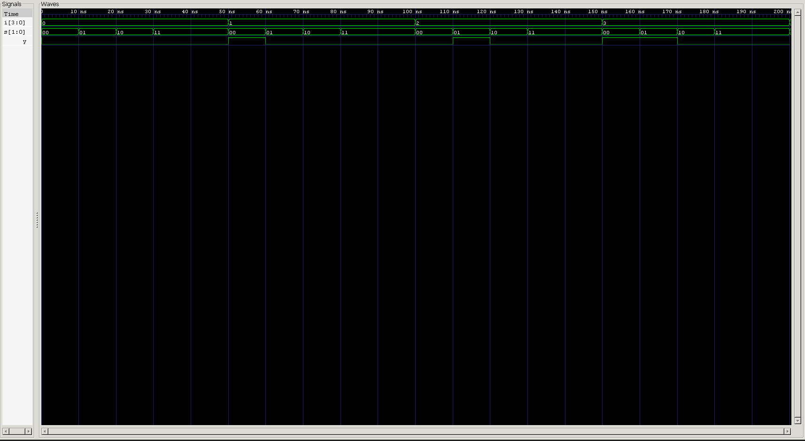

<div align="center">

# 4×1 Multiplexer

**Procedural Verilog Model · Automated & Self-Checking Testbenches · RTL Verification**

`Project 07` — Combinational Circuits — *Verilog Fundamentals*


</div>

---

## 📖 Objective

The objective of this project is to understand the design and implementation of a **4×1 Multiplexer (MUX)** using Verilog HDL. The project demonstrates how a multiplexer selects one input from several signals based on the value of its select lines.

Beyond the RTL implementation itself, this project is about a shift in modeling style — moving from continuous assignments to **procedural modeling** with `always @(*)` — along with verification through automated and self-checking testbenches.

### What you'll learn

| Topic | Focus |
|---|---|
| 🔀 Data Selection | Routing one of many inputs to a single output |
| ⚙️ Procedural Modeling | `always @(*)`, `case`, and `default` |
| 🧵 `wire` vs `reg` | Why procedurally-assigned outputs need `reg` |
| 🤖 Automated Testing | Nested-loop exhaustive input × select coverage |
| ✅ Self-Checking Verification | Variable bit indexing as a reference model |
| 🌊 Simulation | Icarus Verilog + GTKWave workflow |

---

## 🧠 Theory

A **Multiplexer (MUX)** is a combinational logic circuit that selects one input from several input lines and forwards it to a single output.

A **4×1 Multiplexer** has:
- **4 Data Inputs**
- **2 Select Lines**
- **1 Output**

Unlike adders or comparators, which perform arithmetic or comparison, a multiplexer is purely a **data selector** — it doesn't compute anything, it just routes.

The number of select lines required for an *N*-input multiplexer is:

$$\text{Select Lines} = \log_2(N)$$

For a 4×1 MUX: 4 inputs → 2 select lines.

---

## 🏗️ Hardware Representation

```
              ┌────────────────┐
   I0 ───────►│                │
   I1 ───────►│                │
   I2 ───────►│    4×1 MUX     │───────► Y
   I3 ───────►│                │
              │                │
   S1 ───────►│                │
   S0 ───────►│                │
              └────────────────┘
```

---

## ⚙️ Working Principle

The multiplexer continuously monitors the select lines `S1` and `S0`. Depending on their binary value, exactly one input is routed to the output:

```
S1 S0 = 00  →  Output = I0
S1 S0 = 01  →  Output = I1
S1 S0 = 10  →  Output = I2
S1 S0 = 11  →  Output = I3
```

Only one input can ever be selected at a time.

---

## 📊 Truth Table

| S1 | S0 | Output |
|:--:|:--:|:------:|
| 0 | 0 | **I0** |
| 0 | 1 | **I1** |
| 1 | 0 | **I2** |
| 1 | 1 | **I3** |

---

## ⚙️ Boolean Equation

$$Y = (\overline{S_1} \cdot \overline{S_0} \cdot I_0) + (\overline{S_1} \cdot S_0 \cdot I_1) + (S_1 \cdot \overline{S_0} \cdot I_2) + (S_1 \cdot S_0 \cdot I_3)$$

Each AND term "enables" exactly one input based on the select-line combination; the final OR combines all four possible paths into a single output.

---

## 🔌 Logic Diagram

```
            ~S1  ~S0
             │     │
             ▼     ▼
  I0 ──────AND───────┐
                      │
            ~S1   S0  │
             │     │  │
             ▼     ▼  │
  I1 ──────AND────────┤
                      │
             S1  ~S0  │
             │     │  │
             ▼     ▼  │
  I2 ──────AND────────┼──── OR ───► Y
                      │
             S1   S0  │
             │     │  │
             ▼     ▼  │
  I3 ──────AND────────┘
```

---

## 💻 RTL Design

The RTL implementation is written using an **`always @(*)`** block combined with a **`case`** statement. Unlike earlier projects, which relied primarily on continuous assignments (`assign`), this project introduces **procedural modeling** for combinational logic.

The two select lines (`S1`, `S0`) determine which input bit reaches the output, following this sequence:

1. Monitor all input changes via `always @(*)`
2. Evaluate the select lines
3. Select the matching input using a `case` statement
4. Drive the selected input to the output
5. Include a `default` case so the output always has a defined value

This description is fully synthesizable and represents the behavior of a real hardware multiplexer.

---

## 🧵 Verilog Concepts Learned

### 1. `always @(*)`

Describes **combinational procedural logic**. Unlike `assign`, which continuously drives an output, an `always` block re-executes whenever *any* signal used inside it changes. Using `@(*)` removes the need to hand-write a sensitivity list — and eliminates a whole class of simulation-vs-synthesis mismatches that come from getting that list wrong.

### 2. Procedural Assignments

Signals assigned inside an `always` block are procedural, and Verilog requires them to be declared `reg`:

```verilog
output reg y;
```

Important nuance: in Verilog, `reg` does **not** necessarily mean a hardware flip-flop — it simply means "this signal is assigned inside a procedural block."

### 3. `case` Statement

Provides a clean, readable way to implement selection logic. Instead of a chain of `if-else` statements or a long Boolean expression, each select value maps directly to its corresponding input — easier to read, easier to maintain, easier to scale to wider multiplexers.

### 4. `default` Case

Ensures the output always resolves to a defined value, even if the select signal somehow carries an unexpected value (`X` or `Z`) during simulation. Including a `default` branch is considered good RTL coding practice, full stop.

---

## 🤖 Automated Testbench

Verification uses two nested loops:

- **Outer loop** — sweeps all possible 4-bit input combinations
- **Inner loop** — applies every possible select value

```
Input Combinations   = 16
Select Combinations  = 4

Total Test Cases = 16 × 4 = 64
```

This guarantees every valid input–select pairing gets simulated. Results are displayed via `$monitor`, so the selected output can be observed for every test case.

---

## ✅ Self-Checking Testbench

Rather than manually inspecting waveforms, the expected output is calculated inside the testbench and compared against the DUT automatically — using Verilog's **variable bit indexing**:

```verilog
exp_y = i[s];
```

This one line is a complete, compact reference model of multiplexer behavior. For every test case, the testbench:

- Calculates the expected output
- Compares it against the DUT output
- Reports `PASS` or `FAIL` automatically
- Updates pass/fail counters
- Prints a final verification summary

This approach is standard in professional RTL verification because it minimizes manual inspection and surfaces design errors immediately.

---

## 🌊 Waveform Analysis



**Analysis:**
- Output changes immediately when the select lines change ✅
- Output always matches the currently selected input bit ✅
- All four select combinations verified ✅
- Every possible input combination tested ✅
- No undefined or unexpected outputs observed ✅

---

## 🎛️ Design Decisions

**Bus-based inputs** — instead of four separate ports:
```verilog
input i0, i1, i2, i3;
```
the design groups them into a single bus:
```verilog
input [3:0] i;
```
This keeps the design cleaner and trivially easier to scale to wider multiplexers.

**`case` over a raw Boolean equation** — while a MUX can be written as a flat Boolean expression, a `case` statement more closely mirrors the actual hardware selection process, and is the preferred style for anything larger than a 2×1 MUX.

**Variable bit indexing in the testbench** — using `i[s]` instead of a second `case` statement keeps the reference model compact, easy to maintain, and far less likely to accidentally duplicate a bug from the DUT itself.

---

## 🏗️ Engineering Insight

A multiplexer is fundamentally a **data routing circuit**. Where arithmetic circuits compute and comparators decide relationships between values, a multiplexer simply decides **which data gets forwarded to the output**.

```
          Data
           │
           ▼
 I0 ─────────────┐
 I1 ─────────────┤
 I2 ─────────────┤──► Multiplexer ───► Output
 I3 ─────────────┘
                 ▲
                 │
          Control Signals
             S1, S0
```

This separation between **data** and **control** is a foundational concept in digital system design and computer architecture. Modern processors lean on multiplexers constantly — for selecting operands, addresses, instructions, and execution paths through the datapath.

---

## ⚠️ Common Beginner Mistakes

- Declaring the output as `wire` instead of `reg` when assigning it inside an `always` block
- Forgetting the `default` case in a `case` statement
- Writing an incomplete sensitivity list instead of using `always @(*)`
- Confusing the `reg` keyword with an actual hardware register
- Assuming the select lines carry data instead of control information
- Forgetting that a module name can't begin with a number
- Manually checking outputs instead of writing a self-checking testbench

---

## 🌟 Real-World Applications

- Data Routing
- CPU Datapath Design
- ALU Input Selection
- Memory Address Selection
- Bus Switching
- FPGA & ASIC Designs
- Communication Systems
- Embedded Systems

---

## 📂 Project Structure

```
04_combinational_circuits/
└── 07_mux_4x1/
    ├── rtl/
    │   └── mux_4x1.v
    ├── tb/
    │   ├── mux_4x1_tb.v
    │   └── mux_4x1_self_checking_tb.v
    ├── waveform.png
    └── README.md
```

---

## ▶️ How to Run

```bash
# Automated testbench
iverilog -o mux_4x1.out rtl/mux_4x1.v tb/mux_4x1_tb.v
vvp mux_4x1.out
gtkwave waveform.vcd

# Self-checking testbench
iverilog -o mux_4x1_self_checking.out rtl/mux_4x1.v tb/mux_4x1_self_checking_tb.v
vvp mux_4x1_self_checking.out
```

The self-checking run automatically reports PASS or FAIL for every test case and prints a final verification summary.

---

## 🎯 Key Concepts Learned

`Multiplexer as Combinational Circuit` · `Data Selection via Select Lines` · `Boolean Implementation of 4×1 MUX` · `Procedural Modeling (always @(*))` · `case Statement` · `default Case` · `wire vs reg` · `Variable Bit Indexing (i[s])` · `Automated Testbench` · `Self-Checking Verification` · `Exhaustive Combinational Testing`

---

## 📝 Project Summary

This project introduced the design and verification of a **4×1 Multiplexer** — one of the most fundamental combinational circuits in digital systems.

Unlike earlier projects, which relied mainly on continuous assignments, this one introduced procedural RTL modeling with `always @(*)` and `case`, offering a cleaner and more scalable approach to selection logic. Verification combined automated and self-checking testbenches, achieving **100% coverage across all 64 possible input–select combinations**.

---

## 💼 Interview Questions

<details>
<summary><b>1. What is the purpose of a multiplexer?</b></summary>
<br>
To select one input from multiple data lines and route it to a single output, based on the value of its select lines.
</details>

<details>
<summary><b>2. Why does a 4×1 MUX require two select lines?</b></summary>
<br>
Because selecting among 4 inputs requires log₂(4) = 2 select lines to uniquely address each one.
</details>

<details>
<summary><b>3. Explain the difference between `assign` and `always @(*)`.</b></summary>
<br>
`assign` continuously drives a wire via a dataflow expression. `always @(*)` describes procedural logic that re-evaluates whenever any signal it reads changes — useful for case-based or conditional logic that's awkward to express as a single continuous expression.
</details>

<details>
<summary><b>4. Why is the output declared as `reg` inside an `always` block?</b></summary>
<br>
Because signals assigned procedurally (inside always/initial blocks) must be declared as reg in Verilog — reg here just means "procedurally assigned," not a physical register.
</details>

<details>
<summary><b>5. Why should a `default` case be included in a combinational `case` statement?</b></summary>
<br>
To guarantee the output always resolves to a defined value, even if the select signal takes on an unexpected value like X or Z during simulation.
</details>

<details>
<summary><b>6. What is the difference between `wire` and `reg` in Verilog?</b></summary>
<br>
A wire represents a continuously driven connection (used with assign or module ports). A reg holds a value assigned procedurally inside an always or initial block — it does not inherently imply a flip-flop.
</details>

<details>
<summary><b>7. What does `2'b10` represent?</b></summary>
<br>
A 2-bit binary literal equal to decimal 2 — the `2'b` prefix specifies a 2-bit value in binary format.
</details>

<details>
<summary><b>8. What is variable indexing in Verilog?</b></summary>
<br>
Indexing a vector using a variable rather than a fixed constant — e.g. i[s], where s can change at runtime — allowing dynamic bit selection.
</details>

<details>
<summary><b>9. Why is a self-checking testbench preferred over manual waveform inspection?</b></summary>
<br>
It automatically computes expected results, compares them to the DUT, and reports PASS/FAIL — removing human error and scaling cleanly to large test spaces.
</details>

<details>
<summary><b>10. How many test cases are required to exhaustively verify a 4×1 multiplexer with four data inputs?</b></summary>
<br>
16 input combinations × 4 select combinations = 64 total test cases.
</details>

---

<div align="center">

## 👨‍💻 Author

**Padma Charan S S**
*Repository: Verilog Fundamentals — Project-Driven Learning*

</div>

### 🎯 Repository Goal

This repository is being built as a structured journey from basic Verilog syntax to professional RTL design and verification. Each project introduces:

- A new digital design concept
- A new Verilog language feature
- Automated verification techniques
- Self-checking testbenches
- Professional documentation

```
Basic Verilog → Logic Gates → 7400 Series ICs → Combinational Circuits
      → Sequential Circuits → RTL Design → Verification Methodologies
      → FPGA Design → Computer Architecture → Mini CPU Design
```

The objective isn't just to learn Verilog syntax, but to develop the ability to design, verify, and document digital hardware using industry-standard engineering practices.