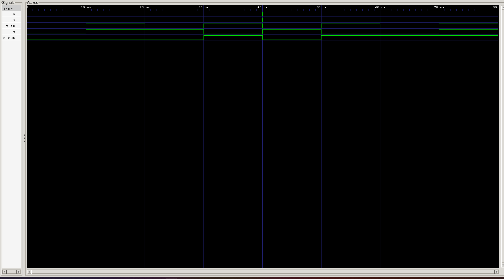

<div align="center">

# Full Adder Using Only 2×1 Multiplexers

**Structural Verilog Model · Universal Logic via Shannon Expansion · Hierarchical RTL**

`Project 11` — Combinational Circuits — *Verilog Fundamentals*


</div>

---

## 📖 Overview

This project builds a **1-bit Full Adder** using **nothing but 2×1 multiplexers** — no XOR, AND, or OR gate is used directly anywhere in the design. Instead, every logic gate the Full Adder needs is *itself* constructed from 2×1 MUXes, and those MUX-built gates are then wired together into the complete adder.

The point isn't just a novelty build — it's a demonstration of one of the most important ideas in digital logic:

> **A 2×1 Multiplexer is a Universal Logic Element.**

With the right choice of data inputs and select line, a single 2×1 MUX can implement *any* Boolean function. That's exactly why multiplexers are everywhere in real hardware — CPUs, FPGAs, ASICs, memory systems, and datapath architectures all lean on this same universality.

### Project Objectives

- Understand the internal working principle of a Full Adder
- Learn how multiplexers implement arbitrary combinational logic
- Design a Full Adder without using any built-in logic gates
- Practice hierarchical and modular RTL design
- Understand logic decomposition via **Shannon Expansion**
- Build genuinely reusable hardware modules

---

## 🔀 Why Use a 2×1 Multiplexer?

A 2×1 multiplexer selects one of two inputs based on a select line:

```
          ┌───────────┐
   D0 ───►│           │
          │   2×1     │───► Y
   D1 ───►│   MUX     │
          │           │
  SEL ───►│           │
          └───────────┘
```

$$SEL = 0 \implies Y = D_0 \qquad SEL = 1 \implies Y = D_1$$

$$Y = (\overline{SEL} \cdot D_0) + (SEL \cdot D_1)$$

The key insight: `D0`, `D1`, and `SEL` don't have to be simple variables — they can be constants, inverted signals, or other logic entirely. That flexibility alone is enough to realize a huge range of Boolean expressions from one piece of hardware.

**Why this matters in real designs** — multiplexers are used everywhere for data selection, conditional logic, signal routing, resource sharing, datapath implementation, ALU design, CPU control logic, and FPGA logic implementation. Reusing one well-understood primitive instead of designing bespoke hardware for every function is a recurring theme in real RTL engineering.

---

## 🧩 Can a 2×1 MUX Implement Logic Gates?

Yes — a properly configured 2×1 MUX can implement **NOT, AND, OR, XOR,** and **XNOR**. Since these gates are sufficient to build arbitrarily complex combinational circuits, a single type of hardware becomes capable of implementing *complete digital systems*. That's what makes the multiplexer a genuinely **universal logic building block**, not just a data selector.

---

## 🛠️ Gate Implementation Using Only 2×1 Multiplexers

The Full Adder needs five logic operations — each one built from a 2×1 MUX by choosing the right constants and select signal.

### 1. NOT Gate

| B | ~B |
|:-:|:--:|
| 0 | 1 |
| 1 | 0 |

| MUX Input | Value |
|---|:-:|
| D0 | 1 |
| D1 | 0 |
| SEL | B |

`B = 0 → Y = D0 = 1` &nbsp;·&nbsp; `B = 1 → Y = D1 = 0` &nbsp;→&nbsp; **Y = ~B**

### 2. AND Gate

| B | Cin | B & Cin |
|:-:|:---:|:-------:|
| 0 | 0 | 0 |
| 0 | 1 | 0 |
| 1 | 0 | 0 |
| 1 | 1 | 1 |

| MUX Input | Value |
|---|:-:|
| D0 | 0 |
| D1 | B |
| SEL | Cin |

`Cin = 0 → Y = 0` &nbsp;·&nbsp; `Cin = 1 → Y = B` &nbsp;→&nbsp; **Y = B & Cin**

### 3. OR Gate

| B | Cin | B \| Cin |
|:-:|:---:|:--------:|
| 0 | 0 | 0 |
| 0 | 1 | 1 |
| 1 | 0 | 1 |
| 1 | 1 | 1 |

| MUX Input | Value |
|---|:-:|
| D0 | B |
| D1 | 1 |
| SEL | Cin |

`Cin = 0 → Y = B` &nbsp;·&nbsp; `Cin = 1 → Y = 1` &nbsp;→&nbsp; **Y = B \| Cin**

### 4. XOR Gate

| B | Cin | B ⊕ Cin |
|:-:|:---:|:-------:|
| 0 | 0 | 0 |
| 0 | 1 | 1 |
| 1 | 0 | 1 |
| 1 | 1 | 0 |

| MUX Input | Value |
|---|:-:|
| D0 | B |
| D1 | ~B |
| SEL | Cin |

`Cin = 0 → Y = B` &nbsp;·&nbsp; `Cin = 1 → Y = ~B` &nbsp;→&nbsp; **Y = B ⊕ Cin**

### 5. XNOR Gate

| B | Cin | B ⊙ Cin |
|:-:|:---:|:-------:|
| 0 | 0 | 1 |
| 0 | 1 | 0 |
| 1 | 0 | 0 |
| 1 | 1 | 1 |

| MUX Input | Value |
|---|:-:|
| D0 | ~B |
| D1 | B |
| SEL | Cin |

`Cin = 0 → Y = ~B` &nbsp;·&nbsp; `Cin = 1 → Y = B` &nbsp;→&nbsp; **Y = B ⊙ Cin**

---

## 🧠 Constructing the Full Adder

With all five MUX-based gates available, they're wired together into two independent datapaths — one for Sum, one for Carry — each resolved with **Shannon Expansion**.

### SUM Path

$$Sum = A \oplus B \oplus C_{in}$$

Expanding around `A`:

$$A = 0 \implies Sum = B \oplus C_{in} \qquad A = 1 \implies Sum = \overline{B \oplus C_{in}}$$

So the final Sum is just another 2×1 MUX, selecting between the XOR and XNOR results based on `A`:

```
             ┌───────────┐
   B ───────►│  XOR MUX  │
 Cin ───────►│           │───► B⊕Cin ──┐
             └───────────┘             │
                                        ▼
             ┌───────────┐      ┌──────────────┐
             │ XNOR MUX  │─────►│   SUM MUX    │
             └───────────┘      │  D0 = XOR    │
                    ▲            │  D1 = XNOR   │───► SUM
                    │            │  SEL = A     │
              ~(B⊕Cin)          └──────────────┘
```

### Carry Path

$$Carry = AB + AC_{in} + BC_{in}$$

Expanding around `A`:

$$A = 0 \implies Carry = B \cdot C_{in} \qquad A = 1 \implies Carry = B + C_{in}$$

Again, one more 2×1 MUX resolves the final result:

```
             ┌───────────┐
   B ───────►│  AND MUX  │
 Cin ───────►│           │───► B&Cin ──┐
             └───────────┘             │
                                        ▼
             ┌───────────┐      ┌──────────────┐
             │  OR MUX   │─────►│  CARRY MUX   │
             └───────────┘      │  D0 = AND    │
                    ▲            │  D1 = OR     │───► Carry
                    │            │  SEL = A     │
                 B|Cin          └──────────────┘
```

---

## 🏗️ Complete Hardware Architecture

```
                          Full Adder
                     ┌──────────────────┐
                     │                  │
                 SUM Path           Carry Path
                     │                  │
          ┌──────────┴──────┐   ┌───────┴───────┐
          │                 │   │               │
       XOR MUX          XNOR MUX AND MUX      OR MUX
          │                 │   │               │
          └────────┬────────┘   └───────┬───────┘
                    │                    │
            ┌───────▼────────┐  ┌────────▼───────┐
   A ──────►│    SUM MUX     │  │   CARRY MUX    │◄────── A
            └───────┬────────┘  └────────┬───────┘
                    │                    │
                   SUM                 Carry
```

### Hardware Statistics

| Component | Quantity |
|---|---:|
| 2×1 Multiplexer | 6 |
| NOT Gate (MUX-based) | 1 |
| XOR Gate (MUX-based) | 1 |
| XNOR Gate (MUX-based) | 1 |
| AND Gate (MUX-based) | 1 |
| OR Gate (MUX-based) | 1 |
| Final Outputs | SUM, Carry |

---

## 🎨 Design Philosophy

Rather than relying on built-in logic gates, this project shows how complex digital circuits can be assembled from a **single reusable hardware primitive**:

```
2×1 MUX → Logic Gates → Full Adder
```

This hierarchical methodology improves reusability, readability, scalability, and maintainability — and closely resembles the design flow used in real professional RTL development, where a small set of well-verified primitives gets composed into larger and larger systems.

---

## 💻 RTL Implementation

The design follows a **hierarchical structural modeling** approach. Instead of writing the Full Adder directly from Boolean equations, it's decomposed into reusable modules:

```
                Full Adder
                     │
        ┌────────────┴────────────┐
        │                         │
     SUM Path                Carry Path
        │                         │
   XOR / XNOR              AND / OR
        │                         │
        └────────────┬────────────┘
                     │
                 2×1 Multiplexer
```

Every module is instantiated separately, keeping the design modular, reusable, and easy to reason about.

### Module Hierarchy

```
full_adder_mux
├── xor_gate_mux   └── mux2x1
├── xnor_gate_mux  └── mux2x1
├── and_gate_mux   └── mux2x1
├── or_gate_mux    └── mux2x1
├── sum_mux        └── mux2x1
└── carry_mux      └── mux2x1
```

This hierarchy is a direct illustration of **hardware abstraction** — complex circuits built entirely from simpler, reusable modules, all the way down to a single primitive.

---

## 📊 Full Adder Truth Table

| A | B | Cin | Sum | Carry |
|:-:|:-:|:---:|:---:|:-----:|
| 0 | 0 | 0 | **0** | **0** |
| 0 | 0 | 1 | **1** | **0** |
| 0 | 1 | 0 | **1** | **0** |
| 0 | 1 | 1 | **0** | **1** |
| 1 | 0 | 0 | **1** | **0** |
| 1 | 0 | 1 | **0** | **1** |
| 1 | 1 | 0 | **0** | **1** |
| 1 | 1 | 1 | **1** | **1** |

---

## 🧪 Simulation

The testbench sweeps all possible combinations of `A`, `B`, and `Cin`:

$$2^3 = 8 \text{ total combinations}$$

For every combination, the generated Sum and Carry are compared against the expected Full Adder truth table above — verifying that the entire MUX-built gate stack behaves identically to a conventional gate-level implementation.

---

## 🌊 Simulation Waveform



**Analysis:**
- SUM follows the Full Adder truth table across all 8 combinations ✅
- Carry follows the Full Adder truth table across all 8 combinations ✅
- Every logic operation is confirmed to be implemented entirely through multiplexers, with no direct gate primitives involved ✅

---

## 📂 Project Directory

```
11_full_adder_using_mux/
├── mux2x1/
│   ├── mux2x1.v
│   ├── mux2x1_tb.v
│   ├── waveform.png
│   └── README.md
│
├── not_gate_mux.v
├── and_gate_mux.v
├── or_gate_mux.v
├── xor_gate_mux.v
├── xnor_gate_mux.v
│
├── full_adder_mux.v
├── full_adder_mux_tb.v
│
├── waveform.vcd
├── waveform.png
└── README.md
```

---

## ▶️ How to Run

```bash
# 1 — Compile
iverilog -o full_adder_mux.out \
  mux2x1.v \
  not_gate_mux.v \
  and_gate_mux.v \
  or_gate_mux.v \
  xor_gate_mux.v \
  xnor_gate_mux.v \
  full_adder_mux.v \
  full_adder_mux_tb.v

# 2 — Simulate
vvp full_adder_mux.out

# 3 — View Waveform
gtkwave waveform.vcd
```

---

## 🎯 Concepts Covered

`2×1 Multiplexer` · `Universal Logic` · `Structural Modeling` · `Module Instantiation` · `Hierarchical Design` · `Shannon Expansion` · `Full Adder Design` · `Combinational Logic` · `RTL Design Methodology` · `Verilog HDL`

---

## 🌟 Real-World Applications

Though this project is educational, the underlying principle shows up throughout real digital systems:

- Arithmetic Logic Units (ALUs)
- CPUs
- Digital Signal Processors (DSPs)
- FPGA Designs
- ASIC Designs
- Datapath Architectures
- Processor Arithmetic Units

---

## 🎓 Learning Outcomes

After completing this project, you should be able to:

- Explain how a 2×1 multiplexer operates
- Implement common logic gates using only multiplexers
- Apply Shannon Expansion to simplify Boolean functions
- Design a Full Adder without built-in logic gates
- Build hierarchical RTL modules
- Write reusable Verilog code using structural modeling
- Simulate and verify combinational circuits with a testbench
- Analyze simulation waveforms using GTKWave

---

## 🚀 Future Improvements

- Parameterized N-bit Full Adder built from this MUX-based Full Adder cell
- Ripple Carry Adder assembled from the MUX-based Full Adder
- Carry Lookahead Adder using MUX-based logic
- An ALU built from MUX-based arithmetic circuits
- FPGA implementation and real hardware verification

---

## 🏁 Conclusion

This project demonstrates that a **2×1 multiplexer is a universal building block capable of implementing a complete 1-bit Full Adder without using any built-in logic gates**.

By constructing each logic gate from multiplexers, then assembling those gates hierarchically, the project reinforces core ideas in digital logic design, modular hardware development, and RTL methodology — all built on a single, deceptively simple primitive.

Beyond the Full Adder itself, this project is really about a design philosophy: complex digital systems can be built from a small number of reusable hardware primitives. That philosophy — modularity, scalability, reusability — is exactly what drives real FPGA and ASIC development, where reliable, maintainable hardware depends on composing trusted building blocks rather than reinventing logic from scratch every time.

---

<div align="center">

## 👨‍💻 Author

**Padma Charan S S**
*Repository: Verilog Fundamentals — Project-Driven Learning*

</div>

### 🗺️ Repository Roadmap

```
Basic Verilog → Logic Gates → 7400 Series ICs → Combinational Circuits
      → Sequential Circuits → RTL Design → Verification Methodologies
      → FPGA Design → Computer Architecture → Mini CPU Design
```