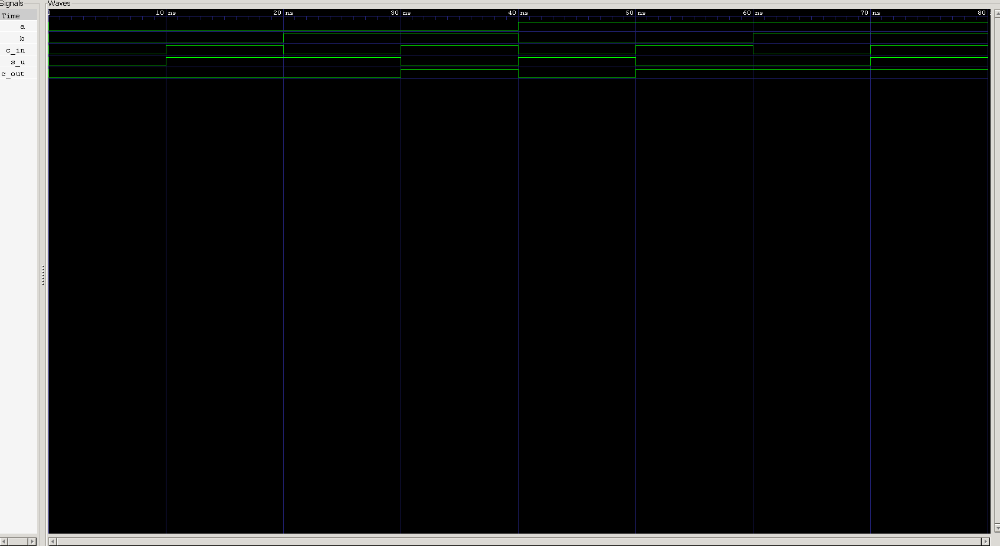

<div align="center">

# 8-to-3 Binary Encoder

**Behavioral Verilog Model · One-Hot Input Encoding · Automated & Self-Checking Testbenches**

`Project 14` — Combinational Circuits — *Verilog Fundamentals*


</div>

---

## 📖 Overview

This project implements an **8-to-3 Binary Encoder** using combinational logic in Verilog HDL. An encoder performs the reverse operation of a decoder — it converts a **one-hot input** into its corresponding **3-bit binary representation**, compressing multiple input lines down into a compact code instead of expanding binary information outward.

The design assumes **exactly one input is HIGH at a time**. Under that one-hot condition, the output directly represents the binary index of whichever input is active.

### Project Objectives

- Understand the operation of a Binary Encoder
- Learn the concept of one-hot encoding
- Derive Boolean equations from a truth table
- Implement combinational logic using continuous assignments
- Design a structural RTL module
- Verify the design via simulation and self-checking verification

---

## 🧠 What Is an Encoder?

An **Encoder** is a combinational circuit that converts one active input line into its equivalent binary code. Where a decoder expands binary information into multiple outputs, an encoder does the opposite — compressing multiple input lines into fewer output bits.

For an **8-to-3 Encoder**: 8 inputs, 3 outputs, exactly one input HIGH at a time.

```
Input  = 00001000
Output = 011
```

Since **D3** is the active input, the encoder outputs **3 (011)**.

---

## 🏗️ Block Diagram

```
                ┌───────────────────┐
   D0 ─────────►│                   │
   D1 ─────────►│                   │
   D2 ─────────►│                   │
   D3 ─────────►│                   │───► B2
   D4 ─────────►│   8-to-3 Encoder  │───► B1
   D5 ─────────►│                   │───► B0
   D6 ─────────►│                   │
   D7 ─────────►│                   │
                └───────────────────┘
```

---

## 🧩 Hardware Architecture

The design consists of:

- Eight input signals
- Three output signals
- Three OR networks
- Continuous assignment statements

Each output bit is generated by OR-ing the specific input lines dictated by the encoder truth table below.

---

## 🎨 Design Philosophy

Rather than deriving complex Boolean expressions, this encoder is read directly off its truth table — each output bit simply represents one bit of the binary index of whichever input is active. That directness is the whole point: it makes the relationship between "which wire is HIGH" and "what number comes out" immediately visible in the RTL.

---

## 📊 Truth Table

| Active Input | B2 | B1 | B0 |
|:---:|:--:|:--:|:--:|
| D0 | 0 | 0 | 0 |
| D1 | 0 | 0 | **1** |
| D2 | 0 | **1** | 0 |
| D3 | 0 | **1** | **1** |
| D4 | **1** | 0 | 0 |
| D5 | **1** | 0 | **1** |
| D6 | **1** | **1** | 0 |
| D7 | **1** | **1** | **1** |

---

## ⚙️ Boolean Equation Derivation

Straight from the truth table:

$$B_0 = D_1 + D_3 + D_5 + D_7$$

$$B_1 = D_2 + D_3 + D_6 + D_7$$

$$B_2 = D_4 + D_5 + D_6 + D_7$$

These map directly onto three `assign` statements — no simplification or optimization needed, since the truth table's structure already *is* the minimal SOP form.

---

## 🤔 Why Does This Work?

The encoder relies entirely on the one-hot assumption — exactly one input line HIGH at a time. Each input corresponds to one binary position, so:

$$D_5 = 1 \implies \text{Binary Output} = 101$$

$$D_2 = 1 \implies \text{Binary Output} = 010$$

Because only one input is ever active, none of the OR terms above can accidentally combine two different inputs' contributions — the OR logic reconstructs the correct binary output cleanly, every time.

---

## 🔥 One-Hot Encoding

The encoder requires its input to follow the **one-hot** rule: exactly one bit HIGH, everything else LOW.

**Valid inputs:**

```
00000001
00000010
00000100
00001000
00010000
00100000
01000000
10000000
```

**Invalid inputs:**

```
00000000   ← no input active
00000110   ← two inputs active
10100000   ← two inputs active
```

If more than one input goes HIGH simultaneously, a standard encoder has no way to uniquely determine the correct binary output — the result is ambiguous.

---

## 💻 RTL Implementation

The encoder is implemented using **behavioral RTL modeling** — every output bit is produced via continuous assignment (`assign`) statements based on the Boolean equations derived above. This implementation is simple, fully synthesizable, and technology-independent.

---

## 🧪 Testbench Methodology

The standard testbench verifies every valid one-hot combination using a `for` loop combined with the **left shift operator** to generate patterns automatically:

```verilog
d = 8'b00000001 << i;
```

This produces:

```
i=0 → 00000001
i=1 → 00000010
i=2 → 00000100
   ...
i=7 → 10000000
```

The encoder's output is observed for each generated input.

---

## ✅ Self-Checking Verification

The self-checking testbench compares the encoder's output directly against the loop index:

```verilog
if (b == i)
```

Since Verilog compares numeric *values* rather than number formats, the binary output compares cleanly against the decimal loop variable:

```
3'b101 == 5   →   PASS
```

This removes manual waveform inspection entirely and fully automates functional verification.

---

## 🌊 Waveform



**Analysis:**
- Each one-hot input pattern produces exactly one corresponding binary output ✅
- The output correctly tracks the position of the active input across all 8 combinations ✅
- No undefined (`X`) or unexpected transitions appear between valid one-hot inputs ✅
- Self-checking testbench reports PASS for all 8 test cases, confirming output matches the expected binary index at every step ✅

---

## 📂 Project Structure

```
14_encoder/
├── rtl/
│   └── encoder_8x3.v
│
├── tb/
│   ├── encoder_8x3_tb.v
│   └── encoder_8x3_self_checking_tb.v
│
├── waveform.png
└── README.md
```

---

## ▶️ How to Run

```bash
# 1 — Compile
iverilog -o encoder.out encoder_8x3.v encoder_8x3_tb.v

# 2 — Simulate
vvp encoder.out

# 3 — View Waveform
gtkwave waveform.vcd
```

---

## ⚠️ Limitations

A standard Binary Encoder assumes:

- Exactly one input is HIGH
- Multiple active inputs produce ambiguous outputs
- No mechanism exists to determine input priority

This limitation is precisely what motivates the **Priority Encoder** — the next logical step, which resolves the multiple-active-input case by picking a defined winner.

---

## 🌟 Real-World Applications

- Keyboard encoding
- Interrupt controllers
- Data compression
- Digital communication systems
- Input selection circuits
- Processor input interfaces

---

## 🎯 Learning Outcomes

After completing this project, the following concepts are understood:

- Binary Encoding
- One-Hot Encoding
- Truth Table Derivation
- Boolean Equation Derivation
- Continuous Assignment (`assign`)
- Combinational RTL Design
- Self-Checking Verification
- Shift Operators (`<<`)
- Automated Testbench Generation

---

## 🚀 Future Work

The concepts learned here prepare you for:

- Priority Encoder
- Decoder
- Binary to Gray Converter
- Gray to Binary Converter
- BCD to Seven-Segment Decoder
- Parity Generator
- Barrel Shifter

---

## 🏁 Conclusion

This project demonstrates the implementation of an **8-to-3 Binary Encoder** using combinational logic in Verilog HDL. By converting one-hot input signals into their corresponding binary representation, the design introduces one of the fundamental building blocks of digital systems.

It also reinforces Boolean logic derivation, continuous assignment modeling, one-hot encoding, automated testbench generation, and self-checking verification — providing a strong foundation for more advanced encoding circuits such as the **Priority Encoder**.

---

<div align="center">

## 👨‍💻 Author

**Padma Charan S S**
*Repository: Verilog Fundamentals — Project-Driven Learning*

</div>

### 🗺️ Repository Roadmap

```
Basic Verilog → Logic Gates → 7400 Series ICs → Combinational Circuits
      → Sequential Circuits → RTL Design → Verification Methodologies
      → FPGA Design → Computer Architecture → Mini CPU Design
```