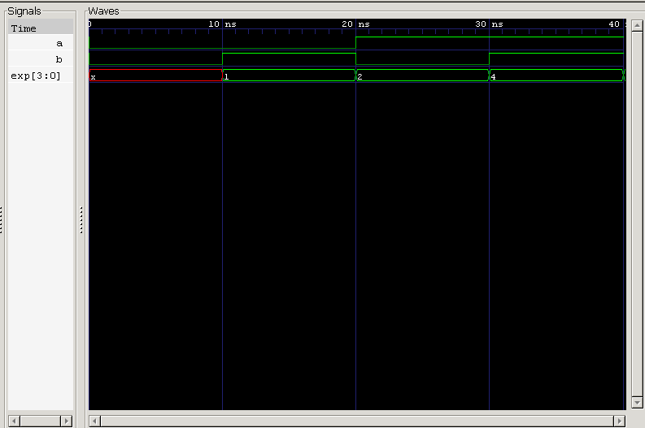

<div align="center">

# 2×4 Decoder

**Dataflow Verilog Model · Minterm Generation · Automated & Self-Checking Testbenches**

`Project 16` — Combinational Circuits — *Verilog Fundamentals*


</div>

---

## 📖 Overview

This project implements a **2×4 Decoder** using **dataflow modeling** in Verilog HDL. A decoder converts an *n*-bit binary input into **2ⁿ mutually exclusive outputs** — for every valid input combination, **exactly one output goes HIGH** while every other output stays LOW.

It's the direct structural counterpart of the encoders built in the last two projects — where an encoder compresses many signals into a compact code, a decoder expands a compact code back out into one-hot form.

The design is built entirely from Boolean equations via continuous assignment (`assign`) statements, with verification through both a standard testbench and a self-checking testbench.

### Objectives

- Understand the working principle of a Decoder
- Learn the relationship between binary inputs and one-hot outputs
- Implement a 2×4 Decoder using dataflow modeling
- Learn how Boolean equations translate directly into Verilog
- Understand the concept of minterms
- Verify the design via simulation
- Write a self-checking testbench

---

## 🧠 What Is a Decoder?

A Decoder is a combinational circuit that converts a binary input into one of many output lines — the reverse operation of an Encoder:

```
Encoder:  Many Inputs  →  Few Outputs
Decoder:  Few Inputs   →  Many Outputs
```

For every input combination, exactly one output activates.

---

## 🏗️ Block Diagram

```
              ┌───────────────────┐
                                  │───► Y0
   A ────────►│                  │───► Y1
   B ────────►│   2×4 Decoder    │───► Y2
              │                  │───► Y3
              └───────────────────┘
```

---

## 🔀 Decoder Operation

**Input:** `A B` &nbsp;·&nbsp; **Output:** `Y3 Y2 Y1 Y0`

| Input | Output |
|:-:|:-:|
| 00 | 0001 |
| 01 | 0010 |
| 10 | 0100 |
| 11 | 1000 |

Only one output line is HIGH for any given input combination.

---

## 📊 Truth Table

| A | B | Y3 | Y2 | Y1 | Y0 |
|:-:|:-:|:--:|:--:|:--:|:--:|
| 0 | 0 | 0 | 0 | 0 | **1** |
| 0 | 1 | 0 | 0 | **1** | 0 |
| 1 | 0 | 0 | **1** | 0 | 0 |
| 1 | 1 | **1** | 0 | 0 | 0 |

---

## ⚙️ Boolean Equation Formation

From the truth table:

$$Y_0 = \overline{A} \cdot \overline{B}$$

$$Y_1 = \overline{A} \cdot B$$

$$Y_2 = A \cdot \overline{B}$$

$$Y_3 = A \cdot B$$

These translate directly into four continuous assignment statements — no simplification needed, since each equation is already a single AND term.

---

## 🆕 New Digital Design Concept — Minterms

A **minterm** is a Boolean expression that evaluates HIGH for **exactly one** input combination.

| Minterm | Binary | Boolean Expression |
|:-:|:-:|---|
| m₀ | 00 | Ā·B̄ |
| m₁ | 01 | Ā·B |
| m₂ | 10 | A·B̄ |
| m₃ | 11 | A·B |

Each decoder output corresponds to exactly one minterm:

$$Y_0 = m_0 \qquad Y_1 = m_1 \qquad Y_2 = m_2 \qquad Y_3 = m_3$$

This is exactly why a decoder is often described as a **minterm generator** — the same principle powering the DEMUX-based minterm circuits earlier in this repository, but here expressed directly via Boolean equations instead of a physical DEMUX structure.

---

## 🆕 New Verilog Concept — Dataflow Modeling

This project introduces **dataflow modeling**: instead of describing behavior with procedural blocks (`always`), combinational logic is expressed directly as Boolean expressions via continuous assignment:

```verilog
assign y0 = ~a & ~b;
```

The hardware continuously evaluates this expression whenever either input changes — no clocking, no procedural triggers, just a direct wire-level relationship. Dataflow modeling is the natural fit for simple combinational logic like this.

### Behavioral vs. Dataflow Modeling

| Behavioral Modeling | Dataflow Modeling |
|---|---|
| Uses `always` blocks | Uses `assign` statements |
| Describes behavior/procedure | Describes Boolean equations directly |
| Useful for complex, conditional logic | Ideal for simple combinational logic |

---

## 🏗️ Structural Design (Alternative)

The same decoder can be realized structurally using two NOT gates and four AND gates:

```
   A ──►[NOT]──► A'
   B ──►[NOT]──► B'

   A' ──┐
        ├──[AND]──► Y0
   B' ──┘

   A' ──┐
        ├──[AND]──► Y1
   B  ──┘

   A  ──┐
        ├──[AND]──► Y2
   B' ──┘

   A  ──┐
        ├──[AND]──► Y3
   B  ──┘
```

The dataflow implementation above is simply the direct Verilog expression of this same gate-level hardware.

---

## 🔁 Design Flow

```
Truth Table → Boolean Equation → Dataflow RTL → Simulation → Waveform Verification
```

---

## 🧪 Testbench Methodology

With 2 inputs, the decoder has:

$$2^2 = 4 \text{ input combinations}$$

The testbench generates all four automatically via a loop: `00 → 01 → 10 → 11`.

---

## ✅ Self-Checking Verification

The self-checking testbench:

- Calculates the expected output
- Compares it against the DUT output
- Prints `PASS` if they match
- Prints `FAIL` otherwise

This enables fully automatic functional verification, with no manual waveform reading required.

---

## 🌊 Simulation Waveform



**Analysis:**
- Exactly one output line is HIGH for every input combination ✅
- Correct one-hot decoding confirmed across all four input combinations ✅
- No undefined (`X`) or overlapping-HIGH states observed on any output ✅
- Self-checking testbench reports PASS for all 4 test cases ✅

---

## 📂 Project Structure

```
16_2x4_decoder/
├── rtl/
│   └── decoder_2x4.v
│
├── tb/
│   ├── decoder_2x4_tb.v
│   └── decoder_2x4_self_checking_tb.v
│
├── Images/
│   └── waveform.png
│
└── README.md
```

---

## ▶️ How to Run

```bash
# 1 — Compile
iverilog -o decoder.out rtl/decoder_2x4.v tb/decoder_2x4_tb.v

# 2 — Simulate
vvp decoder.out

# 3 — View Waveform
gtkwave decoder.vcd
```

---

## 🌟 Real-World Applications

- Memory Address Decoding
- Instruction Decoding in CPUs
- Chip Select Logic
- Digital Display Systems
- Microprocessors
- Embedded Systems
- Communication Systems

---

## 🎯 Learning Outcomes

After completing this project, I learned:

- The working principle of a Decoder
- The difference between an Encoder and a Decoder
- Dataflow modeling
- Continuous assignment (`assign`)
- Boolean equation implementation
- Minterm generation
- One-hot output generation
- Writing standard testbenches
- Writing self-checking testbenches

---

## 🚀 Future Improvements

- 3×8 Decoder
- Decoder with Enable Input
- Structural gate-level decoder
- Parameterized decoder
- Address decoder for memory systems

---

## 🏁 Conclusion

This project demonstrated the implementation of a **2×4 Decoder** using dataflow modeling in Verilog HDL. The decoder successfully converts a 2-bit binary input into a one-hot 4-bit output, using Boolean equations implemented directly via continuous assignments.

Through this project, concepts such as **minterms**, **one-hot encoding**, **dataflow modeling**, and **automated functional verification** were reinforced — providing a strong foundation for more advanced combinational logic designs, and completing the natural pairing with the Encoder project that came before it.

---

<div align="center">

## 👨‍💻 Author

**Padma Charan S S**
*Repository: Verilog Fundamentals — Project-Driven Learning*

</div>

### 🗺️ Repository Roadmap

```
Basic Verilog → Logic Gates → 7400 Series ICs → Combinational Circuits
      → Sequential Circuits → RTL Design → Verification Methodologies
      → FPGA Design → Computer Architecture → Mini CPU Design
```