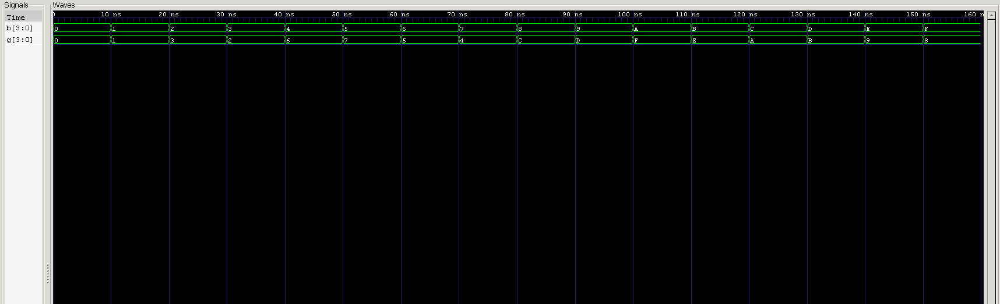

<div align="center">

# Binary to Gray Code Converter

**Dataflow Verilog Model · Vector Concatenation · Automated & Self-Checking Testbenches**

`Project 17` — Combinational Circuits — *Verilog Fundamentals*


</div>

---

## 📖 Overview

This project implements a **4-bit Binary to Gray Code Converter** using dataflow modeling in Verilog HDL. Gray code is a numbering system with one very deliberate property: **only one bit changes between any two consecutive values**. That single property is what makes it indispensable anywhere transition errors from propagation delay can cause real problems — digital communication, position sensing, and asynchronous digital systems all lean on it.

The converter is built from continuous assignment (`assign`), vector indexing, bitwise XOR (`^`), and vector concatenation (`{}`) — a compact set of RTL techniques for a circuit that turns out to need surprisingly little hardware. Verified with both a standard and a self-checking testbench.

### Project Objectives

- Understand the purpose of Gray code
- Learn the difference between Binary and Gray code
- Implement Binary-to-Gray conversion using dataflow modeling
- Learn the bitwise XOR (`^`) operation
- Learn vector indexing
- Learn vector concatenation (`{}`)
- Write a self-checking verification environment
- Verify all possible input combinations

---

## 🧠 What Is Gray Code?

Gray code is a binary numbering system in which **only one bit changes between consecutive numbers**. Ordinary binary can flip multiple bits at once between adjacent values — Gray code eliminates that entirely, which is exactly what prevents the erroneous intermediate states that propagation delay can otherwise cause.

| Decimal | Binary | Gray |
|:-:|:-:|:-:|
| 0 | 0000 | 0000 |
| 1 | 0001 | 0001 |
| 2 | 0010 | 0011 |
| 3 | 0011 | 0010 |
| 4 | 0100 | 0110 |
| 5 | 0101 | 0111 |
| 6 | 0110 | 0101 |
| 7 | 0111 | 0100 |

Only one bit changes at every step in the Gray column — that's the entire point.

---

## 🏗️ Block Diagram

```
                  ┌────────────────────────┐
   B[3:0] ───────►│  Binary to Gray         │───► G[3:0]
                  │      Converter          │
                  └────────────────────────┘
```

---

## ⚠️ Why Gray Code?

Consider the ordinary binary transition:

$$0111 \rightarrow 1000$$

Three bits change simultaneously. Because real gates don't switch instantaneously, propagation delay can cause the circuit to briefly pass through incorrect intermediate values — `1111`, `1011`, `1001` — before settling on the correct result. If anything reads the value during that window, it gets garbage.

The equivalent Gray code transition:

$$0100 \rightarrow 1100$$

Only **one** bit changes. There's no intermediate state to accidentally read, because there's no multi-bit race condition to begin with. This single guarantee is what makes Gray code dramatically more reliable in real hardware.

---

## 🌟 Applications

- Rotary Encoders
- Shaft Position Sensors
- Elevators
- Industrial Automation
- CNC Machines
- Robotics
- Analog-to-Digital Converters (ADCs)
- Asynchronous FIFO Pointers
- Clock Domain Crossing (CDC)
- FPGA & ASIC Designs

---

## 📊 Truth Table

| Binary | Gray |
|:------:|:----:|
| 0000 | 0000 |
| 0001 | 0001 |
| 0010 | 0011 |
| 0011 | 0010 |
| 0100 | 0110 |
| 0101 | 0111 |
| 0110 | 0101 |
| 0111 | 0100 |
| 1000 | 1100 |
| 1001 | 1101 |
| 1010 | 1111 |
| 1011 | 1110 |
| 1100 | 1010 |
| 1101 | 1011 |
| 1110 | 1001 |
| 1111 | 1000 |

---

## ⚙️ Boolean Equation Formation

For a 4-bit binary input `B3 B2 B1 B0`, the Gray code bits are:

$$G_3 = B_3$$

$$G_2 = B_3 \oplus B_2$$

$$G_1 = B_2 \oplus B_1$$

$$G_0 = B_1 \oplus B_0$$

The MSB passes straight through unchanged; every other bit is the XOR of itself with its neighbor one position higher.

---

## 🔌 Hardware Architecture

```
   B3 ─────────────────────────────► G3

   B3 ──┐
        ├──[XOR]───────────────────► G2
   B2 ──┘

   B2 ──┐
        ├──[XOR]───────────────────► G1
   B1 ──┘

   B1 ──┐
        ├──[XOR]───────────────────► G0
   B0 ──┘
```

The entire converter needs just **three XOR gates** and a direct wire for the MSB — about as efficient as combinational logic gets.

---

## 🎨 Design Philosophy

Rather than implementing this from a full 16-row truth table, Gray code generation exploits a simple mathematical relationship between adjacent binary bits: XOR each bit with its neighbor, and leave the MSB untouched. The result is RTL that's compact, efficient, and trivially synthesizable — no logic minimization required, because the relationship is already minimal.

---

## 💻 RTL Implementation

Implemented using **dataflow modeling** — the entire Gray output vector is produced by a **single continuous assignment statement**, combining vector indexing, bitwise XOR, and vector concatenation into one concise, readable line of RTL.

---

## 🆕 New Verilog Concept — Vector Indexing

Instead of declaring four separate scalar inputs:

```verilog
input b3, b2, b1, b0;
```

the design uses a single 4-bit vector:

```verilog
input [3:0] b;
```

and accesses individual bits via indexing:

```verilog
b[3]   b[2]   b[1]   b[0]
```

This is the standard approach in professional RTL — grouping related bits into one signal rather than scattering them across separate named ports.

---

## 🆕 New Verilog Concept — Vector Concatenation

The Gray output is assembled using the concatenation operator `{}`:

```verilog
{g3, g2, g1, g0}
```

Rather than assigning each output bit individually, all four bits are combined into a single vector assignment — resulting in cleaner, more maintainable RTL than four separate `assign` lines would give.

---

## 🆕 New Verilog Concept — Bitwise XOR

This project introduces the **bitwise XOR (`^`) operator**, which outputs HIGH only when its two input bits differ:

| A | B | A ^ B |
|:-:|:-:|:-----:|
| 0 | 0 | 0 |
| 0 | 1 | **1** |
| 1 | 0 | **1** |
| 1 | 1 | 0 |

Gray code conversion is one of the most common real-world uses of XOR in digital design — the entire converter is essentially XOR applied at the right bit offsets.

---

## 🔁 Design Flow

```
Binary Input → Boolean Equation → Dataflow RTL → Simulation → Gray Code Output
```

---

## 🧪 Testbench Methodology

With 4 inputs, the converter has:

$$2^4 = 16 \text{ test cases}$$

The testbench generates all sixteen binary values automatically via a loop, applying each to the DUT in sequence.

---

## ✅ Self-Checking Verification

The self-checking testbench:

- Computes the expected Gray code using the same mathematical relationship (not a hardcoded truth table)
- Compares it against the DUT output
- Prints `PASS` if they match
- Prints `FAIL` otherwise

Deriving the expected value mathematically rather than tabulating it keeps the reference model concise and easy to trust.

---

## 🌊 Simulation Waveform



**Analysis:**
- Binary input sequence steps through all 16 combinations correctly ✅
- Gray code output correctly reflects the XOR relationship at every step ✅
- Only one output bit changes between any two consecutive Gray values, confirming the defining Gray code property ✅
- Self-checking testbench reports PASS for all 16 test cases ✅

---

## 📂 Project Structure

```
17_binary_to_gray_converter/
├── rtl/
│   └── binary_to_gray.v
│
├── tb/
│   ├── binary_to_gray_tb.v
│   └── binary_to_gray_self_checking_tb.v
│
├── Images/
│   └── waveform.png
│
└── README.md
```

---

## ▶️ How to Run

```bash
# 1 — Compile
iverilog -o binary_to_gray.out rtl/binary_to_gray.v tb/binary_to_gray_tb.v

# 2 — Simulate
vvp binary_to_gray.out

# 3 — View Waveform
gtkwave waveform.vcd
```

---

## 🎯 Learning Outcomes

After completing this project, I learned:

- Binary Number System
- Gray Code Number System
- Binary to Gray Conversion
- Dataflow Modeling
- Bitwise XOR (`^`)
- Vector Indexing
- Vector Concatenation (`{}`)
- Continuous Assignment (`assign`)
- Standard Testbench Design
- Self-Checking Verification

---

## 🚀 Future Improvements

The concepts learned here prepare you for:

- Gray to Binary Converter
- Parity Generator
- Parity Checker
- CRC Generator
- Error Detection Circuits
- Communication Systems

---

## 🏁 Conclusion

This project demonstrated the implementation of a **4-bit Binary to Gray Code Converter** using dataflow modeling in Verilog HDL. By exploiting the XOR relationship between adjacent binary bits, the design efficiently generates Gray code while guaranteeing only one bit changes between consecutive values.

The project also introduced **vector indexing**, **vector concatenation**, and the **bitwise XOR operator** — reinforcing essential Verilog coding techniques and building a strong foundation for communication systems, error detection circuits, and more advanced digital hardware design.

---

<div align="center">

## 👨‍💻 Author

**Padma Charan S S**
*Repository: Verilog Fundamentals — Project-Driven Learning*

</div>

### 🗺️ Repository Roadmap

```
Basic Verilog → Logic Gates → 7400 Series ICs → Combinational Circuits
      → Sequential Circuits → RTL Design → Verification Methodologies
      → FPGA Design → Computer Architecture → Mini CPU Design
```