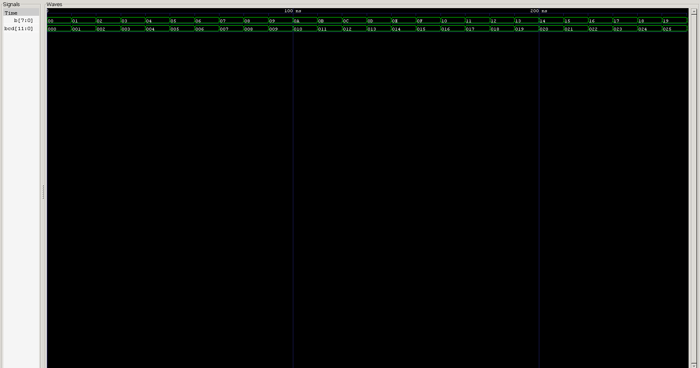

<div align="center">

# 🔢 19 — Binary to BCD Converter

### 8-Bit Binary → 12-Bit BCD · Double Dabble Algorithm in Verilog HDL

*Project 19 of the **Verilog Fundamentals** repository*

[](#)
[](#)
[](#)
[](#)
[](#)

</div>

---

## 📖 Overview

This project implements an **8-bit Binary to BCD Converter** using the **Double Dabble (Shift-and-Add-3) Algorithm** in Verilog HDL.

The converter accepts an 8-bit binary input covering the full range **0–255** and produces a **12-bit Binary Coded Decimal (BCD)** output — three decimal digits, each independently encoded in 4 bits.

```
Binary:  11111111
Decimal: 255
BCD:     0010 0101 0101
           2    5    5
```

This project marks a shift from simple Boolean gate design toward **algorithmic RTL** — hardware that represents a repeated computational process, built from a synthesizable `for` loop, a temporary working register, part-selects, and conditional correction logic.

Correctness is verified with an **automated self-checking testbench** that exhaustively tests all **256 possible inputs**.

---

## 🎯 Objectives

- 🔹 Understand Binary Coded Decimal (BCD) representation
- 🔹 Understand the difference between Binary and BCD
- 🔹 Learn the Double Dabble algorithm
- 🔹 Implement Binary → BCD conversion in synthesizable Verilog
- 🔹 Use procedural `for` loops inside RTL (not just testbenches)
- 🔹 Use temporary working registers and vector part-selects
- 🔹 Implement conditional Add-3 correction logic
- 🔹 Build an automated, self-checking testbench
- 🔹 Verify the complete input space (all 256 combinations)

---

## 📚 Prerequisites

| Topic | Why it matters |
|---|---|
| Combinational Logic Fundamentals | Foundation for `always @(*)` blocks |
| Verilog Vectors & Part-Selects | Access individual BCD digit fields |
| `for` Loops in Testbenches | Baseline before using `for` in RTL |
| Shift Operators (`<<`) | Core mechanism of Double Dabble |
| Conditional (`if`) Statements | Implements the Add-3 correction |
| Testbench Fundamentals | Build the self-checking verification |

---

## 🧠 What Is BCD?

**Binary Coded Decimal (BCD)** encodes every decimal digit independently using 4 binary bits, rather than representing the whole number as one binary value.

```
Decimal: 25
  2 → 0010
  5 → 0101
Therefore: 25 → 0010 0101
```

BCD uses only 10 of the 16 possible 4-bit patterns:

| Valid BCD (0–9) | Invalid BCD |
|---|---|
| `0000`–`1001` | `1010`, `1011`, `1100`, `1101`, `1110`, `1111` |

### Binary vs. BCD

| Decimal | Binary | BCD |
|:-:|:-:|:-:|
| 0 | `00000000` | `0000 0000 0000` |
| 5 | `00000101` | `0000 0000 0101` |
| 9 | `00001001` | `0000 0000 1001` |
| 10 | `00001010` | `0000 0001 0000` |
| 25 | `00011001` | `0000 0010 0101` |
| 99 | `01100011` | `0000 1001 1001` |
| 100 | `01100100` | `0001 0000 0000` |
| 255 | `11111111` | `0010 0101 0101` |

> ⚠️ **Why not just split the binary bits?** `11111111` naively splits into `1111 1111` = 15 and 15 — neither is a valid BCD digit (max is 9). A proper conversion algorithm is required.

Since the max value is 255, **three decimal digits** are needed (Hundreds, Tens, Ones), each 4 bits → **12-bit output**, `BCD[11:0]`.

---

## 🔁 The Double Dabble Algorithm

Also called **Shift-and-Add-3**, this is a hardware-friendly method for binary → BCD conversion. It repeats two operations once per input bit:

1. **Add 3** to any BCD digit ≥ 5
2. **Shift** the entire working register left by 1 bit

For an 8-bit input, this repeats **8 times**.

### Why Add 3?

Shifting a BCD digit left doubles its value. `4 × 2 = 8` is still valid, but `5 × 2 = 10` overflows a single BCD digit. Pre-correcting digits ≥ 5 by adding 3 ensures the shift produces the correct decimal carry:

```
Digit ≥ 5  ──▶  Digit + 3  ──▶  Shift left
```

### Process Flow

```
Binary Input
     │
     ▼
Initialize BCD digits to zero
     │
     ▼
Check Hundreds digit ── if ≥ 5 → Add 3
     │
     ▼
Check Tens digit ── if ≥ 5 → Add 3
     │
     ▼
Check Ones digit ── if ≥ 5 → Add 3
     │
     ▼
Shift working register left
     │
     ▼
Process next binary bit ── repeat × 8
     │
     ▼
12-bit BCD Output
```

---

## 🗂️ Working Register

The design uses a **20-bit temporary working register**, split into a 12-bit BCD area and an 8-bit binary input area:

```
┌──────────────┬───────────────┐
│   BCD Area   │  Binary Input │
│    12 bits   │     8 bits    │
└──────────────┴───────────────┘
     [19:8]          [7:0]
```

| Field | Bits | Represents |
|---|:-:|---|
| `temp[19:16]` | 4 | Hundreds digit |
| `temp[15:12]` | 4 | Tens digit |
| `temp[11:8]` | 4 | Ones digit |
| `temp[7:0]` | 8 | Binary processing area |

Initially: `temp = 0000_0000_0000_BBBBBBBB`. Across 8 shift iterations, the binary bits migrate into the BCD region, being corrected along the way.

---

## 🔌 Block Diagram

```
                    ┌──────────────────────┐
                    │                        │
Binary Input ──────▶│   Double Dabble        │
   B[7:0]            │   Conversion Logic     │
                    │                        │
                    │   Add 3 if digit ≥ 5   │
                    │            │            │
                    │        Shift << 1       │
                    │            │            │
                    │        Repeat × 8        │
                    │                        │
                    └───────────┬────────────┘
                                 │
                                 ▼
                           BCD Output [11:0]
                                 │
             ┌───────────────────┼───────────────────┐
             │                   │                   │
         Hundreds              Tens                Ones
          [11:8]               [7:4]               [3:0]
```

---

## 🏗️ Hardware Architecture

- 8-bit binary input
- 20-bit temporary working register
- Three 4-bit BCD correction sections (Hundreds / Tens / Ones)
- Conditional Add-3 correction logic
- Left-shift operation
- 12-bit BCD output

> The entire algorithm is implemented as **combinational logic** — no clock signal is required.

---

## 💻 RTL Implementation

The core logic lives inside a single `always @(*)` block, where the working register is updated using a **synthesizable `for` loop**:

```verilog
always @(*) begin
    temp = {12'b0, binary_in};   // load binary into working register

    for (i = 0; i < 8; i = i + 1) begin
        if (temp[19:16] >= 5) temp[19:16] = temp[19:16] + 3;  // Hundreds
        if (temp[15:12] >= 5) temp[15:12] = temp[15:12] + 3;  // Tens
        if (temp[11:8]  >= 5) temp[11:8]  = temp[11:8]  + 3;  // Ones

        temp = temp << 1;   // shift entire register left
    end

    bcd_out = temp[19:8];   // extract final BCD result
end
```

| Element | Purpose |
|---|---|
| `temp[19:0]` | Combined BCD + binary working register |
| `for (i = 0; i < 8; ...)` | One correction-and-shift cycle per input bit |
| `if (digit >= 5) digit = digit + 3;` | The "Add-3" correction |
| `temp = temp << 1;` | Propagates binary data into the BCD region |

---

## 💡 New Verilog Concepts

<table>
<tr>
<td valign="top" width="50%">

**Synthesizable `for` Loop**

Previously used only in testbenches for stimulus generation — here it's used *inside RTL*. The synthesis tool unrolls it into repeated combinational hardware.

> A `for` loop in synthesizable RTL does **not** imply multiple clock cycles — this design stays fully combinational.

**Temporary Working Register**

`temp[19:0]` holds both the BCD digits *and* the shifting binary input simultaneously, enabling the whole Double Dabble process in one register.

</td>
<td valign="top" width="50%">

**Vector Part-Select**

```verilog
temp[19:16]   // Hundreds
temp[15:12]   // Tens
temp[11:8]    // Ones
```
Part-selects isolate and modify specific digit fields within the larger vector.

**Procedural Assignment + Shift**

```verilog
temp[19:16] = temp[19:16] + 3;  // Add-3 correction
temp = temp << 1;               // Left shift
```
Applied repeatedly inside the `always @(*)` block to drive the algorithm forward.

</td>
</tr>
</table>

---

## 🎯 Design Flow

```
8-bit Binary Input
        │
        ▼
Initialize 20-bit Working Register
        │
        ▼
Check BCD Digits ── Add 3 if Digit ≥ 5
        │
        ▼
Shift Left ── Repeat × 8
        │
        ▼
Extract BCD[11:0]
        │
        ▼
Simulation ── Self-Checking Verification
```

---

## 🧪 Testbench Methodology

With **8 input bits**, the full input space is:

$$2^8 = 256 \text{ combinations}$$

The automated testbench loops from **0 → 255**, applying every possible input to the DUT — complete input-space coverage, not sampled cases.

### Expected BCD Calculation

The testbench independently derives the expected digits arithmetically. For decimal `237`:

```
Hundreds = 237 / 100        = 2
Remaining = 237 % 100        = 37
Tens      = 37 / 10          = 3
Ones      = 37 % 10          = 7

237  →  2  3  7  →  0010 0011 0111
```

### Self-Checking Verification

```
Expected BCD   vs   DUT BCD
```

For every one of the 256 inputs:
- ✅ **Match** → `PASS`
- ❌ **Mismatch** → `FAIL`

The testbench maintains a running failure counter and reports a final pass/fail summary at the end of simulation.

---

## 🌊 Simulation Waveform



The waveform should demonstrate:
- The binary input sequence sweeping across test values
- The corresponding BCD output at each step
- Correct conversion across the complete input range

---

## 📂 Project Structure

```
19_binary_to_bcd/
├── README.md
├── rtl/
│   └── binary_to_bcd.v
├── tb/
│   ├── binary_to_bcd_tb.v
│   └── binary_to_bcd_self_checking_tb.v
└── Images/
    └── waveform.png
```

---

## ▶️ How to Run

```bash
# 1. Compile design + testbench
iverilog -o binary_to_bcd.out rtl/binary_to_bcd.v tb/binary_to_bcd_tb.v

# 2. Run the simulation
vvp binary_to_bcd.out

# 3. View waveform in GTKWave
gtkwave waveform.vcd
```

---

## 🌟 Applications

Binary-to-BCD conversion matters wherever a binary value needs to be **displayed or processed as decimal digits**:

<table>
<tr>
<td valign="top" width="50%">

**Display Systems**
- Digital counters & clocks
- Calculators
- Seven-segment displays
- Digital meters

</td>
<td valign="top" width="50%">

**Systems & Instrumentation**
- Embedded systems
- Microprocessor systems
- FPGA display interfaces
- Digital instrumentation

</td>
</tr>
</table>

---

## 🎓 Learning Outcomes

<table>
<tr>
<td valign="top" width="50%">

**Conceptual**
- Binary vs. BCD representation
- Double Dabble / Shift-and-Add-3 method
- Algorithmic (not just Boolean) RTL design

</td>
<td valign="top" width="50%">

**Verilog & Verification**
- `always @(*)`, synthesizable `for` loops
- Temporary working registers & part-selects
- Shift operators, conditional logic
- Self-checking, full-coverage testbenches

</td>
</tr>
</table>

---

## 💼 Interview Questions

<details>
<summary><b>1. What is BCD, and how does it differ from pure binary?</b></summary>
<br>

BCD encodes each decimal digit independently in 4 bits, while pure binary represents the whole number using positional powers of two. BCD trades compactness for straightforward decimal-digit extraction.
</details>

<details>
<summary><b>2. Why can't you just split an 8-bit binary number into two 4-bit nibbles to get BCD?</b></summary>
<br>

Because a 4-bit nibble can represent values 0–15, but valid BCD digits only span 0–9. Values 10–15 (`1010`–`1111`) are invalid BCD digits, so a conversion algorithm is required.
</details>

<details>
<summary><b>3. What is the Double Dabble algorithm?</b></summary>
<br>

A hardware-friendly binary-to-BCD conversion method that repeatedly adds 3 to any BCD digit ≥ 5, then shifts the entire working register left by one bit — once per input bit.
</details>

<details>
<summary><b>4. Why is 3 added to digits ≥ 5 before shifting?</b></summary>
<br>

Shifting doubles a digit's value. Doubling a digit ≥ 5 would overflow past 9 (a single BCD digit's max), so adding 3 beforehand makes the shift produce the correct decimal carry into the next digit position.
</details>

<details>
<summary><b>5. How many iterations does an 8-bit Double Dabble conversion require?</b></summary>
<br>

Eight — one shift-and-correct cycle per input bit.
</details>

<details>
<summary><b>6. Does using a `for` loop inside RTL mean the design takes multiple clock cycles?</b></summary>
<br>

Not necessarily. A `for` loop inside synthesizable combinational RTL is unrolled by the synthesis tool into repeated hardware logic — this design remains fully combinational with no clock signal.
</details>

<details>
<summary><b>7. Why is a 20-bit working register used for an 8-bit input and 12-bit output?</b></summary>
<br>

It holds both regions simultaneously: 12 bits for the growing BCD digits and 8 bits for the shrinking binary input, allowing the whole conversion to happen through repeated shifts within one register.
</details>

<details>
<summary><b>8. How does the self-checking testbench validate correctness?</b></summary>
<br>

For every one of the 256 possible 8-bit inputs, it independently computes the expected BCD digits via division/modulo arithmetic, compares that against the DUT's output, and reports PASS/FAIL — tracking a failure counter across the full input space.
</details>

---

## 🚀 Future Work

This project's concepts feed directly into:

- BCD → Seven-Segment Decoder
- Gray → Binary Converter
- Parity Generator / Checker
- Digital Display Systems
- Arithmetic Processing Units
- ALU Design

---

## ✅ Conclusion

This project implements an **8-bit Binary to BCD Converter** using the **Double Dabble (Shift-and-Add-3) algorithm**, converting values from **0 to 255** into their corresponding **12-bit BCD representation**.

It introduces key algorithmic RTL concepts — **synthesizable `for` loops, temporary working registers, part-selects, procedural assignments, and shift operations** — and is fully verified across all **256 possible inputs** using an automated self-checking testbench.

This project marks an important step from simple Boolean combinational circuits toward **algorithmic RTL design**, where a hardware description represents a repeated computational process rather than a direct Boolean equation.

---

<div align="center">

## 👨‍💻 Author

**Padma Charan S S**

**Repository:** Verilog Fundamentals · **Approach:** Project-Driven Learning

### 🗺️ Repository Roadmap

```
Basic Verilog → Logic Gates → 7400 Series ICs → Combinational Circuits
     → Sequential Logic → RTL Design → FPGA Design → Computer Architecture → CPU Design
```

*Every project teaches one new concept through practical implementation.*

---

> *"Double Dabble shows that hardware can encode a repeated computational process — not just a Boolean equation — turning a shift register into a decimal-digit extractor."*

</div>