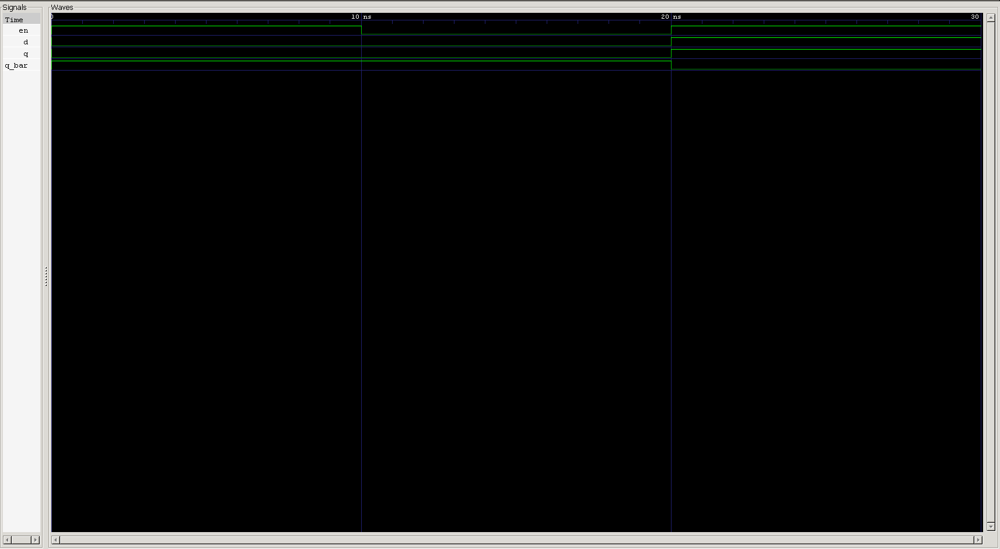

<div align="center">

# 🚪 D Latch (Transparent Latch)

**A hazard-free, single-input evolution of the SR latch — eliminating the forbidden state by construction**

[](#)
[](#)
[](#)
[-purple.svg)](#)
[](#)

</div>

---

## 📑 Table of Contents

- [Overview](#-overview)
- [Learning Objectives](#-learning-objectives)
- [Prerequisites](#-prerequisites)
- [Theory](#-theory)
- [Truth Table](#-truth-table)
- [Symbol & Interface](#-symbol--interface)
- [RTL Design](#-rtl-design)
- [Design Notes](#-design-notes)
- [Testbench](#-testbench)
- [Expected Simulation Results](#-expected-simulation-results)
- [Waveform](#-waveform)
- [Project Structure](#-project-structure)
- [Getting Started](#️-getting-started)
- [Key Concepts Learned](#-key-concepts-learned)
- [Reflections](#-reflections)
- [Interview Questions](#-interview-questions)
- [Author](#-author)

---

## 📖 Overview

The **D Latch** (Data or "Delay" latch) is the natural next step after the SR latch: it replaces the two independent Set/Reset inputs with a **single data input, `d`**, guaranteeing that `q` and `q_bar` are always complementary whenever the latch is transparent. This removes the SR latch's forbidden `S=R` state entirely — there's no combination of a single bit that can produce an invalid configuration.

Like the [Gated SR Latch](../sr_latch), this is a **level-sensitive** device: while `en` (enable) is high, the latch is *transparent* and `q` tracks `d` directly. While `en` is low, the latch **holds** its last value, ignoring any further changes on `d`.

---

## 🎯 Learning Objectives

| # | Concept |
|---|---------|
| 1 | D latch behavior as a refinement of the SR latch |
| 2 | Eliminating invalid/forbidden states by design |
| 3 | Level-sensitive transparency vs. hold behavior |
| 4 | Latch inference via intentionally incomplete assignments |
| 5 | `case` statements inside `always @(*)` |
| 6 | Defensive handling of unknown (`x`/`z`) input states |
| 7 | Old-style (non-ANSI) Verilog port declarations |
| 8 | Self-checking testbenches for sequential logic |
| 9 | RTL simulation using Icarus Verilog |
| 10 | Waveform verification using GTKWave |

---

## 📚 Prerequisites

- The [Gated SR Latch](../sr_latch) project (this design builds directly on it)
- Verilog `always` blocks and sensitivity lists
- The concept of latch inference via incomplete assignment
- Basic familiarity with blocking assignments (`=`)

---

## 🧠 Theory

A D latch can be thought of as an SR latch with its forbidden state designed out: instead of independent `s`/`r` inputs, a single `d` input is internally routed so that `S` and `R` are always complements of each other. As a result:

- **`en = 1`** → the latch is **transparent**: `q` follows `d` directly (`q = d`, `q_bar = ~d`).
- **`en = 0`** → the latch **holds** its last output, ignoring any further changes on `d`.

Because `d` is a single bit, `q` and `q_bar` can never disagree the way an SR latch's outputs can when `S = R` — there simply isn't a second independent input to create that conflict.

---

## 📊 Truth Table

| `en` | `d` | Mode | `q` | `q_bar` |
|:---:|:---:|:---:|:---:|:---:|
| 0 | X | HOLD | previous | previous |
| 1 | 0 | TRANSPARENT | 0 | 1 |
| 1 | 1 | TRANSPARENT | 1 | 0 |

---

## 🔌 Symbol & Interface

```text
                  D LATCH
            ┌───────────────────┐
      D  ──►│                   │──► Q
      EN ──►│      D LATCH      │──► Q_BAR
            │                   │
            └───────────────────┘
```

### Inputs

| Signal | Width | Description |
|---|:---:|---|
| `en` | 1-bit | Latch transparency control — `1` = transparent, `0` = hold |
| `d` | 1-bit | Data input |

### Outputs

| Signal | Width | Description |
|---|:---:|---|
| `q` | 1-bit | Latch output |
| `q_bar` | 1-bit | Complementary latch output |

---

## 💻 RTL Design

```verilog
module d_latch (en,d,q,q_bar);

input en;
input d;
output reg q;
output reg q_bar;

always @(*) begin
    if(en)
    begin
        case (d)
           1'b0 : begin
            q=0;
            q_bar=1;
           end
           1'b1 : begin
            q=1;
            q_bar=0;

           end
            default: 

            begin
                q=1'bx;
                q_bar=1'bx;
            end
        endcase
    end
    else
    begin
        //hold
    end
    
end

endmodule
```

---

## 🔍 Design Notes

<details>
<summary><strong>The <code>default</code> case isn't dead code</strong></summary><br>

Since `d` is declared as a single bit, it looks like `1'b0` and `1'b1` cover every possibility — but Verilog's 4-state value system means `d` can also carry `x` (unknown) or `z` (high-impedance), particularly on uninitialized signals early in simulation. The `default` branch catches those cases and propagates `x` to both outputs rather than silently falling through, which keeps simulation behavior honest about genuinely unknown states instead of masking them.
</details>

<details>
<summary><strong>Latch inference in the <code>else</code> branch is intentional</strong></summary><br>

As with the SR latch, the empty `else // hold` branch is what causes Verilog to infer a storage element that retains its previous value when `en = 0`. This would be a red flag in ordinary combinational logic, but it's the entire mechanism this design relies on to hold state.
</details>

<details>
<summary><strong>Port declaration style</strong></summary><br>

This module uses the older Verilog-1995 style — port names listed in the module header, with direction and type declared separately below — rather than the more modern ANSI-style inline declarations (`input wire en, input wire d, ...`) used in earlier projects in this repo. Both are functionally equivalent; ANSI style is generally preferred in new code for readability, but you'll encounter the older style often in legacy codebases.
</details>

<details>
<summary><strong>Consider adding a <code>`timescale</code> directive</strong></summary><br>

Unlike the earlier NOT gate and SR latch modules, this file doesn't declare `` `timescale ``. It isn't required for functional simulation, but without it, delay values in the testbench (e.g. `#10`) fall back to simulator defaults rather than an explicit, well-defined time unit — worth adding `` `timescale 1ns/1ps `` at the top for consistency with the rest of the repo.
</details>

---

## 🧪 Testbench

A self-checking-style testbench exercises transparency, data tracking, and the enable-gated hold behavior:

```verilog
`timescale 1ns/1ps

module d_latch_tb;

    reg  en;
    reg  d;
    wire q, q_bar;

    // Instantiate DUT
    d_latch DUT (
        .en    (en),
        .d     (d),
        .q     (q),
        .q_bar (q_bar)
    );

    initial begin
        $dumpfile("waveform_d_latch.vcd");
        $dumpvars(0, d_latch_tb);

        // t=0   | en=0 → HOLD (outputs undefined until first drive)
        en = 0; d = 0; #10;

        // t=10  | en=1, d=1 → TRANSPARENT, q follows d
        en = 1; d = 1; #10;

        // t=20  | en=1, d=0 → still transparent, q tracks the change
        d = 0; #10;

        // t=30  | en=0, d=1 → HOLD (d change is ignored)
        en = 0; d = 1; #10;

        // t=40  | d=0 while en=0 → still HOLD, no change
        d = 0; #10;

        // t=50  | en=1, d=1 → transparent again
        en = 1; d = 1; #10;

        $finish;
    end

endmodule
```

---

## 📊 Expected Simulation Results

| Time (ns) | `en` | `d` | Mode | `q` | `q_bar` |
|:---:|:---:|:---:|:---:|:---:|:---:|
| 0  | 0 | 0 | HOLD (initial, undriven) | x | x |
| 10 | 1 | 1 | TRANSPARENT | 1 | 0 |
| 20 | 1 | 0 | TRANSPARENT (tracks change) | 0 | 1 |
| 30 | 0 | 1 | HOLD (ignores `d`) | 0 | 1 |
| 40 | 0 | 0 | HOLD (still ignores `d`) | 0 | 1 |
| 50 | 1 | 1 | TRANSPARENT | 1 | 0 |
| 60 | — | — | `$finish` — simulation ends | — | — |

---

## 🌊 Waveform



**Analysis**

- **@ 0–10 ns** — `en = 0`; outputs remain undriven (`x`) since no state has been latched yet.
- **@ 10 ns** — `en` goes high with `d = 1` → `q` rises to `1`, `q_bar` falls to `0`.
- **@ 20 ns** — `d` changes to `0` while `en` is still high → `q` **immediately follows** to `0`, confirming transparency.
- **@ 30 ns** — `en` drops to `0` while `d` simultaneously changes to `1` → outputs **hold** at their prior value (`q = 0`), proving `d` is ignored once disabled.
- **@ 40 ns** — `d` changes again to `0` while `en` remains low → no effect; outputs stay held.
- **@ 50 ns** — `en` returns high with `d = 1` → latch becomes transparent again and `q` follows `d` up to `1`.
- **@ 60 ns** — `$finish` terminates the simulation.

---

## 📂 Project Structure

```text
0X_d_latch/
├── README.md
├── d_latch.v
├── d_latch_tb.v
└── waveform_d_latch.png
```

---

## ▶️ Getting Started

### Step 1 — Compile

```bash
iverilog -o d_latch.out d_latch.v d_latch_tb.v
```

### Step 2 — Run Simulation

```bash
vvp d_latch.out
```

### Step 3 — Open GTKWave

```bash
gtkwave waveform_d_latch.vcd
```

---

## 🎓 Key Concepts Learned

<table>
<tr>
<td valign="top" width="33%">

**Design**
- D latch behavior
- Level-sensitive transparency
- Hold vs. transparent modes
- Eliminating invalid states by construction
- Relationship to the SR latch

</td>
<td valign="top" width="33%">

**Verilog Mechanics**
- Behavioral modeling
- `always @(*)`
- `case` statements
- Latch inference via incomplete assignment
- Non-ANSI port declarations

</td>
<td valign="top" width="33%">

**Toolflow**
- `` `timescale ``
- `$dumpfile` / `$dumpvars`
- `$finish`
- Icarus Verilog
- GTKWave

</td>
</tr>
</table>

---

## 📝 Reflections

Building the D latch right after the SR latch made the relationship between the two very concrete: the D latch isn't a different circuit so much as a **constrained** SR latch, where the single data input structurally prevents the forbidden state from ever occurring. It also reinforced a subtlety easy to miss on a single-bit signal — that `x`/`z` are real, reachable values in simulation, not just an academic footnote, which is why the `default` case in the `case` statement actually matters here.

This project builds directly on the sequential-logic foundation laid by the SR latch.

---

## 💼 Interview Questions

<details>
<summary><strong>1. How does a D latch eliminate the SR latch's invalid state?</strong></summary><br>

By deriving both control signals from a single data input instead of two independent ones, so `S` and `R` (internally) are always complements of each other — there's no way to drive both "set" and "reset" simultaneously.
</details>

<details>
<summary><strong>2. Why is the <code>default</code> case in the <code>case (d)</code> statement necessary if <code>d</code> is only one bit?</strong></summary><br>

Because Verilog signals are 4-state, not 2-state — a single bit can still carry `x` or `z` (commonly seen on uninitialized signals). The `default` branch ensures those states are handled explicitly rather than left to fall through silently.
</details>

<details>
<summary><strong>3. What does "transparent" mean in the context of a latch?</strong></summary><br>

It means the output directly follows the input in real time while the latch is enabled — any change on `d` immediately propagates to `q`, as opposed to being sampled only at a specific instant (which is how a flip-flop behaves).
</details>

<details>
<summary><strong>4. Why is the <code>else</code> branch of the <code>if(en)</code> statement left empty?</strong></summary><br>

The absence of an assignment there is what causes Verilog to infer a latch that retains its previous output — it's the mechanism that implements "hold," not a missing case.
</details>

<details>
<summary><strong>5. What's the practical risk of using a level-sensitive latch instead of an edge-triggered flip-flop in a synchronous digital system?</strong></summary><br>

Because a latch stays transparent for the entire time it's enabled (not just an instant), it's more vulnerable to timing hazards like race conditions between combinational logic feeding it, which is why most synchronous designs favor edge-triggered flip-flops for their datapath and use latches sparingly and deliberately.
</details>

<details>
<summary><strong>6. In this design, why does the testbench change <code>d</code> while <code>en</code> is still high before disabling it?</strong></summary><br>

To confirm the latch is genuinely transparent — that `q` tracks `d` in real time, not just on the first assignment — before testing that the same change is ignored once `en` goes low.
</details>

<details>
<summary><strong>7. What's the difference between the old-style port declaration used here and ANSI-style declarations?</strong></summary><br>

Old-style (Verilog-1995) declares port names in the module header and their direction/type separately in the body, as this file does. ANSI-style (Verilog-2001 onward) declares direction and type inline in the header itself. They're functionally identical — ANSI style is just more concise and generally preferred in modern code.
</details>

---

## 🚀 What's Next

<div align="center">

Moving from level-sensitive latches toward edge-triggered storage — the D Flip-Flop — where transparency gives way to sampling only at a clock edge.

</div>

---

<div align="center">

## 👨‍💻 Author

**Padma Charan S S**

**Repository:** Verilog Fundamentals · **Section:** Sequential Logic

**Learning Approach:** Project-Driven Learning

### Repository Roadmap

```
Basic Verilog → Combinational Logic → Sequential Logic
      → RTL Design → FPGA Design → Computer Architecture → CPU Design
```

*Every project teaches one new concept through practical implementation.*

---

*"Learning Verilog by designing hardware, verifying functionality, documenting the process, and improving one project at a time."*

</div>