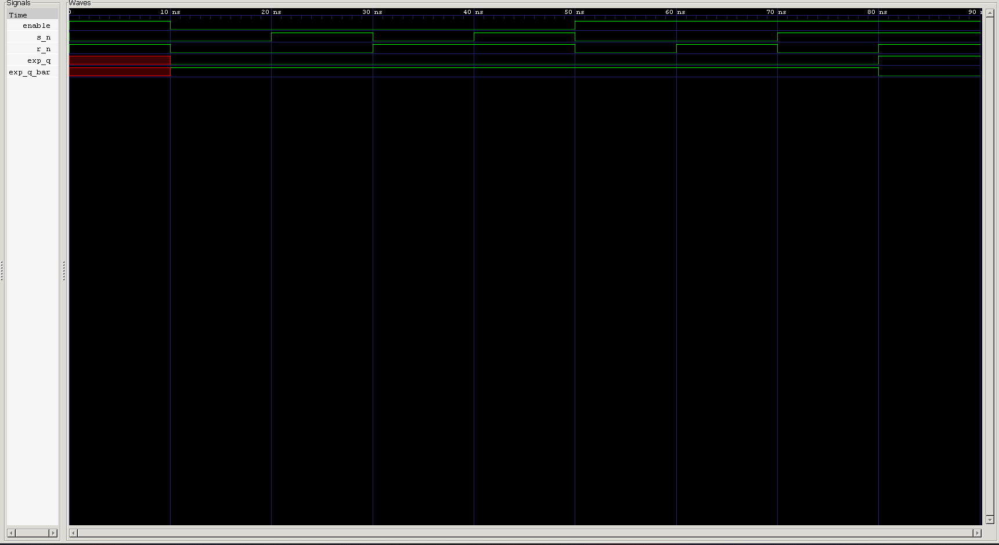

<div align="center">

# 🔒 Gated SR Latch

**A level-sensitive Set-Reset Latch with active-low control inputs — the first sequential storage element in the Verilog Fundamentals journey**

[](#)
[](#)
[](#)
[-purple.svg)](#)
[](#)

</div>

---

## 📑 Table of Contents

- [Overview](#-overview)
- [Learning Objectives](#-learning-objectives)
- [Prerequisites](#-prerequisites)
- [Theory](#-theory)
- [Truth Table](#-truth-table)
- [Symbol & Interface](#-symbol--interface)
- [RTL Design](#-rtl-design)
- [Design Notes](#-design-notes)
- [Testbench](#-testbench)
- [Expected Simulation Results](#-expected-simulation-results)
- [Waveform](#-waveform)
- [Project Structure](#-project-structure)
- [Getting Started](#️-getting-started)
- [Key Concepts Learned](#-key-concepts-learned)
- [Reflections](#-reflections)
- [Interview Questions](#-interview-questions)
- [Author](#-author)

---

## 📖 Overview

The **SR (Set-Reset) Latch** is the most fundamental memory element in digital electronics — the building block that everything from flip-flops to register files is ultimately derived from. Unlike the purely combinational logic gates covered earlier in this repository, a latch can **hold state**, making this the first *sequential* circuit in the journey.

This project implements a **Gated SR Latch**: a level-sensitive latch with active-low `s_n` (Set) and `r_n` (Reset) inputs, controlled by an `enable` signal. When `enable` is high, the latch is *transparent* and responds to `s_n`/`r_n`. When `enable` is low, the latch *holds* its last state regardless of the inputs.

---

## 🎯 Learning Objectives

| # | Concept |
|---|---------|
| 1 | Level-sensitive latch behavior in Verilog |
| 2 | Behavioral (not gate-level) sequential modeling |
| 3 | Active-low input convention (`_n` suffix) |
| 4 | Latch inference via intentionally incomplete assignments |
| 5 | `case` statements inside `always @(*)` |
| 6 | Enable-gated storage elements |
| 7 | Set / Reset / Hold / Invalid states |
| 8 | Self-checking testbenches for sequential logic |
| 9 | RTL simulation using Icarus Verilog |
| 10 | Waveform verification using GTKWave |

---

## 📚 Prerequisites

- Combinational logic fundamentals (see prior logic gate projects)
- The concept of digital memory / state retention
- Verilog `always` blocks and sensitivity lists
- Basic familiarity with blocking assignments (`=`)

---

## 🧠 Theory

A **Gated SR Latch** extends the classic SR latch with an `enable` input that determines whether the latch is transparent (tracking its S/R inputs) or opaque (holding its last output).

**Behavior in this design:**

- **`enable = 0`** → the latch **holds** its previous output, ignoring `s_n` and `r_n` entirely.
- **`enable = 1`** → the latch responds to `{s_n, r_n}`:
  - `s_n = r_n = 0` → **HOLD** (retain previous state)
  - `s_n = 0, r_n = 1` → **RESET** (`q = 0`)
  - `s_n = 1, r_n = 0` → **SET** (`q = 1`)
  - `s_n = r_n = 1` → **INVALID** (`q = q_bar = x`, undefined)

> ⚠️ See [Design Notes](#-design-notes) — this state mapping is worth double-checking against your intended convention before treating it as a drop-in NAND-gate SR latch.

---

## 📊 Truth Table

| `enable` | `s_n` | `r_n` | Mode | `q` | `q_bar` |
|:---:|:---:|:---:|:---:|:---:|:---:|
| 0 | X | X | HOLD | previous | previous |
| 1 | 0 | 0 | HOLD | previous | previous |
| 1 | 0 | 1 | RESET | 0 | 1 |
| 1 | 1 | 0 | SET | 1 | 0 |
| 1 | 1 | 1 | INVALID | x | x |

---

## 🔌 Symbol & Interface

```text
                 GATED SR LATCH
            ┌───────────────────────┐
   ENABLE ─►│                       │
     S_N  ─►│      SR LATCH         │──► Q
     R_N  ─►│                       │──► Q_BAR
            └───────────────────────┘
```

### Inputs

| Signal | Width | Description |
|---|:---:|---|
| `enable` | 1-bit | Latch transparency control — `1` = transparent, `0` = hold |
| `s_n` | 1-bit | Active-low Set |
| `r_n` | 1-bit | Active-low Reset |

### Outputs

| Signal | Width | Description |
|---|:---:|---|
| `q` | 1-bit | Latch output |
| `q_bar` | 1-bit | Complementary latch output |

---

## 💻 RTL Design

```verilog
`timescale 1ns/1ps

module sr_latch(
    input enable,
    input s_n,
    input r_n,

    output reg q,
    output reg q_bar
);

always @(*) begin

    if (enable) begin

        case ({s_n, r_n})

            2'b00: begin
                // HOLD
                // No assignment → retain previous state
            end

            2'b01: begin
                // RESET
                q     = 1'b0;
                q_bar = 1'b1;
            end

            2'b10: begin
                // SET
                q     = 1'b1;
                q_bar = 1'b0;
            end

            2'b11: begin
                // INVALID / FORBIDDEN
                q     = 1'bx;
                q_bar = 1'bx;
            end

            default: begin
                q     = 1'bx;
                q_bar = 1'bx;
            end

        endcase

    end

    else begin
        // ENABLE = 0 → HOLD
        // No assignment → retain previous state
    end

end

endmodule
```

---

## 🔍 Design Notes

<details>
<summary><strong>Latch inference is intentional here — not a bug</strong></summary><br>

In ordinary combinational design, an `always @(*)` block that doesn't assign an output on every path (like the `HOLD` branches here) triggers a synthesis warning and infers an unwanted latch. **In this design, that inferred latch *is* the point** — it's precisely how the storage behavior is implemented. If you see lint warnings about incomplete assignments in this file, that's expected and correct, not something to "fix" by adding a default `q = q; q_bar = q_bar;` — doing so wouldn't change simulated behavior but is worth being deliberate about either way.
</details>

<details>
<summary><strong>Double-check the SET/RESET/HOLD/INVALID mapping against your target convention</strong></summary><br>

The classic NAND-gate-based SR latch with active-low inputs (the behavior the `_n` suffix typically implies) usually defines:

- `s_n = r_n = 1` → **HOLD**
- `s_n = r_n = 0` → **INVALID**

This design maps those two states the opposite way (`00` = HOLD, `11` = INVALID), and SET/RESET are likewise swapped relative to that convention. That's not necessarily wrong — it depends entirely on what you intended `s_n`/`r_n` to mean in *this* design — but if you were modeling a standard cross-coupled NAND latch, it's worth re-checking the case mapping against your reference truth table.
</details>

---

## 🧪 Testbench

A self-checking-style testbench exercises every reachable state, including the enable-gated hold behavior:

```verilog
`timescale 1ns/1ps

module sr_latch_tb;

    reg  enable;
    reg  s_n, r_n;
    wire q, q_bar;

    // Instantiate DUT
    sr_latch DUT (
        .enable (enable),
        .s_n    (s_n),
        .r_n    (r_n),
        .q      (q),
        .q_bar  (q_bar)
    );

    initial begin
        $dumpfile("waveform_sr_latch.vcd");
        $dumpvars(0, sr_latch_tb);

        // t=0   | enable=0 → HOLD (outputs undefined until first drive)
        enable = 0; s_n = 1; r_n = 1; #10;

        // t=10  | enable=1, s_n=1, r_n=0 → SET
        enable = 1; s_n = 1; r_n = 0;  #10;

        // t=20  | s_n=0, r_n=0 → HOLD (retains SET state)
        s_n = 0; r_n = 0; #10;

        // t=30  | s_n=0, r_n=1 → RESET
        s_n = 0; r_n = 1; #10;

        // t=40  | s_n=1, r_n=1 → INVALID
        s_n = 1; r_n = 1; #10;

        // t=50  | enable=0 → HOLD (ignores s_n/r_n changes)
        enable = 0; s_n = 1; r_n = 0; #10;

        $finish;
    end

endmodule
```

---

## 📊 Expected Simulation Results

| Time (ns) | `enable` | `s_n` | `r_n` | Mode | `q` | `q_bar` |
|:---:|:---:|:---:|:---:|:---:|:---:|:---:|
| 0  | 0 | 1 | 1 | HOLD (initial, undriven) | x | x |
| 10 | 1 | 1 | 0 | SET | 1 | 0 |
| 20 | 1 | 0 | 0 | HOLD (retains SET) | 1 | 0 |
| 30 | 1 | 0 | 1 | RESET | 0 | 1 |
| 40 | 1 | 1 | 1 | INVALID | x | x |
| 50 | 0 | 1 | 0 | HOLD (enable overrides inputs) | x | x |
| 60 | — | — | — | `$finish` — simulation ends | — | — |

---

## 🌊 Waveform



**Analysis**

- **@ 0–10 ns** — `enable = 0`; outputs remain undriven (`x`) since no state has been set yet.
- **@ 10 ns** — `enable` goes high with `{s_n, r_n} = 10` → `q` rises to `1` (SET).
- **@ 20 ns** — `{s_n, r_n} = 00` → outputs **hold** at `q = 1`, confirming state retention within the enabled window.
- **@ 30 ns** — `{s_n, r_n} = 01` → `q` falls to `0` (RESET).
- **@ 40 ns** — `{s_n, r_n} = 11` → both outputs go to `x` (INVALID / forbidden state).
- **@ 50 ns** — `enable` drops to `0`; despite `s_n = 1, r_n = 0` (which would normally SET), the outputs **hold** their prior value — confirming `enable` gates the latch correctly.
- **@ 60 ns** — `$finish` terminates the simulation.

---

## 📂 Project Structure

```text
0X_sr_latch/
├── README.md
├── sr_latch.v
├── sr_latch_tb.v
└── waveform_sr_latch.png
```

---

## ▶️ Getting Started

### Step 1 — Compile

```bash
iverilog -o sr_latch.out sr_latch.v sr_latch_tb.v
```

### Step 2 — Run Simulation

```bash
vvp sr_latch.out
```

### Step 3 — Open GTKWave

```bash
gtkwave waveform_sr_latch.vcd
```

---

## 🎓 Key Concepts Learned

<table>
<tr>
<td valign="top" width="33%">

**Design**
- SR latch behavior
- Level-sensitive storage
- Active-low signaling
- `enable`-gated logic
- Set / Reset / Hold / Invalid states

</td>
<td valign="top" width="33%">

**Verilog Mechanics**
- Behavioral modeling
- `always @(*)`
- `case` statements
- Latch inference via incomplete assignment
- `reg` outputs

</td>
<td valign="top" width="33%">

**Toolflow**
- `` `timescale ``
- `$dumpfile` / `$dumpvars`
- `$finish`
- Icarus Verilog
- GTKWave

</td>
</tr>
</table>

---

## 📝 Reflections

This project marks the transition from **combinational** to **sequential** design in this repository. The key conceptual shift was realizing that an "incomplete" assignment — something to avoid in ordinary combinational logic — is exactly the mechanism used here to describe state retention. Getting the `enable`-gated hold behavior right also reinforced why active-low naming conventions matter: a single flipped assumption about what `s_n`/`r_n` mean can silently swap your SET and RESET states.

This was my **first sequential circuit implementation and verification project**.

---

## 💼 Interview Questions

<details>
<summary><strong>1. What makes an SR latch a sequential circuit rather than a combinational one?</strong></summary><br>

Its output depends not only on the current inputs but also on the circuit's previous state — it has memory. A purely combinational circuit's output is a function of only the present inputs.
</details>

<details>
<summary><strong>2. Why does this design use an incomplete <code>case</code> statement instead of assigning outputs on every branch?</strong></summary><br>

The missing assignment in the HOLD branches is what causes Verilog to infer a latch that retains its previous value — this is the actual mechanism used to model state retention, not an oversight.
</details>

<details>
<summary><strong>3. What is the difference between a latch and a flip-flop?</strong></summary><br>

A latch is level-sensitive — it's transparent and follows its inputs whenever `enable` (or a clock level) is asserted. A flip-flop is edge-triggered — it only samples its inputs at a clock edge, making its timing behavior far more predictable in synchronous designs.
</details>

<details>
<summary><strong>4. Why is the <code>{s_n, r_n} = 11</code> (or whichever combination is defined as invalid in a given design) state considered forbidden?</strong></summary><br>

In a real SR latch, that combination typically drives both outputs to the same logic level, breaking the complementary `q`/`q_bar` relationship the latch is supposed to maintain — and the resulting next state becomes unpredictable once the inputs change again.
</details>

<details>
<summary><strong>5. Why are the inputs named with a <code>_n</code> suffix?</strong></summary><br>

The `_n` suffix is a common convention indicating an **active-low** signal — the input is asserted (does its stated job) when driven to `0`, not `1`.
</details>

<details>
<summary><strong>6. Why does the testbench need to test the <code>enable = 0</code> case explicitly, even after already verifying SET, RESET, and HOLD?</strong></summary><br>

Because `enable = 0` must override `s_n`/`r_n` entirely — a test that only toggles `s_n`/`r_n` while `enable` stays high would never catch a bug where the latch incorrectly responds to inputs while disabled.
</details>

<details>
<summary><strong>7. What real synthesis risk does unintentional latch inference create in a design, and how does that differ from this project's intentional use?</strong></summary><br>

Unintentional latch inference (e.g., a missing `else` in what was meant to be pure combinational logic) creates unwanted memory elements that can cause glitches, timing closure issues, and behavior that mismatches simulation vs. synthesis. Here, the latch is the explicit design goal, so the same "incomplete assignment" pattern is correct rather than a defect to eliminate.
</details>

<details>
<summary><strong>8. Why is <code>q_bar</code> generally expected to be the complement of <code>q</code>, and when does that break down in this design?</strong></summary><br>

`q` and `q_bar` are meant to represent complementary latch outputs. That relationship breaks down in the INVALID state, where both are forced to the same undefined value (`x`) — which is exactly why that input combination is treated as forbidden.
</details>

---

## 🚀 What's Next

<div align="center">

Building on level-sensitive storage toward edge-triggered elements — D latches, D flip-flops, and eventually registers built from arrays of flip-flops.

</div>

---

<div align="center">

## 👨‍💻 Author

**Padma Charan S S**

**Repository:** Verilog Fundamentals · **Section:** Sequential Logic

**Learning Approach:** Project-Driven Learning

### Repository Roadmap

```
Basic Verilog → Combinational Logic → Sequential Logic
      → RTL Design → FPGA Design → Computer Architecture → CPU Design
```

*Every project teaches one new concept through practical implementation.*

---

*"Learning Verilog by designing hardware, verifying functionality, documenting the process, and improving one project at a time."*

</div>