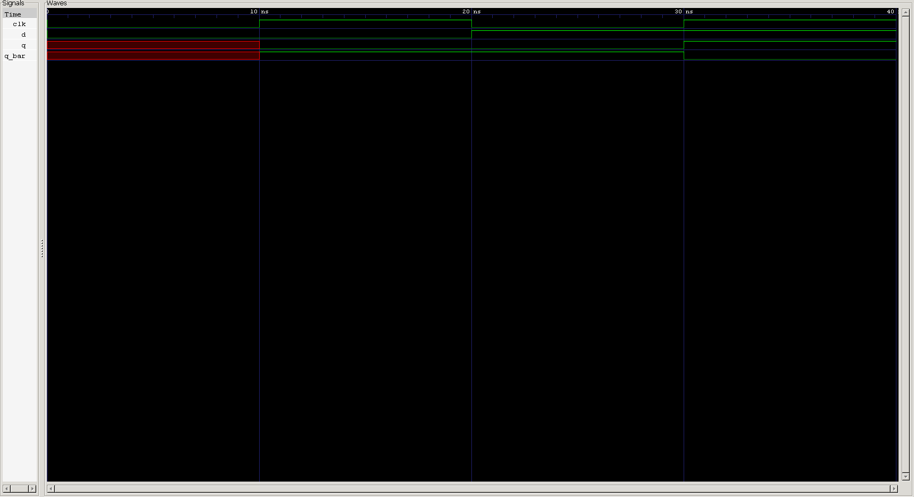

<div align="center">

# ⏱️ D Flip-Flop (Edge-Triggered)

**The first edge-triggered storage element in the journey — trading a latch's continuous transparency for clock-synchronized sampling**

[](#)
[](#)
[](#)
[-purple.svg)](#)
[](#)

</div>

---

## 📑 Table of Contents

- [Overview](#-overview)
- [Learning Objectives](#-learning-objectives)
- [Prerequisites](#-prerequisites)
- [Theory](#-theory)
- [Truth Table](#-truth-table)
- [Symbol & Interface](#-symbol--interface)
- [RTL Design](#-rtl-design)
- [Design Notes](#-design-notes)
- [Testbench](#-testbench)
- [Expected Simulation Results](#-expected-simulation-results)
- [Waveform](#-waveform)
- [Project Structure](#-project-structure)
- [Getting Started](#️-getting-started)
- [Key Concepts Learned](#-key-concepts-learned)
- [Reflections](#-reflections)
- [Interview Questions](#-interview-questions)
- [Author](#-author)

---

## 📖 Overview

The **D Flip-Flop** marks a fundamental shift from everything before it in this repository: it's the first **edge-triggered** circuit. Where the [D Latch](../d_latch) is *transparent* — continuously following `d` whenever `en` is high — the D flip-flop samples `d` only at the **rising edge of a clock signal** and holds that value until the next edge. Between edges, `d` can change freely with zero effect on the output.

This edge-triggered discipline is what makes synchronous digital design possible: every register, counter, and pipeline stage in real hardware is built on exactly this behavior.

---

## 🎯 Learning Objectives

| # | Concept |
|---|---------|
| 1 | Edge-triggered vs. level-sensitive storage |
| 2 | `posedge` sensitivity in `always` blocks |
| 3 | Synchronous sampling of a data input |
| 4 | Clock generation in a testbench |
| 5 | Blocking vs. non-blocking assignment in clocked logic |
| 6 | Behavior with no reset — undefined power-up state |
| 7 | `case` statements with a computed `default` branch |
| 8 | Self-checking testbenches for clocked sequential logic |
| 9 | RTL simulation using Icarus Verilog |
| 10 | Waveform verification using GTKWave |

---

## 📚 Prerequisites

- The [D Latch](../d_latch) project (this design is best understood by contrast with it)
- Verilog `always` blocks and edge sensitivity (`posedge` / `negedge`)
- The concept of a clock signal and clock period
- Basic familiarity with blocking (`=`) vs. non-blocking (`<=`) assignment

---

## 🧠 Theory

A **D Flip-Flop** samples its `d` input at a single instant — the rising edge of `clk` — and holds that sampled value at its output until the next rising edge, completely ignoring whatever `d` does in between.

This is the key distinction from the D latch covered previously:

| | D Latch | D Flip-Flop |
|---|---|---|
| **Trigger** | Level (`en` high) | Edge (`posedge clk`) |
| **Behavior while active** | Transparent — `q` tracks `d` continuously | Opaque except at the exact clock edge |
| **Sensitivity to mid-cycle `d` changes** | Fully responsive | Completely ignored |

Because sampling happens only at a precise instant, edge-triggered flip-flops avoid the timing hazards that come with a latch's extended transparency window — which is exactly why they're the standard building block for registers in synchronous design.

---

## 📊 Truth Table

**Characteristic table** (clock-edge behavior):

| `clk` | `d` | `q` (next) | `q_bar` (next) |
|:---:|:---:|:---:|:---:|
| ↑ (rising edge) | 0 | 0 | 1 |
| ↑ (rising edge) | 1 | 1 | 0 |
| 0, 1, or ↓ (falling edge) | X | *no change (hold)* | *no change (hold)* |

---

## 🔌 Symbol & Interface

```text
                 D FLIP-FLOP
             ┌───────────────────┐
       D  ──►│                   │──► Q
             │       D FF        │
      CLK ──►│▷                  │──► Q_BAR
             └───────────────────┘
```
*(the `▷` marks the clock pin as edge-triggered — standard flip-flop notation)*

### Inputs

| Signal | Width | Description |
|---|:---:|---|
| `d` | 1-bit | Data input, sampled only at the clock edge |
| `clk` | 1-bit | Clock — output updates on the rising edge |

### Outputs

| Signal | Width | Description |
|---|:---:|---|
| `q` | 1-bit | Flip-flop output |
| `q_bar` | 1-bit | Complementary output |

---

## 💻 RTL Design

```verilog
module d_ff(input d,input clk,output reg q,output reg q_bar);

always @(posedge clk ) begin

    case (d)
       1'b0 : begin
        q=0;
        q_bar=1;
       end 

       1'b1 : begin
        q=1;
        q_bar=0;
       end
        default: begin q=d; q_bar=~d; end

    endcase
    
end

endmodule
```

---

## 🔍 Design Notes

<details>
<summary><strong>The explicit <code>1'b0</code> / <code>1'b1</code> branches are redundant</strong></summary><br>

Look closely at the `default` branch: `q = d; q_bar = ~d;` already produces the correct result for `d = 0` and `d = 1` too — it's a general-purpose assignment, not a fallback specific to `x`/`z`. That means the entire `case` statement is logically equivalent to simply:

```verilog
always @(posedge clk) begin
    q     = d;
    q_bar = ~d;
end
```

The explicit `0`/`1` branches aren't wrong, just unnecessary — worth knowing since a reviewer or simulator won't flag this as an issue, but it's dead weight relative to what the code actually needs to express.
</details>

<details>
<summary><strong>Blocking assignments (<code>=</code>) inside a clocked always block</strong></summary><br>

This design uses blocking assignments (`=`) inside an edge-triggered `always @(posedge clk)` block. It simulates correctly here because there's only one always block with no dependency chain between flip-flops. However, the standard RTL convention — and the safer default habit — is to use **non-blocking assignments (`<=`)** for any sequential/clocked logic. Non-blocking assignments ensure all flip-flops in a design sample their inputs using the *pre-edge* values simultaneously, which matters as soon as you chain multiple flip-flops together (e.g., a shift register) where blocking assignments can produce simulation results that don't match real hardware.
</details>

<details>
<summary><strong>No reset — outputs start unknown</strong></summary><br>

This flip-flop has no reset input, synchronous or asynchronous. Until the very first `posedge clk` occurs in simulation, `q` and `q_bar` remain at Verilog's default unknown value (`x`). Real designs almost always include a reset path specifically to avoid depending on power-up behavior being well-defined — worth adding if this flip-flop is meant to be reused as a building block for a register or counter.
</details>

<details>
<summary><strong>ANSI-style port declaration</strong></summary><br>

Unlike the D latch's older Verilog-1995 style, this module declares port direction and type inline in the header (`input d, input clk, output reg q, ...`). This is the modern ANSI style and is generally preferred for readability in new designs.
</details>

---

## 🧪 Testbench

A self-checking-style testbench generates a clock and deliberately changes `d` **between** clock edges to demonstrate that only the value present at the rising edge matters:

```verilog
`timescale 1ns/1ps

module d_ff_tb;

    reg  d, clk;
    wire q, q_bar;

    // Instantiate DUT
    d_ff DUT (
        .d     (d),
        .clk   (clk),
        .q     (q),
        .q_bar (q_bar)
    );

    // Clock generation: 10 ns period
    initial clk = 0;
    always #5 clk = ~clk;

    initial begin
        $dumpfile("waveform_d_ff.vcd");
        $dumpvars(0, d_ff_tb);

        d = 0;          // t=0   | before first edge, outputs undefined
        #8  d = 1;       // t=8   | mid-cycle change, no effect yet
        #10 d = 0;       // t=18  | mid-cycle change (after edge @15)
        #4  d = 1;       // t=22  | mid-cycle change again before edge @25
        #6  d = 0;       // t=28  | mid-cycle change before edge @35

        #16 $finish;     // t=44  | end simulation
    end

endmodule
```

---

## 📊 Expected Simulation Results

| Time (ns) | Event | `d` | `clk` | `q` | `q_bar` |
|:---:|---|:---:|:---:|:---:|:---:|
| 0  | Initial | 0 | 0 | x | x |
| 5  | **posedge** — samples `d=0` | 0 | ↑ | 0 | 1 |
| 8  | `d` changes (mid-cycle, no effect) | 1 | 1 | 0 | 1 |
| 15 | **posedge** — samples `d=1` | 1 | ↑ | 1 | 0 |
| 18 | `d` changes (mid-cycle, no effect) | 0 | 0 | 1 | 0 |
| 22 | `d` changes again (mid-cycle, no effect) | 1 | 1 | 1 | 0 |
| 25 | **posedge** — samples `d=1` (unchanged) | 1 | ↑ | 1 | 0 |
| 28 | `d` changes (mid-cycle, no effect) | 0 | 0 | 1 | 0 |
| 35 | **posedge** — samples `d=0` | 0 | ↑ | 0 | 1 |
| 44 | `$finish` — simulation ends | — | — | — | — |

---

## 🌊 Waveform



**Analysis**

- **@ 0–5 ns** — before the first clock edge, `q`/`q_bar` remain unknown (`x`) — there's no reset to define a starting state.
- **@ 5 ns** — first `posedge` samples `d = 0` → `q = 0`, `q_bar = 1`.
- **@ 8 ns** — `d` changes to `1`, but since this isn't a clock edge, the outputs **do not change**.
- **@ 15 ns** — `posedge` samples the current `d = 1` → `q` updates to `1`.
- **@ 18–22 ns** — `d` toggles twice between edges (`0`, then back to `1`); neither change has any effect on the outputs.
- **@ 25 ns** — `posedge` samples `d = 1` (its value at that instant) → `q` stays at `1`, demonstrating that the earlier blips were correctly ignored.
- **@ 28 ns** — `d` changes to `0` mid-cycle; no effect yet.
- **@ 35 ns** — `posedge` samples `d = 0` → `q` falls to `0`.
- **@ 44 ns** — `$finish` terminates the simulation.

The output only ever moves at a rising clock edge — a clear visual contrast to the D latch's continuous tracking of `d`.

---

## 📂 Project Structure

```text
0X_d_ff/
├── README.md
├── d_ff.v
├── d_ff_tb.v
└── waveform_d_ff.png
```

---

## ▶️ Getting Started

### Step 1 — Compile

```bash
iverilog -o d_ff.out d_ff.v d_ff_tb.v
```

### Step 2 — Run Simulation

```bash
vvp d_ff.out
```

### Step 3 — Open GTKWave

```bash
gtkwave waveform_d_ff.vcd
```

---

## 🎓 Key Concepts Learned

<table>
<tr>
<td valign="top" width="33%">

**Design**
- Edge-triggered storage
- `posedge` sampling
- D latch vs. D flip-flop
- Synchronous design principles
- Absence of reset and its implications

</td>
<td valign="top" width="33%">

**Verilog Mechanics**
- `always @(posedge clk)`
- Blocking vs. non-blocking assignment
- `case` with a general-purpose `default`
- ANSI-style port declarations
- `reg` outputs

</td>
<td valign="top" width="33%">

**Toolflow**
- Clock generation in a testbench
- `` `timescale ``
- `$dumpfile` / `$dumpvars`
- Icarus Verilog
- GTKWave

</td>
</tr>
</table>

---

## 📝 Reflections

This project was the clearest "aha" moment so far in the sequential logic progression: watching the D latch track every wiggle of `d` in the previous project, then watching this flip-flop calmly ignore the exact same kind of mid-cycle changes and update only at the clock edge, made the level-sensitive vs. edge-triggered distinction concrete rather than just a definition to memorize.

It also surfaced a subtlety worth internalizing early — that blocking assignments *happen* to work in a single, isolated always block, but non-blocking assignments are the convention for clocked logic for good reason once multiple flip-flops start depending on each other.

This was my **first edge-triggered sequential circuit implementation and verification project**.

---

## 💼 Interview Questions

<details>
<summary><strong>1. What is the key functional difference between a D latch and a D flip-flop?</strong></summary><br>

A D latch is level-sensitive — it's transparent and continuously follows `d` whenever its enable is asserted. A D flip-flop is edge-triggered — it samples `d` only at a specific clock edge and holds that value until the next edge, ignoring any changes to `d` in between.
</details>

<details>
<summary><strong>2. Why are the <code>1'b0</code> and <code>1'b1</code> case branches technically unnecessary in this design?</strong></summary><br>

Because the `default` branch computes `q = d; q_bar = ~d;`, which already produces the correct result for `d = 0` and `d = 1` — it isn't a fallback reserved for unknown values here, it's a general solution that happens to also cover the two defined cases.
</details>

<details>
<summary><strong>3. Why is <code>always @(posedge clk)</code> used instead of <code>always @(*)</code>?</strong></summary><br>

`always @(*)` triggers whenever any signal read inside the block changes, which is appropriate for combinational logic. `always @(posedge clk)` triggers only on the rising edge of `clk`, which is exactly the sampling behavior a flip-flop needs — reacting to a specific instant rather than continuously.
</details>

<details>
<summary><strong>4. What is the practical risk of using blocking assignments in clocked always blocks, even if this specific module simulates correctly?</strong></summary><br>

Once multiple flip-flops depend on each other's outputs (e.g., in a shift register or pipeline), blocking assignments can cause a flip-flop to see an already-updated value from earlier in the same clock edge rather than the pre-edge value — producing simulation results that don't match how the real hardware behaves. Non-blocking assignments avoid this by updating all outputs simultaneously at the end of the time step.
</details>

<details>
<summary><strong>5. Why does this flip-flop's output start as <code>x</code> rather than <code>0</code> at the beginning of simulation?</strong></summary><br>

There's no reset input in this design, so `q` and `q_bar` retain Verilog's default unknown state until the very first `posedge clk` provides a defined value. In real silicon, this maps to the fact that a flip-flop's power-up state is genuinely unpredictable without a reset circuit.
</details>

<details>
<summary><strong>6. Why does the testbench deliberately change <code>d</code> in between clock edges rather than only at the edges?</strong></summary><br>

To prove the flip-flop actually ignores mid-cycle changes rather than happening to sample the right value by coincidence — if `d` only ever changed exactly at the edges, the test wouldn't distinguish edge-triggered behavior from level-sensitive behavior.
</details>

<details>
<summary><strong>7. Why are edge-triggered flip-flops generally preferred over level-sensitive latches for synchronous digital design?</strong></summary><br>

Because a latch stays transparent for its entire active window, timing hazards from combinational logic feeding it can propagate through unpredictably. An edge-triggered flip-flop samples at one precise instant, which makes timing analysis (setup/hold) well-defined and is the basis for reliable synchronous design.
</details>

---

## 🚀 What's Next

<div align="center">

Extending this single flip-flop into wider structures — multi-bit registers, shift registers, and eventually counters — all built from arrays of edge-triggered storage elements like this one.

</div>

---

<div align="center">

## 👨‍💻 Author

**Padma Charan S S**

**Repository:** Verilog Fundamentals · **Section:** Sequential Logic

**Learning Approach:** Project-Driven Learning

### Repository Roadmap

```
Basic Verilog → Combinational Logic → Sequential Logic
      → RTL Design → FPGA Design → Computer Architecture → CPU Design
```

*Every project teaches one new concept through practical implementation.*

---

*"Learning Verilog by designing hardware, verifying functionality, documenting the process, and improving one project at a time."*

</div>