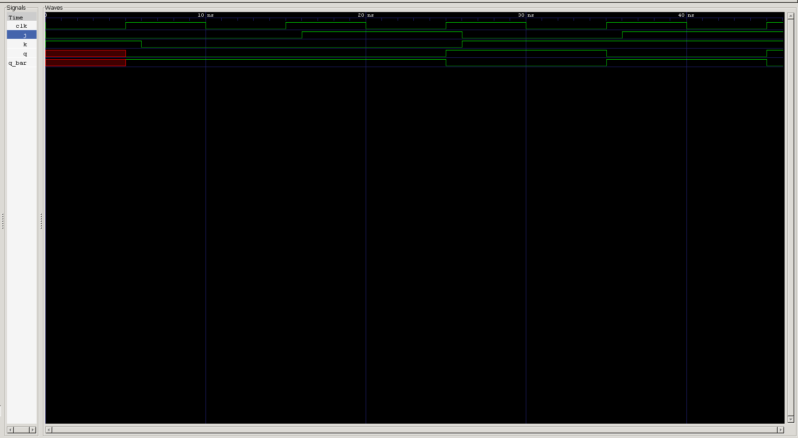

<div align="center">

# 🔁 JK Flip-Flop

**The edge-triggered flip-flop that closes the SR latch's forbidden gap — turning the invalid state into a toggle**

[](#)
[](#)
[](#)
[](#)
[-purple.svg)](#)
[](#)

</div>

---

## 📑 Table of Contents

- [Overview](#-overview)
- [Learning Objectives](#-learning-objectives)
- [Prerequisites](#-prerequisites)
- [Theory](#-theory)
- [Truth Table](#-truth-table)
- [Symbol & Interface](#-symbol--interface)
- [RTL Design](#-rtl-design)
- [Design Notes](#-design-notes)
- [Verification](#-verification)
- [Testbench](#-testbench)
- [Expected Simulation Results](#-expected-simulation-results)
- [Waveform](#-waveform)
- [Project Structure](#-project-structure)
- [Getting Started](#️-getting-started)
- [Key Concepts Learned](#-key-concepts-learned)
- [Reflections](#-reflections)
- [Interview Questions](#-interview-questions)
- [Author](#-author)

---

## 📖 Overview

The **JK Flip-Flop** is the edge-triggered answer to a problem that's followed this repository since the very first [Gated SR Latch](../sr_latch): what should happen when both control inputs are asserted at once? The SR latch declared that combination **forbidden**. The JK flip-flop instead gives it a well-defined, useful meaning — **toggle** — turning what was once an invalid state into a fourth legitimate operating mode.

This project also introduces a new verification style to the repository: a **self-checking, exhaustive testbench** — the same rigor used in the [4-Bit Mini ALU](../mini_alu) project — that automatically generates every input combination, computes the expected result from a reference model, and reports PASS/FAIL without any manual waveform inspection.

---

## 🎯 Learning Objectives

| # | Concept |
|---|---------|
| 1 | JK flip-flop modes: Hold, Reset, Set, Toggle |
| 2 | Eliminating the SR latch's forbidden state via toggle |
| 3 | Correct use of non-blocking assignment (`<=`) in clocked logic |
| 4 | Why an empty `case` branch is safe inside a `posedge`-triggered block |
| 5 | Self-checking testbenches with a software reference model |
| 6 | Exhaustive verification of a small input space |
| 7 | The case-equality operator (`===`) for x/z-aware comparison |
| 8 | Clock generation ordering pitfalls (`#5 clk = ~clk` vs. `clk = ~clk; #5;`) |
| 9 | RTL simulation using Icarus Verilog |
| 10 | Waveform verification using GTKWave |

---

## 📚 Prerequisites

- The [D Flip-Flop](../d_ff) project (same edge-triggered foundation, one more control input)
- The [Gated SR Latch](../sr_latch) project (JK resolves its forbidden state)
- Verilog `always @(posedge clk)` and non-blocking assignment
- Comfort reading a self-checking testbench with a loop-driven reference model

---

## 🧠 Theory

A JK flip-flop behaves like an SR flip-flop for three of its four input combinations, but resolves the fourth — both inputs asserted — into a **toggle** instead of an invalid state:

| Mode | Condition | Behavior |
|---|---|---|
| **Hold** | `J=0, K=0` | Output unchanged |
| **Reset** | `J=0, K=1` | `Q → 0` |
| **Set** | `J=1, K=0` | `Q → 1` |
| **Toggle** | `J=1, K=1` | `Q → ~Q` |

Because every one of the four input combinations now maps to a well-defined outcome, the JK flip-flop has **no forbidden state** — a meaningful upgrade over the SR latch it's derived from. The toggle mode also makes it a natural building block for counters, which is exactly where this repository is headed next.

---

## 📊 Truth Table

**Characteristic table** (sampled at `posedge clk`):

| `J` | `K` | Mode | `Q` (next) | `Q_bar` (next) |
|:---:|:---:|:---:|:---:|:---:|
| 0 | 0 | HOLD | `Q` (unchanged) | `Q_bar` (unchanged) |
| 0 | 1 | RESET | 0 | 1 |
| 1 | 0 | SET | 1 | 0 |
| 1 | 1 | TOGGLE | `~Q` | `~Q_bar` |

---

## 🔌 Symbol & Interface

```text
                 JK FLIP-FLOP
             ┌───────────────────┐
       J  ──►│                   │──► Q
             │       JK FF       │
       K  ──►│                   │──► Q_BAR
      CLK ──►│▷                  │
             └───────────────────┘
```

### Inputs

| Signal | Width | Description |
|---|:---:|---|
| `j` | 1-bit | Set control |
| `k` | 1-bit | Reset control |
| `clk` | 1-bit | Clock — outputs update on the rising edge |

### Outputs

| Signal | Width | Description |
|---|:---:|---|
| `q` | 1-bit | Flip-flop output |
| `q_bar` | 1-bit | Complementary output |

---

## 💻 RTL Design

```verilog
module jk_ff(input j,k,clk, output reg q,output reg q_bar);

always @(posedge clk ) begin

    case ({j,k})
        2'b00:;
        2'b01: begin q<=0;q_bar<=1; end
        2'b10 : begin q<=1;q_bar<=0; end 
        2'b11 : begin q<=~q;q_bar<=~q_bar; end 
        default:
        begin q<=0;q_bar<=0; end  
    endcase
    
end

endmodule
```

---

## 🔍 Design Notes

<details>
<summary><strong>Non-blocking assignments used correctly ✅</strong></summary><br>

Unlike the earlier [D Flip-Flop](../d_ff) project, this design uses non-blocking assignments (`<=`) throughout its clocked `always` block — the correct convention for sequential logic. Worth calling out as good practice, especially since the toggle branch (`q<=~q`) depends on the flip-flop's own current output; non-blocking assignment guarantees `~q` is evaluated against the pre-edge value, which is exactly what a toggle should do.
</details>

<details>
<summary><strong>The empty <code>2'b00:;</code> branch is safe here — unlike similar-looking cases in earlier projects</strong></summary><br>

In the SR latch and D latch, an empty branch inside a *combinational* `always @(*)` block was what caused Verilog to infer a latch — a deliberate but delicate technique. Here, the empty branch sits inside an `always @(posedge clk)` block, which is already describing a flip-flop by definition. Simply not issuing a new non-blocking assignment for `q`/`q_bar` on this branch means they naturally keep their existing register values across the clock edge — this is the normal, expected way to describe "hold" in edge-triggered logic, with none of the combinational-latch-inference subtlety from earlier designs.
</details>

<details>
<summary><strong>The <code>default</code> branch sets both outputs to <code>0</code> — worth a second look</strong></summary><br>

When `j` or `k` carries an unknown value (`x`/`z`), this design forces `q <= 0; q_bar <= 0;`. That's different from how earlier projects handled unknown inputs — the D latch and SR latch both propagated `x` to their outputs to make the "I don't know" state visible. Here, both outputs are driven to a *defined* value, but one that isn't complementary (`q` and `q_bar` are both low simultaneously, which shouldn't happen for a healthy flip-flop pair). This isn't exercised by the current exhaustive testbench (which only ever drives defined `0`/`1` values), but it's worth deciding intentionally — either restore the `x`-propagation convention used elsewhere, or document why forcing `00` is the desired fallback here.
</details>

<details>
<summary><strong>Bit ordering in the testbench doesn't need to match the DUT's</strong></summary><br>

The DUT selects its case branch using `{j, k}` (J as the high bit). The testbench instead drives inputs with `{k, j} = i` (K as the high bit) while sweeping `i` from `0` to `3`. At first glance these look like they should match — they don't need to. Each is just a two-bit concatenation used to enumerate a 2-bit space; as long as the testbench's loop visits all four `(j, k)` pairs exactly once (which it does), the ordering convention it happens to use for packing `i` into `k` and `j` is irrelevant to correctness.
</details>

<details>
<summary><strong>Clock generation ordering avoids an unknown-clock pitfall</strong></summary><br>

`always #5 clk = ~clk;` puts the delay *before* the assignment, so at time 0 the process simply schedules its first toggle for `t = 5` without reading `clk` yet. This gives the testbench's `initial` block a clean window to set `clk = 0` at time 0 before the clock ever needs a defined starting value — avoiding the classic bug where `clk` starts at Verilog's default unknown (`x`) and stays unknown because `~x` is still `x`.
</details>

---

## 🧪 Verification

This project steps up from the manual/visual verification used in earlier latch and flip-flop projects to a **self-checking, exhaustive testbench** — the same methodology introduced in the [4-Bit Mini ALU](../mini_alu):

1. A software **reference model** independently computes the expected `(q, q_bar)` for every test case, mirroring the DUT's intended Hold / Reset / Set / Toggle behavior.
2. A loop sweeps `i` from `0` to `total_test_cases - 1`, driving every combination of `(j, k)`.
3. Each combination is applied, a clock edge is awaited, and the DUT's actual outputs are compared against the reference model using the case-equality operator (`===`), which correctly handles `x`/`z` if they ever appear.
4. Every case prints **PASS** or **FAIL**, with failures dumping the full input/output state for debugging.
5. A final tally reports whether *all* cases passed.

### Coverage

```text
J = 2 combinations
K = 2 combinations

Total = 2 × 2 = 4
```

### Verification Result

<div align="center">

| Total Cases | Passed | Failed |
|:---:|:---:|:---:|
| **4** | ✅ **4** | **0** |

</div>

> Note: this covers every `(J, K)` combination once, transitioning from whatever state the previous test case left the flip-flop in. It's exhaustive over the *input* space, but each mode is only exercised from one particular prior `Q` — see the [Interview Questions](#-interview-questions) for why that distinction matters.

---

## 🧪 Testbench

```verilog
`timescale 1ns/1ps

module jk_ff_tb;

    reg j;
    reg k;
    reg clk;

    reg exp_q;
    reg exp_q_bar;

    wire q;
    wire q_bar;

    jk_ff dut (
        .j     (j),
        .k     (k),
        .clk   (clk),
        .q     (q),
        .q_bar (q_bar)
    );

    integer i;

    localparam total_test_cases = 2**2;

    integer f_counter    = 0;
    integer test_counter = 0;

    always #5 clk = ~clk;

    initial begin

        $dumpfile("waveform.vcd");
        $dumpvars(0, jk_ff_tb);

        $display("JK Flip Flop Automated test started");

        clk = 0;
        j   = 0;
        k   = 1;

        // Establish known initial state
        @(posedge clk);
        #1;

        exp_q     = 0;
        exp_q_bar = 1;

        for (i = 0; i < total_test_cases; i = i + 1) begin

            {k, j} = i;

            // Only check the flip-flop when a rising edge occurs
            @(posedge clk) begin

                #1;

                if (j == 0 && k == 0) begin
                    // HOLD
                    exp_q     = exp_q;
                    exp_q_bar = ~exp_q;
                end

                else if (j != k) begin
                    exp_q     = j;
                    exp_q_bar = ~j;
                end

                else begin
                    // TOGGLE
                    exp_q     = ~exp_q;
                    exp_q_bar = ~exp_q_bar;
                end

                test_counter = test_counter + 1;

                if (exp_q === q && exp_q_bar === q_bar) begin
                    $display("PASS : Test Case %0d", test_counter);
                end

                else begin
                    $display("--------------------------------------");
                    $display("FAIL : Test Case %0d", test_counter);
                    $display("CLK      = %b", clk);
                    $display("J        = %b", j);
                    $display("K        = %b", k);
                    $display("Expected = %b %b", exp_q, exp_q_bar);
                    $display("Received = %b %b", q, q_bar);
                    $display("--------------------------------------");

                    f_counter = f_counter + 1;
                end

            end

        end

        $display("JK Flip Flop Automated test Ended");

        if (f_counter == 0)
            $display("RESULT : ALL VALID TEST CASES PASSED");
        else
            $display("RESULT : %0d TEST CASE(S) FAILED", f_counter);

        $finish;

    end

endmodule
```

---

## 📊 Expected Simulation Results

| Test | Inputs Applied At | `j` | `k` | Sampled At (posedge) | Mode | `q` | `q_bar` | Result |
|:---:|:---:|:---:|:---:|:---:|:---:|:---:|:---:|:---:|
| *(init)* | t = 0 ns | 0 | 1 | 5 ns | RESET | 0 | 1 | baseline |
| 1 | 6 ns | 0 | 0 | 15 ns | HOLD | 0 | 1 | ✅ PASS |
| 2 | 16 ns | 1 | 0 | 25 ns | SET | 1 | 0 | ✅ PASS |
| 3 | 26 ns | 0 | 1 | 35 ns | RESET | 0 | 1 | ✅ PASS |
| 4 | 36 ns | 1 | 1 | 45 ns | TOGGLE | 1 | 0 | ✅ PASS |

```text
JK Flip Flop Automated test started
PASS : Test Case 1
PASS : Test Case 2
PASS : Test Case 3
PASS : Test Case 4
JK Flip Flop Automated test Ended
RESULT : ALL VALID TEST CASES PASSED
```

---

## 🌊 Waveform



**Analysis**

- **@ 5 ns** — initial `posedge` with `j=0, k=1` establishes a known baseline: `q=0, q_bar=1` (RESET).
- **@ 15 ns** — `j=0, k=0` sampled → **HOLD**: outputs remain `0, 1`.
- **@ 25 ns** — `j=1, k=0` sampled → **SET**: `q` rises to `1`, `q_bar` falls to `0`.
- **@ 35 ns** — `j=0, k=1` sampled → **RESET**: `q` falls back to `0`, `q_bar` rises to `1`.
- **@ 45 ns** — `j=1, k=1` sampled → **TOGGLE**: outputs flip from `(0,1)` to `(1,0)`.
- Every transition lines up exactly with a clock edge — confirming edge-triggered, not level-sensitive, behavior — and every automated check prints `PASS`.

---

## 📂 Project Structure

```text
0X_jk_ff/
├── README.md
├── jk_ff.v
├── jk_ff_tb.v
└── waveform.png
```

---

## ▶️ Getting Started

### Step 1 — Compile

```bash
iverilog -o jk_ff.out jk_ff.v jk_ff_tb.v
```

### Step 2 — Run Simulation

```bash
vvp jk_ff.out
```

### Step 3 — Open GTKWave

```bash
gtkwave waveform.vcd
```

---

## 🎓 Key Concepts Learned

<table>
<tr>
<td valign="top" width="33%">

**Design**
- JK flip-flop modes
- Eliminating forbidden states
- Toggle as a distinct operating mode
- Non-blocking assignment for clocked logic
- Hold via omitted assignment (edge-triggered context)

</td>
<td valign="top" width="33%">

**Verification**
- Self-checking testbenches
- Reference-model comparison
- Exhaustive input coverage
- Case-equality (`===`) for x/z-safe checks
- Automated PASS/FAIL reporting

</td>
<td valign="top" width="33%">

**Toolflow**
- Clock generation ordering
- `$dumpfile` / `$dumpvars`
- `$display` for automated logging
- Icarus Verilog
- GTKWave

</td>
</tr>
</table>

---

## 📝 Reflections

This project tied together two threads that had been developing separately: the *sequential logic* progression (SR latch → D latch → D flip-flop → JK flip-flop), and a *verification methodology* upgrade borrowed from the Mini ALU project — moving from "look at the waveform and eyeball it" to "let the testbench tell you PASS or FAIL." Writing the reference model also made something click: the model has to track state (`exp_q`) across iterations exactly the way the DUT does, otherwise a single wrong assumption early in the loop would silently invalidate every test case after it.

This was my **first flip-flop with a fully self-checking, exhaustive testbench**.

---

## 💼 Interview Questions

<details>
<summary><strong>1. How does a JK flip-flop resolve the SR latch's forbidden state?</strong></summary><br>

By defining the case where both control inputs are asserted (`J=1, K=1`) as a **toggle** rather than leaving it undefined — every one of the four input combinations now has a specific, useful meaning.
</details>

<details>
<summary><strong>2. Why does the toggle branch (<code>q &lt;= ~q</code>) require non-blocking assignment to behave correctly?</strong></summary><br>

Non-blocking assignment evaluates the right-hand side using the value `q` held *before* the current clock edge, guaranteeing a clean flip. With blocking assignment in a more complex block, an earlier statement could change `q` first, causing `~q` to be computed from an already-updated value instead of the true pre-edge state.
</details>

<details>
<summary><strong>3. Why is the empty <code>2'b00:;</code> branch not a latch-inference risk here, when a similarly empty branch was in the SR latch project?</strong></summary><br>

Because this branch lives inside `always @(posedge clk)`, which already describes a flip-flop by nature — skipping an assignment simply preserves the register's value across the edge. The SR latch's empty branch was inside a *combinational* `always @(*)` block, where an unassigned path is what causes Verilog to infer unwanted level-sensitive storage.
</details>

<details>
<summary><strong>4. Why does the testbench use <code>===</code> instead of <code>==</code> to compare expected vs. actual outputs?</strong></summary><br>

`==` returns `x` (neither true nor false) if either operand contains an `x` or `z` bit, which would make the `if` statement's outcome ambiguous. `===` is a 4-state case-equality comparison that treats `x`/`z` as concrete values, so the check always resolves to a definite pass or fail even if unknown values are involved.
</details>

<details>
<summary><strong>5. Is testing all four <code>(J, K)</code> combinations once truly "exhaustive" for a JK flip-flop?</strong></summary><br>

Not in the strictest sense. The flip-flop's next state depends on both the inputs *and* the current `Q`, so a fully exhaustive test would ideally exercise HOLD and TOGGLE from both `Q=0` and `Q=1`. This testbench tests each `(J,K)` pair once, inheriting whatever `Q` the previous test case left behind — which is enough to confirm each branch of the `case` statement fires correctly, but doesn't independently confirm the toggle/hold logic across every starting state the way the ALU project's full 1024-case sweep did for its arithmetic datapath.
</details>

<details>
<summary><strong>6. What does the <code>default</code> branch in the DUT's <code>case</code> statement protect against, and is its current behavior ideal?</strong></summary><br>

It protects against `j` or `k` carrying an unknown (`x`/`z`) value, which the two-bit `case` wouldn't otherwise match. As implemented, it drives both outputs to `0` — a defined but non-complementary result. Propagating `x` to both outputs (matching the convention used in earlier latch projects) would arguably communicate the "unknown" condition more honestly than a defined-but-invalid `00` state.
</details>

<details>
<summary><strong>7. Why does the testbench call <code>@(posedge clk)</code> immediately before checking the outputs, and why is there still a <code>#1</code> delay inside it?</strong></summary><br>

`@(posedge clk)` synchronizes the testbench to the exact simulation event where the DUT updates. The extra `#1` delay lets the DUT's non-blocking assignments — which are scheduled to complete at the *end* of the current time step, not instantaneously — finish updating `q`/`q_bar` before the testbench samples them, avoiding a race between the DUT's update and the testbench's check.
</details>

---

## 🚀 What's Next

<div align="center">

With Hold, Set, Reset, and Toggle in hand, the natural next step is chaining flip-flops together into counters and shift registers — where the JK's toggle mode becomes especially useful.

</div>

---

<div align="center">

## 👨‍💻 Author

**Padma Charan S S**

**Repository:** Verilog Fundamentals · **Section:** Sequential Logic

**Learning Approach:** Project-Driven Learning

### Repository Roadmap

```
Basic Verilog → Combinational Logic → Sequential Logic
      → RTL Design → FPGA Design → Computer Architecture → CPU Design
```

*Every project teaches one new concept through practical implementation.*

---

*"Learning Verilog by designing hardware, verifying functionality, documenting the process, and improving one project at a time."*

</div>