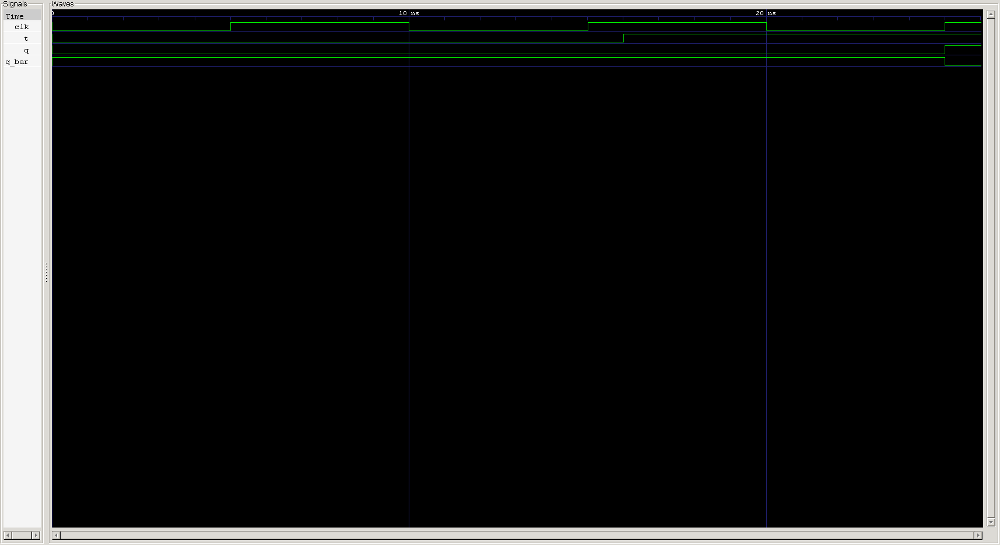

<div align="center">

# 🔄 T Flip-Flop

**A single-input specialization of the JK flip-flop, built for exactly one job: toggle on command — the natural building block for counters**

[](#)
[](#)
[](#)
[](#)
[-purple.svg)](#)
[](#)

</div>

---

## 📑 Table of Contents

- [Overview](#-overview)
- [Learning Objectives](#-learning-objectives)
- [Prerequisites](#-prerequisites)
- [Theory](#-theory)
- [Truth Table](#-truth-table)
- [Symbol & Interface](#-symbol--interface)
- [RTL Design](#-rtl-design)
- [Design Notes](#-design-notes)
- [Verification](#-verification)
- [Testbench](#-testbench)
- [Expected Simulation Results](#-expected-simulation-results)
- [Waveform](#-waveform)
- [Project Structure](#-project-structure)
- [Getting Started](#️-getting-started)
- [Key Concepts Learned](#-key-concepts-learned)
- [Reflections](#-reflections)
- [Interview Questions](#-interview-questions)
- [Author](#-author)

---

## 📖 Overview

The **T (Toggle) Flip-Flop** is what you get when you take the [JK Flip-Flop](../jk_ff) and tie its two control inputs together (`J = K = T`). That collapses four operating modes down to two: **hold** when `T = 0`, and **toggle** when `T = 1`. It sounds like a simplification — and it is — but this exact behavior is the fundamental building block behind ripple counters and frequency dividers, which is where this repository is headed next.

This project continues the **self-checking, exhaustive testbench** methodology introduced in the JK flip-flop project, and adds a new wrinkle: the DUT itself now establishes a known starting state via an `initial` block, rather than starting at `x` like the earlier D and JK flip-flops.

---

## 🎯 Learning Objectives

| # | Concept |
|---|---------|
| 1 | T flip-flop as a constrained JK flip-flop (`J = K = T`) |
| 2 | Toggle vs. hold as the only two operating modes |
| 3 | Using an `initial` block to set a known simulation start state |
| 4 | The difference between an `initial` block and a real hardware reset |
| 5 | Non-blocking assignment for correct toggle behavior |
| 6 | Self-checking, exhaustive testbenches for single-bit control inputs |
| 7 | The case-equality operator (`===`) for x/z-aware comparison |
| 8 | Divide-by-2 behavior as a preview of counter design |
| 9 | RTL simulation using Icarus Verilog |
| 10 | Waveform verification using GTKWave |

---

## 📚 Prerequisites

- The [JK Flip-Flop](../jk_ff) project (T is a direct specialization of it)
- Verilog `always @(posedge clk)` and non-blocking assignment
- Comfort reading a self-checking testbench with a reference model
- Basic awareness of `initial` blocks in Verilog

---

## 🧠 Theory

A T flip-flop has exactly two behaviors, selected by a single input:

| Mode | Condition | Behavior |
|---|---|---|
| **Hold** | `T = 0` | Output unchanged |
| **Toggle** | `T = 1` | `Q → ~Q` |

This is precisely what a JK flip-flop does when `J` and `K` are always equal — the Set (`J=1,K=0`) and Reset (`J=0,K=1`) modes simply don't exist in a T flip-flop's vocabulary, because `T` can never represent "J and K differ."

**Why it matters:** if `T` is held at `1` continuously, the output toggles on *every* clock edge — meaning `Q` changes state at half the frequency of `clk`. Chain enough of these together, each driven by the previous stage's output, and you get a ripple counter, with each T flip-flop acting as one more divide-by-2 stage.

---

## 📊 Truth Table

**Characteristic table** (sampled at `posedge clk`):

| `T` | Mode | `Q` (next) | `Q_bar` (next) |
|:---:|:---:|:---:|:---:|
| 0 | HOLD | `Q` (unchanged) | `Q_bar` (unchanged) |
| 1 | TOGGLE | `~Q` | `~Q_bar` |

---

## 🔌 Symbol & Interface

```text
                 T FLIP-FLOP
             ┌───────────────────┐
       T  ──►│                   │──► Q
             │       T FF        │
      CLK ──►│▷                  │──► Q_BAR
             └───────────────────┘
```

### Inputs

| Signal | Width | Description |
|---|:---:|---|
| `t` | 1-bit | Toggle control — `1` toggles the output, `0` holds it |
| `clk` | 1-bit | Clock — outputs update on the rising edge |

### Outputs

| Signal | Width | Description |
|---|:---:|---|
| `q` | 1-bit | Flip-flop output |
| `q_bar` | 1-bit | Complementary output |

---

## 💻 RTL Design

```verilog
module t_ff(input clk,t,output reg q , output reg q_bar);


initial begin
    q = 0;
    q_bar = 1;
end

always @(posedge clk ) begin
    case (t)
        1'b0:;
        1'b1:begin
            q<=~q;
            q_bar<=~q_bar;
        end 
        default: begin 
            q<=0;
            q_bar<=0;
        end
    endcase

end

endmodule
```

---

## 🔍 Design Notes

<details>
<summary><strong>The <code>initial</code> block gives a clean simulation start — but it isn't a hardware reset</strong></summary><br>

Unlike the D and JK flip-flop projects, which left `q`/`q_bar` at `x` until the first clock edge, this design uses `initial begin q = 0; q_bar = 1; end` to establish a known state at time 0. That's convenient for simulation and for a testbench that wants deterministic results from the start. Worth being clear about its limits, though: an `initial` block only runs once, at the very start of simulation (or, on some FPGA flows, as a power-up value baked into the bitstream) — it is **not** the same as a reset input that lets you re-initialize the flip-flop on demand during operation, and many ASIC synthesis flows don't support `initial` on registers at all. If this flip-flop ever needs to be reset mid-operation (e.g. as part of a counter that can be cleared), it will need an explicit reset port.
</details>

<details>
<summary><strong>Non-blocking assignments used correctly ✅</strong></summary><br>

Same good practice carried over from the JK flip-flop: the toggle branch (`q<=~q`) uses non-blocking assignment, guaranteeing `~q` is evaluated against the pre-edge value of `q` rather than any mid-block update.
</details>

<details>
<summary><strong>Empty <code>1'b0:;</code> branch is safe in this edge-triggered context</strong></summary><br>

As with the JK flip-flop, an empty case branch inside `always @(posedge clk)` simply means "don't issue a new assignment" — the register naturally retains its value across the clock edge. This is the expected way to express "hold" in edge-triggered logic, and carries none of the combinational latch-inference risk that an empty branch would inside an `always @(*)` block.
</details>

<details>
<summary><strong>The <code>default</code> branch still sets both outputs to <code>0</code></strong></summary><br>

Same observation as the JK flip-flop project: when `t` is `x`/`z`, this design forces `q <= 0; q_bar <= 0;` — a defined but non-complementary result, rather than propagating `x` to signal "unknown" the way the SR and D latch projects did. Not exercised by the current testbench (which only ever drives `0` or `1`), but worth a consistent convention across the repo.
</details>

<details>
<summary><strong>Minor testbench style note</strong></summary><br>

`@(posedge clk) ;` has a stray semicolon immediately after it, making it a standalone "wait for the edge" statement followed by an empty statement, rather than the `@(posedge clk) begin ... end` grouping used in the JK flip-flop's testbench. It doesn't change behavior here — the following statements execute sequentially either way — but it's a slightly different (and slightly less explicit) style choice worth being consistent about.
</details>

---

## 🧪 Verification

This project follows the same **self-checking, exhaustive testbench** pattern introduced for the JK flip-flop:

1. A software **reference model** (`exp_q`, `exp_q_bar`) tracks the expected output independently of the DUT.
2. A loop sweeps `i` from `0` to `total_test_cases - 1`, driving every value of `t`.
3. Each value is applied, a clock edge is awaited, and the DUT's actual outputs are compared against the reference model using case-equality (`===`).
4. Every case prints **PASS** or **FAIL**, with failures dumping the full input/output state.
5. A final tally reports whether *all* cases passed.

### Coverage

```text
T = 2 combinations

Total = 2
```

### Verification Result

<div align="center">

| Total Cases | Passed | Failed |
|:---:|:---:|:---:|
| **2** | ✅ **2** | **0** |

</div>

> Note: this exhaustively covers both values of `T`, but — same caveat as the JK flip-flop project — each mode is only exercised from one particular starting `Q`. HOLD is tested only from `Q=0`, and TOGGLE is tested only going `0 → 1`, not `1 → 0`. See the [Interview Questions](#-interview-questions) for why that's a meaningful distinction.

---

## 🧪 Testbench

```verilog
`timescale 1ns/1ps

module t_ff_tb;

    reg  clk;
    reg  t;
    reg  exp_q;
    reg  exp_q_bar;
    wire q;
    wire q_bar;

    t_ff dut (
        .clk   (clk),
        .t     (t),
        .q     (q),
        .q_bar (q_bar)
    );

    integer i;
    localparam total_test_cases = 2;
    integer f_counter    = 0;
    integer test_counter = 0;

    always #5 clk = ~clk;

    initial begin
        $dumpfile("waveform.vcd");
        $dumpvars(0, t_ff_tb);

        $display("T Flip Flop Automated Test Started ");

        clk = 0;
        t   = 0;

        @(posedge clk);
        #1;

        exp_q     = 0;
        exp_q_bar = 1;

        for (i = 0; i < total_test_cases; i = i + 1) begin
            t = i;

            @(posedge clk);
            #1;

            if (t) begin
                exp_q     = ~exp_q;
                exp_q_bar = ~exp_q_bar;
            end
            else begin
                exp_q     = exp_q;
                exp_q_bar = exp_q_bar;
            end

            test_counter = test_counter + 1;

            if (exp_q === q && exp_q_bar === q_bar) begin
                $display("PASS : Test Case %0d", test_counter);
            end
            else begin
                $display("--------------------------------------");
                $display("FAIL : Test Case %0d", test_counter);
                $display("CLK      = %b", clk);
                $display("T        = %b", t);
                $display("Expected = %b %b", exp_q, exp_q_bar);
                $display("Received = %b %b", q, q_bar);
                $display("--------------------------------------");

                f_counter = f_counter + 1;
            end
        end

        $display("T Flip Flop Automated test Ended");

        if (f_counter == 0)
            $display("RESULT : ALL VALID TEST CASES PASSED");
        else
            $display("RESULT : %0d TEST CASE(S) FAILED", f_counter);

        $finish;
    end

endmodule
```

---

## 📊 Expected Simulation Results

| Test | `t` Applied At | `t` | Sampled At (posedge) | Mode | `q` | `q_bar` | Result |
|:---:|:---:|:---:|:---:|:---:|:---:|:---:|:---:|
| *(init)* | t = 0 ns | 0 | 5 ns | HOLD | 0 | 1 | baseline |
| 1 | 6 ns | 0 | 15 ns | HOLD | 0 | 1 | ✅ PASS |
| 2 | 16 ns | 1 | 25 ns | TOGGLE | 1 | 0 | ✅ PASS |

```text
T Flip Flop Automated Test Started
PASS : Test Case 1
PASS : Test Case 2
T Flip Flop Automated test Ended
RESULT : ALL VALID TEST CASES PASSED
```

---

## 🌊 Waveform



**Analysis**

- **@ 0 ns** — the `initial` block gives `q=0, q_bar=1` before the first clock edge even occurs.
- **@ 5 ns** — first `posedge` with `t=0` → **HOLD**: outputs stay at `0, 1`.
- **@ 15 ns** — `t=0` sampled again → **HOLD**: no change.
- **@ 25 ns** — `t=1` sampled → **TOGGLE**: `q` rises to `1`, `q_bar` falls to `0`.
- Every automated check prints `PASS`, and the output only ever moves on a clock edge where `t=1` — confirming correct toggle-on-command behavior.

---

## 📂 Project Structure

```text
0X_t_ff/
├── README.md
├── t_ff.v
├── t_ff_tb.v
└── waveform.png
```

---

## ▶️ Getting Started

### Step 1 — Compile

```bash
iverilog -o t_ff.out t_ff.v t_ff_tb.v
```

### Step 2 — Run Simulation

```bash
vvp t_ff.out
```

### Step 3 — Open GTKWave

```bash
gtkwave waveform.vcd
```

---

## 🎓 Key Concepts Learned

<table>
<tr>
<td valign="top" width="33%">

**Design**
- T flip-flop as a JK specialization
- Toggle vs. hold
- `initial` block for known start state
- Non-blocking assignment for toggling
- Divide-by-2 behavior

</td>
<td valign="top" width="33%">

**Verification**
- Self-checking testbenches
- Reference-model comparison
- Exhaustive input coverage
- Case-equality (`===`) for x/z-safe checks
- Automated PASS/FAIL reporting

</td>
<td valign="top" width="33%">

**Toolflow**
- `initial` vs. reset semantics
- `$dumpfile` / `$dumpvars`
- `$display` for automated logging
- Icarus Verilog
- GTKWave

</td>
</tr>
</table>

---

## 📝 Reflections

Building the T flip-flop right after the JK made the relationship between them obvious in a way that just reading about it wouldn't have: tying `J` and `K` together doesn't just simplify the interface, it structurally removes two of the four modes from ever being reachable. It was also a good moment to think carefully about `initial` blocks — they're an easy way to get a clean simulation start, but conflating them with a real reset is a mistake worth catching early, before it becomes a habit carried into a design that actually needs one.

This project also reinforced why toggle flip-flops matter beyond the exercise itself: this is the literal building block the next project (a counter) will chain together.

---

## 💼 Interview Questions

<details>
<summary><strong>1. How is a T flip-flop related to a JK flip-flop?</strong></summary><br>

A T flip-flop is a JK flip-flop with its two inputs tied together (`J = K = T`). That eliminates the independent Set (`J=1,K=0`) and Reset (`J=0,K=1`) modes, leaving only Hold (`T=0`) and Toggle (`T=1`).
</details>

<details>
<summary><strong>2. Why is a T flip-flop especially useful for building counters?</strong></summary><br>

Holding `T=1` continuously makes the output toggle on every clock edge, producing a signal at exactly half the input clock's frequency. Chaining these divide-by-2 stages, each fed by the previous stage's output, is the classic way to build a ripple counter.
</details>

<details>
<summary><strong>3. What's the difference between initializing a flip-flop with an <code>initial</code> block and giving it a reset input?</strong></summary><br>

An `initial` block sets a value once, at the very start of simulation (or as a power-up default on some FPGA flows) — it can't be triggered again during operation. A reset input is a real signal the design can assert at any time to force the flip-flop back to a known state, and unlike `initial` blocks, resets are broadly synthesizable across FPGA and ASIC flows.
</details>

<details>
<summary><strong>4. Why does the toggle branch use non-blocking assignment instead of blocking?</strong></summary><br>

Non-blocking assignment (`<=`) evaluates `~q` using `q`'s value from before the current clock edge, which is what a correct toggle requires. This matters more once flip-flops are chained together (as in a counter), where blocking assignment could let one stage read an already-updated value from earlier in the same edge.
</details>

<details>
<summary><strong>5. Does testing <code>T=0</code> and <code>T=1</code> once each fully verify the flip-flop's behavior?</strong></summary><br>

Not completely. It confirms both branches of the `case` statement fire correctly, but HOLD is only exercised while `Q=0`, and TOGGLE is only exercised going from `Q=0` to `Q=1` — not the reverse. A more rigorous test would also confirm HOLD while `Q=1` and TOGGLE going `1 → 0`, since the flip-flop's actual next state depends on both `T` and its current `Q`.
</details>

<details>
<summary><strong>6. Why is the case-equality operator (<code>===</code>) used in the comparison instead of <code>==</code>?</strong></summary><br>

`==` produces an ambiguous (`x`) result if either operand contains an unknown bit, which would make the surrounding `if` statement's outcome undefined. `===` performs a strict 4-state comparison, so the check always resolves to a clear pass or fail even in the presence of `x`/`z` values.
</details>

<details>
<summary><strong>7. What would happen if <code>T</code> were held at <code>1</code> for two consecutive clock edges instead of one?</strong></summary><br>

The output would toggle twice — once per edge — ending up back at its original value. This is exactly the divide-by-2 relationship that makes T flip-flops useful for counters: two toggles of the output correspond to one full period of the toggling behavior, at half the clock's frequency.
</details>

---

## 🚀 What's Next

<div align="center">

Chaining multiple T flip-flops together — each driven by the previous stage's output — to build a **ripple counter**, the next natural step after mastering toggle behavior.

</div>

---

<div align="center">

## 👨‍💻 Author

**Padma Charan S S**

**Repository:** Verilog Fundamentals · **Section:** Sequential Logic

**Learning Approach:** Project-Driven Learning

### Repository Roadmap

```
Basic Verilog → Combinational Logic → Sequential Logic
      → RTL Design → FPGA Design → Computer Architecture → CPU Design
```

*Every project teaches one new concept through practical implementation.*

---

*"Learning Verilog by designing hardware, verifying functionality, documenting the process, and improving one project at a time."*

</div>